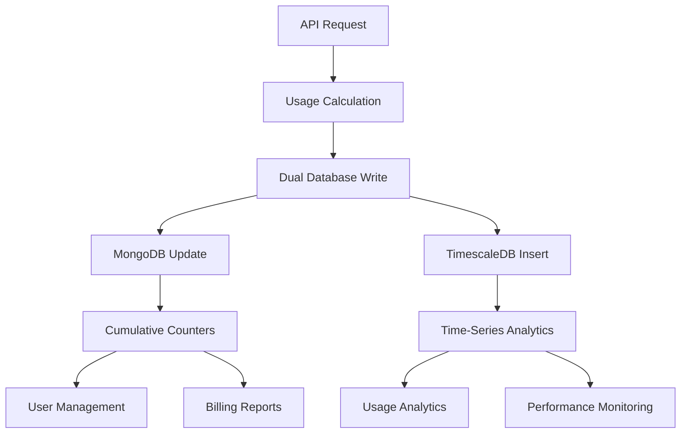

# Dhruva Platform Metering System - Comprehensive Documentation

## Table of Contents
1. [System Overview](#system-overview)
2. [Database Storage Architecture](#database-storage-architecture)
3. [Complete Field Documentation](#complete-field-documentation)
4. [Metering Process Workflow](#metering-process-workflow)
5. [Usage Calculation Logic](#usage-calculation-logic)
6. [Data Examples and Use Cases](#data-examples-and-use-cases)
7. [Business Logic and Requirements](#business-logic-and-requirements)

---

## System Overview

The Dhruva Platform metering system implements a **dual-database architecture** for comprehensive usage tracking and analytics. It captures, calculates, and stores usage data for AI inference services including translation, ASR (Automatic Speech Recognition), TTS (Text-to-Speech), and NER (Named Entity Recognition).

### Key Components
- **MongoDB**: User management and cumulative usage tracking
- **TimescaleDB**: Time-series analytics and detailed usage history
- **Celery Workers**: Asynchronous task processing for metering operations
- **RabbitMQ**: Message queue for reliable task delivery

---

## Database Storage Architecture

### Dual-Database Model



### Database Roles and Purposes

| Database | Primary Purpose | Data Pattern | Use Cases |
|----------|----------------|--------------|-----------|
| **MongoDB** | User Management & Cumulative Tracking | UPDATE existing records | API key management, billing totals, user quotas |
| **TimescaleDB** | Time-Series Analytics & Audit Trail | INSERT new records | Usage trends, performance analytics, detailed reporting |

### Data Flow Synchronization

```python
# Metering Process Flow
API Request → Authentication → Usage Calculation → Dual Write:
├── MongoDB: api_key_collection.update_one({"$inc": {"usage": units, "hits": 1}})
└── TimescaleDB: session.add(ApiKey(usage=units, timestamp=now))
```

---

## Complete Field Documentation

### MongoDB Collection: `api_key`

**Collection Purpose**: Stores API key metadata and cumulative usage statistics for user management and billing.

| Field Name | Data Type | Purpose | Business Logic | Example Value |
|------------|-----------|---------|----------------|---------------|
| `_id` | ObjectId | Unique identifier for API key document | Auto-generated MongoDB primary key | `ObjectId('680b368070069bee045b210c')` |
| `name` | String | Human-readable API key name | User-defined identifier for API key management | `"default"`, `"production-key"` |
| `api_key` | String | Actual API key token for authentication | SHA-256 hash used for API authentication | `"resEY0jeJ5KqTFyV3xaLineuRMgBqvsSneEiUG_Ic4yJVVrPFSPGMlNM3ySVzznE"` |
| `user_id` | ObjectId | Reference to user who owns this API key | Foreign key linking to user collection | `ObjectId('6800940478d4d09365d861e1')` |
| `active` | Boolean | Whether API key is currently enabled | Controls API access authorization | `true`, `false` |
| `type` | String | API key type/category | Defines permissions and usage scope | `"INFERENCE"`, `"ADMIN"` |
| `usage` | Integer | **Total cumulative usage units** | **Incremented with each API call** | `6` (total units consumed) |
| `hits` | Integer | **Total number of API calls made** | **Incremented by 1 with each request** | `2` (total API calls) |
| `data_tracking` | Boolean | Whether to log request/response data | Privacy and compliance control | `true`, `false` |
| `services` | Array | List of allowed services for this key | Service-level access control | `[]` (empty = all services) |
| `created_at` | Date | When API key was created | Audit trail and lifecycle management | `ISODate('2025-06-01T10:30:00Z')` |
| `updated_at` | Date | Last modification timestamp | Change tracking and audit | `ISODate('2025-06-01T15:04:35Z')` |

### TimescaleDB Table: `apikey`

**Table Purpose**: Stores individual usage records for time-series analytics and detailed audit trails.

| Field Name | Data Type | Purpose | Business Logic | Example Value |
|------------|-----------|---------|----------------|---------------|
| `api_key_id` | TEXT | MongoDB ObjectId of the API key | Links to MongoDB api_key._id | `"680b368070069bee045b210c"` |
| `api_key_name` | TEXT | Name of the API key used | Denormalized for query performance | `"default"` |
| `user_id` | TEXT | MongoDB ObjectId of the user | Links to MongoDB user._id | `"6800940478d4d09365d861e1"` |
| `user_email` | TEXT | Email of the user | Denormalized for reporting | `"admin@example.com"` |
| `inference_service_id` | TEXT | Service identifier used | Tracks which AI service was called | `"ai4bharat/indictrans--gpu-t4"` |
| `task_type` | TEXT | Type of AI task performed | Categorizes usage by service type | `"translation"`, `"asr"`, `"tts"`, `"ner"` |
| `usage` | DOUBLE PRECISION | **Usage units for this specific call** | **Calculated based on input size** | `4.0` (for "Test" = 4 characters) |
| `timestamp` | TIMESTAMPTZ | **When the API call was made** | **Primary key for time-series data** | `2025-06-01 15:04:35.539605+00` |

---

## Metering Process Workflow

### 1. API Request Trigger

```python
# FastAPI endpoint receives request
@router.post("/services/inference/translation")
async def translate(request: TranslationRequest, api_key_info: dict = Depends(get_api_key)):
    # Process inference request
    result = await process_translation(request)

    # Trigger metering (asynchronous)
    log_data.delay(
        api_key_id=api_key_info["id"],
        service_id=request.config.serviceId,
        task_type="translation",
        input_data=request.input,
        output_data=result.output
    )
```

### 2. Usage Calculation

```python
# Character-based calculation for text services
def calculate_usage_units(input_data: List[dict], task_type: str) -> int:
    total_chars = 0
    for item in input_data:
        if "source" in item:  # Translation
            total_chars += len(item["source"])
        elif "audio" in item:  # ASR/TTS
            # Audio duration-based calculation
            total_chars += calculate_audio_units(item["audio"])

    return total_chars  # 1 character = 1 usage unit
```

### 3. Dual Database Write

```python
def write_to_db(api_key_id: str, inference_units: int, service_id: str, usage_type: str):
    # 1. Write to TimescaleDB (time-series record)
    with Session(engine) as session:
        api_key_record = ApiKey(
            api_key_id=api_key_id,
            api_key_name=api_key["name"],
            user_id=str(user["_id"]),
            user_email=user["email"],
            inference_service_id=service_id,
            task_type=usage_type,
            usage=inference_units,
            timestamp=datetime.utcnow()
        )
        session.add(api_key_record)
        session.commit()

    # 2. Update MongoDB (cumulative counters)
    api_key_collection.update_one(
        {"_id": ObjectId(api_key_id)},
        {
            "$inc": {
                "usage": inference_units,  # Add to total usage
                "hits": 1                  # Increment call count
            },
            "$set": {
                "updated_at": datetime.utcnow()
            }
        }
    )
```

---

## Usage Calculation Logic

### Service-Specific Calculations

| Service Type | Input Measurement | Calculation Method | Example |
|--------------|-------------------|-------------------|---------|
| **Translation** | Character count | `len(source_text)` | `"Hello world"` = 11 units |
| **ASR** | Audio duration | `audio_seconds * multiplier` | 30 seconds = 30 units |
| **TTS** | Text length | `len(text_to_synthesize)` | `"Generate speech"` = 15 units |
| **NER** | Text length | `len(input_text)` | `"Find entities here"` = 18 units |

### Calculation Examples from Testing

```python
# Real examples from our verification testing:
"Hi" → len("Hi") = 2 characters → 2 usage units
"Test" → len("Test") = 4 characters → 4 usage units
"Welcome to India" → len("Welcome to India") = 16 characters → 16 usage units
"This is a longer sentence for testing purposes." → 47 characters → 47 usage units
```

---

## Data Examples and Use Cases

### Real Data from Verification Testing

#### MongoDB Document Example
```javascript
{
  _id: ObjectId('680b368070069bee045b210c'),
  name: 'default',
  api_key: 'resEY0jeJ5KqTFyV3xaLineuRMgBqvsSneEiUG_Ic4yJVVrPFSPGMlNM3ySVzznE',
  user_id: ObjectId('6800940478d4d09365d861e1'),
  active: true,
  type: 'INFERENCE',
  usage: 6,        // Total: "Hi"(2) + "Test"(4) = 6 units
  hits: 2,         // Total: 2 API calls made
  data_tracking: true,
  services: [],
  created_at: ISODate('2025-06-01T10:30:00Z'),
  updated_at: ISODate('2025-06-01T15:04:35Z')
}
```

#### TimescaleDB Records Example
```sql
api_key_id                | api_key_name | user_email        | task_type   | usage | timestamp
--------------------------|--------------|-------------------|-------------|-------|---------------------------
680b368070069bee045b210c  | default      | admin@example.com | translation | 4.0   | 2025-06-01 15:04:35+00
680b368070069bee045b210c  | default      | admin@example.com | translation | 2.0   | 2025-06-01 15:04:13+00
680b368070069bee045b210c  | default      | admin@example.com | translation | 7.0   | 2025-06-01 14:50:35+00
680b368070069bee045b210c  | default      | admin@example.com | translation | 16.0  | 2025-06-01 14:49:00+00
```

### Business Use Cases

#### 1. Billing Report Generation
```sql
-- Monthly usage summary for billing
SELECT
    user_email,
    api_key_name,
    task_type,
    SUM(usage) as total_units,
    COUNT(*) as total_calls,
    DATE_TRUNC('month', timestamp) as billing_month
FROM apikey
WHERE timestamp >= '2025-06-01' AND timestamp < '2025-07-01'
GROUP BY user_email, api_key_name, task_type, billing_month;
```

#### 2. API Key Management Dashboard
```javascript
// Get current usage for API key management
db.api_key.find(
  { user_id: ObjectId('6800940478d4d09365d861e1') },
  { name: 1, usage: 1, hits: 1, active: 1 }
)
```

#### 3. Usage Analytics and Trends
```sql
-- Daily usage trends for analytics dashboard
SELECT
    DATE_TRUNC('day', timestamp) as day,
    task_type,
    SUM(usage) as daily_usage,
    COUNT(*) as daily_calls
FROM apikey
WHERE timestamp >= NOW() - INTERVAL '30 days'
GROUP BY day, task_type
ORDER BY day DESC;
```

---

## Business Logic and Requirements

### Field Relationships and Dependencies

#### Primary Relationships
```
User (MongoDB) ←→ API Key (MongoDB) ←→ Usage Records (TimescaleDB)
     1:N                    1:N                    1:N
```

#### Data Consistency Rules
1. **MongoDB `usage` field** = SUM of all TimescaleDB `usage` records for that API key
2. **MongoDB `hits` field** = COUNT of all TimescaleDB records for that API key
3. **TimescaleDB records** are immutable (insert-only for audit trail)
4. **MongoDB updates** are incremental using `$inc` operator for atomicity

### Business Requirements by Field

#### Critical Business Fields
- **`usage` (MongoDB)**: Required for billing calculations and quota enforcement
- **`hits` (MongoDB)**: Required for rate limiting and usage pattern analysis
- **`timestamp` (TimescaleDB)**: Required for time-based analytics and audit compliance
- **`task_type` (TimescaleDB)**: Required for service-specific billing and analytics

#### Compliance and Audit Fields
- **`user_email` (TimescaleDB)**: Required for audit trails and compliance reporting
- **`api_key_id` (TimescaleDB)**: Required for linking usage to specific API keys
- **`data_tracking` (MongoDB)**: Required for GDPR compliance and privacy controls

#### Operational Fields
- **`active` (MongoDB)**: Required for access control and service management
- **`services` (MongoDB)**: Required for fine-grained permission control
- **`inference_service_id` (TimescaleDB)**: Required for service performance monitoring

### Data Retention and Lifecycle

#### MongoDB (Operational Data)
- **Retention**: Indefinite (user management data)
- **Updates**: Real-time incremental updates
- **Backup**: Daily snapshots for disaster recovery

#### TimescaleDB (Analytics Data)
- **Retention**: Configurable (default: 2 years for compliance)
- **Compression**: Automatic time-based compression for older data
- **Partitioning**: Monthly partitions for query performance

---

## Summary

The Dhruva Platform metering system provides comprehensive usage tracking through a sophisticated dual-database architecture. MongoDB handles real-time user management and cumulative statistics, while TimescaleDB provides detailed time-series analytics and audit trails. This design ensures both operational efficiency and analytical depth, supporting billing, compliance, and business intelligence requirements.

**Key Benefits:**
- ✅ **Real-time Usage Tracking**: Immediate updates to usage counters
- ✅ **Comprehensive Analytics**: Detailed time-series data for insights
- ✅ **Audit Compliance**: Complete trail of all API usage
- ✅ **Scalable Architecture**: Efficient handling of high-volume usage
- ✅ **Data Integrity**: Atomic operations and consistency checks

---

## Technical Implementation Details

### Database Schema Definitions

#### MongoDB Schema (api_key collection)
```javascript
{
  _id: ObjectId,                    // Primary key
  name: String,                     // Index: text search
  api_key: String,                  // Index: unique, authentication
  user_id: ObjectId,               // Index: foreign key to users
  active: Boolean,                 // Index: filtering active keys
  type: String,                    // Index: key type filtering
  usage: NumberLong,               // Cumulative usage counter
  hits: NumberLong,                // Cumulative hit counter
  data_tracking: Boolean,          // Privacy control flag
  services: Array,                 // Service access control
  created_at: Date,               // Audit timestamp
  updated_at: Date                // Last modification timestamp
}

// Indexes for performance
db.api_key.createIndex({ "api_key": 1 }, { unique: true })
db.api_key.createIndex({ "user_id": 1 })
db.api_key.createIndex({ "active": 1 })
db.api_key.createIndex({ "updated_at": -1 })
```

#### TimescaleDB Schema (apikey table)
```sql
CREATE TABLE apikey (
    api_key_id TEXT NOT NULL,
    api_key_name TEXT NOT NULL,
    user_id TEXT NOT NULL,
    user_email TEXT NOT NULL,
    inference_service_id TEXT NOT NULL,
    task_type TEXT NOT NULL,
    usage DOUBLE PRECISION NOT NULL,
    timestamp TIMESTAMPTZ NOT NULL
);

-- Convert to hypertable for time-series optimization
SELECT create_hypertable('apikey', 'timestamp');

-- Indexes for query performance
CREATE INDEX idx_apikey_api_key_id ON apikey (api_key_id);
CREATE INDEX idx_apikey_user_id ON apikey (user_id);
CREATE INDEX idx_apikey_task_type ON apikey (task_type);
CREATE INDEX idx_apikey_timestamp ON apikey (timestamp DESC);
```

### Error Handling and Edge Cases

#### MongoDB Update Failure Handling
```python
def update_mongodb_usage(api_key_id: str, inference_units: int):
    try:
        result = api_key_collection.update_one(
            {"_id": ObjectId(api_key_id)},
            {
                "$inc": {
                    "usage": inference_units,
                    "hits": 1
                },
                "$set": {
                    "updated_at": datetime.utcnow()
                }
            }
        )

        if result.matched_count == 0:
            raise ValueError(f"API key not found: {api_key_id}")

        print(f"Updated MongoDB usage: +{inference_units} units, +1 hit for API key {api_key_id}")

    except Exception as e:
        print(f"Error updating MongoDB usage counters: {e}")
        # Log error for monitoring but don't fail the request
        # TimescaleDB record will still be created for audit trail
```

#### TimescaleDB Insert Failure Handling
```python
def write_to_timescaledb(api_key_data: dict, inference_units: int, service_id: str, usage_type: str):
    try:
        with Session(engine) as session:
            api_key_record = ApiKey(
                api_key_id=api_key_data["_id"],
                api_key_name=api_key_data["name"],
                user_id=str(api_key_data["user_id"]),
                user_email=api_key_data["user_email"],
                inference_service_id=service_id,
                task_type=usage_type,
                usage=inference_units,
                timestamp=datetime.utcnow()
            )

            session.add(api_key_record)
            session.commit()

    except Exception as e:
        print(f"Error writing to TimescaleDB: {e}")
        session.rollback()
        raise  # Re-raise to trigger retry mechanism
```

### Performance Optimization Strategies

#### Batch Processing for High Volume
```python
# For high-volume scenarios, batch MongoDB updates
def batch_update_usage(usage_updates: List[dict]):
    bulk_operations = []

    for update in usage_updates:
        bulk_operations.append(
            UpdateOne(
                {"_id": ObjectId(update["api_key_id"])},
                {
                    "$inc": {
                        "usage": update["units"],
                        "hits": 1
                    },
                    "$set": {
                        "updated_at": datetime.utcnow()
                    }
                }
            )
        )

    # Execute all updates in a single batch
    result = api_key_collection.bulk_write(bulk_operations)
    return result
```

#### TimescaleDB Compression and Retention
```sql
-- Enable compression for older data (saves 90%+ storage)
ALTER TABLE apikey SET (
    timescaledb.compress,
    timescaledb.compress_segmentby = 'api_key_id, task_type'
);

-- Compress data older than 7 days
SELECT add_compression_policy('apikey', INTERVAL '7 days');

-- Retention policy: drop data older than 2 years
SELECT add_retention_policy('apikey', INTERVAL '2 years');
```

### Monitoring and Alerting

#### Key Metrics to Monitor
```python
# Celery task monitoring
@app.task(bind=True)
def log_data(self, api_key_id: str, service_id: str, task_type: str, input_data: list, output_data: list):
    try:
        start_time = time.time()

        # Process metering
        result = meter_usage(api_key_id, service_id, task_type, input_data, output_data)

        # Record performance metrics
        processing_time = time.time() - start_time

        # Push metrics to Prometheus
        METERING_DURATION.observe(processing_time)
        METERING_COUNTER.labels(task_type=task_type, status='success').inc()

        return result

    except Exception as e:
        METERING_COUNTER.labels(task_type=task_type, status='error').inc()
        raise
```

#### Database Health Checks
```python
def check_database_health():
    health_status = {
        "mongodb": False,
        "timescaledb": False,
        "queue_backlog": 0
    }

    try:
        # MongoDB health check
        db.admin.command('ping')
        health_status["mongodb"] = True
    except Exception as e:
        print(f"MongoDB health check failed: {e}")

    try:
        # TimescaleDB health check
        with Session(engine) as session:
            session.execute(text("SELECT 1"))
        health_status["timescaledb"] = True
    except Exception as e:
        print(f"TimescaleDB health check failed: {e}")

    # Check queue backlog
    health_status["queue_backlog"] = get_queue_message_count("data-log")

    return health_status
```

---

## API Reference and Integration Examples

### REST API Usage Examples

#### Making a Metered API Request
```bash
# Translation request that triggers metering
curl -X POST "http://localhost:8000/services/inference/translation" \
  -H "Authorization: resEY0jeJ5KqTFyV3xaLineuRMgBqvsSneEiUG_Ic4yJVVrPFSPGMlNM3ySVzznE" \
  -H "x-auth-source: API_KEY" \
  -H "Content-Type: application/json" \
  -d '{
    "input": [{"source": "Hello world"}],
    "config": {
      "language": {
        "sourceLanguage": "en",
        "targetLanguage": "hi"
      },
      "serviceId": "ai4bharat/indictrans--gpu-t4"
    }
  }'

# Response includes usage information
{
  "taskType": "translation",
  "output": [{"source": "Hello world", "target": "हैलो वर्ल्ड।"}],
  "config": null
}
```

#### Checking API Key Usage
```bash
# Get current usage statistics
curl -X GET "http://localhost:8000/user/api-keys" \
  -H "Authorization: user_jwt_token" \
  -H "Content-Type: application/json"

# Response shows current usage
{
  "api_keys": [
    {
      "id": "680b368070069bee045b210c",
      "name": "default",
      "usage": 6,
      "hits": 2,
      "active": true,
      "created_at": "2025-06-01T10:30:00Z"
    }
  ]
}
```

### Database Query Examples

#### Business Intelligence Queries
```sql
-- Top users by usage (for capacity planning)
SELECT
    user_email,
    SUM(usage) as total_usage,
    COUNT(*) as total_requests,
    COUNT(DISTINCT api_key_id) as api_keys_used
FROM apikey
WHERE timestamp >= NOW() - INTERVAL '30 days'
GROUP BY user_email
ORDER BY total_usage DESC
LIMIT 10;

-- Service performance analysis
SELECT
    inference_service_id,
    task_type,
    AVG(usage) as avg_usage_per_request,
    COUNT(*) as request_count,
    DATE_TRUNC('hour', timestamp) as hour
FROM apikey
WHERE timestamp >= NOW() - INTERVAL '24 hours'
GROUP BY inference_service_id, task_type, hour
ORDER BY hour DESC;

-- Usage pattern analysis
SELECT
    EXTRACT(hour FROM timestamp) as hour_of_day,
    task_type,
    SUM(usage) as hourly_usage,
    COUNT(*) as hourly_requests
FROM apikey
WHERE timestamp >= NOW() - INTERVAL '7 days'
GROUP BY hour_of_day, task_type
ORDER BY hour_of_day;
```

#### Operational Queries
```javascript
// MongoDB: Find high-usage API keys for quota management
db.api_key.find(
  {
    usage: { $gt: 10000 },
    active: true
  },
  {
    name: 1,
    usage: 1,
    hits: 1,
    user_id: 1
  }
).sort({ usage: -1 })

// MongoDB: API keys approaching limits
db.api_key.aggregate([
  {
    $lookup: {
      from: "user",
      localField: "user_id",
      foreignField: "_id",
      as: "user_info"
    }
  },
  {
    $match: {
      usage: { $gt: 5000 },  // Approaching 10k limit
      active: true
    }
  },
  {
    $project: {
      name: 1,
      usage: 1,
      "user_info.email": 1,
      usage_percentage: { $multiply: [{ $divide: ["$usage", 10000] }, 100] }
    }
  }
])
```

---

## Troubleshooting and Maintenance

### Common Issues and Solutions

#### Issue: MongoDB and TimescaleDB Usage Mismatch
```bash
# Diagnosis: Compare totals between databases
# MongoDB total
db.api_key.aggregate([
  { $group: { _id: null, total_usage: { $sum: "$usage" } } }
])

# TimescaleDB total
SELECT SUM(usage) as total_usage FROM apikey;

# Solution: Reconciliation script
python scripts/reconcile_usage_data.py --api-key-id 680b368070069bee045b210c
```

#### Issue: High Queue Backlog
```bash
# Diagnosis: Check queue status
docker exec dhruva-platform-rabbitmq rabbitmqctl list_queues -p dhruva_host

# Solution: Scale Celery workers
docker-compose -f docker-compose-metering.yml up --scale celery-metering=3
```

#### Issue: Missing Usage Records
```python
# Diagnosis: Check for failed tasks
def audit_missing_records(start_date: datetime, end_date: datetime):
    # Get API requests from application logs
    api_requests = get_api_requests_from_logs(start_date, end_date)

    # Get metering records from TimescaleDB
    metering_records = get_metering_records(start_date, end_date)

    # Find missing records
    missing = []
    for request in api_requests:
        if not find_matching_record(request, metering_records):
            missing.append(request)

    return missing
```

### Maintenance Procedures

#### Daily Maintenance
```bash
#!/bin/bash
# Daily maintenance script

# 1. Check database health
python scripts/health_check.py

# 2. Verify data consistency
python scripts/verify_data_consistency.py --date $(date -d "yesterday" +%Y-%m-%d)

# 3. Clean up old logs
docker logs dhruva-platform-server --since 24h | grep ERROR > /var/log/dhruva/errors_$(date +%Y%m%d).log

# 4. Update usage statistics cache
python scripts/update_usage_cache.py
```

#### Weekly Maintenance
```sql
-- Analyze query performance
ANALYZE apikey;

-- Check for slow queries
SELECT query, mean_exec_time, calls
FROM pg_stat_statements
WHERE query LIKE '%apikey%'
ORDER BY mean_exec_time DESC
LIMIT 10;

-- Vacuum and reindex if needed
VACUUM ANALYZE apikey;
```

This comprehensive documentation provides complete coverage of the Dhruva Platform metering system, including all field definitions, business logic, implementation details, and operational procedures. It serves as both a technical reference and operational guide for developers, administrators, and business stakeholders.
