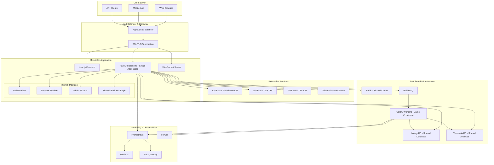
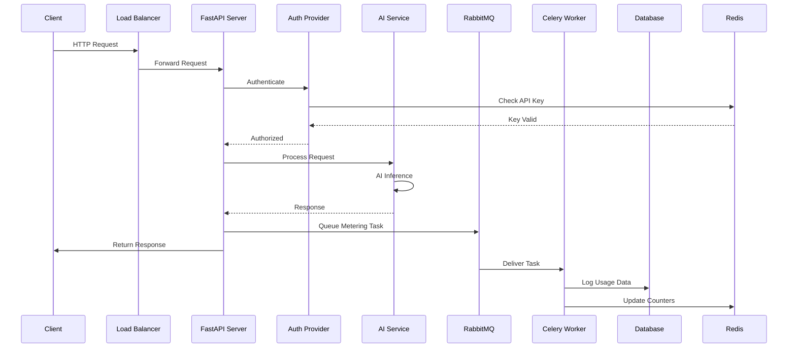
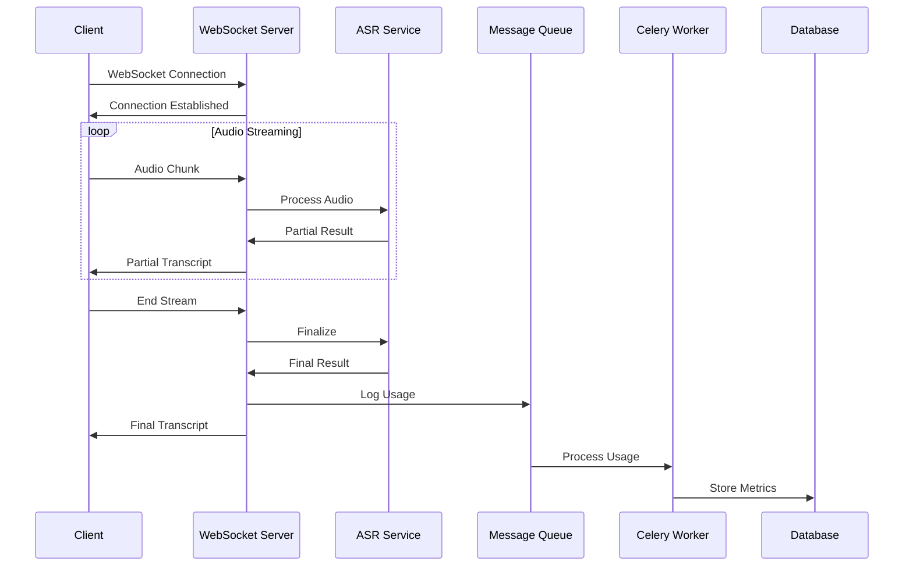
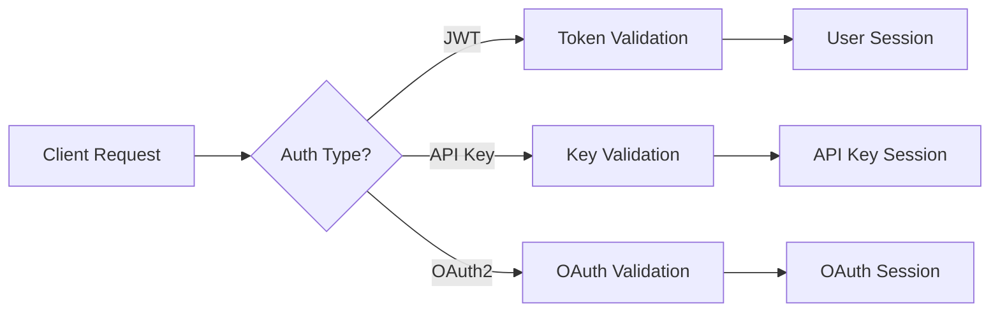

# Dhruva Platform - Comprehensive Documentation

## 📚 Table of Contents

1. [Platform Overview](#platform-overview)
2. [Architecture](#architecture)
3. [Core Components](#core-components)
4. [Module Documentation](#module-documentation)
5. [Deployment Guide](#deployment-guide)
6. [Security](#security)
7. [Monitoring & Observability](#monitoring--observability)
8. [Troubleshooting](#troubleshooting)

## Platform Overview

Dhruva Platform is a comprehensive AI/ML model serving platform for Indian language processing, providing APIs for translation, ASR (Automatic Speech Recognition), TTS (Text-to-Speech), NER (Named Entity Recognition), and transliteration services.

### Key Features
- Multi-language AI Services
- Modular Monolithic Architecture
- Real-time Processing
- Comprehensive Metering
- Enterprise Security
- Monitoring & Observability

### Technology Stack
- **Backend**: Python, FastAPI, Celery
- **Frontend**: Next.js, TypeScript, Chakra UI
- **Databases**: MongoDB, TimescaleDB, Redis
- **Message Queue**: RabbitMQ
- **Monitoring**: Prometheus, Grafana
- **Deployment**: Docker, Docker Compose
- **Authentication**: JWT, OAuth2, API Keys

## Architecture

### High-Level Architecture

### Architecture Pattern: Modular Monolith

The platform follows a **modular monolith pattern** with distributed infrastructure components:

1. **Single Codebase**: All application logic in unified codebase
2. **Internal Modules**: Clear separation of concerns within the monolith
3. **Shared Infrastructure**: Common database connections and utilities
4. **Distributed Components**: For specific purposes (background processing, monitoring)

### Data Flow Architecture

#### Request Processing Flow

#### Streaming Data Flow

## Core Components

### 1. Monolithic Application Core
- **Single Codebase**: All application logic in unified codebase
- **FastAPI Backend**: Single application with multiple internal modules
- **Shared Dependencies**: Common database connections and business logic
- **Internal Routing**: Module-to-module communication via direct function calls

### 2. Frontend Layer (Next.js)
- **Purpose**: User interface and experience
- **Technology**: Next.js 13, TypeScript, Chakra UI
- **Features**:
  - Responsive web interface
  - Real-time AI service testing
  - Admin dashboard
  - User management
  - Service monitoring

### 3. Internal Modules
- **Auth Module**: JWT tokens, API keys, OAuth2 authentication
- **Services Module**: AI service routing and management
- **Admin Module**: Administrative operations and user management
- **Shared Business Logic**: Common utilities and data access

### 4. External AI Services
- **AI4Bharat APIs**: External HTTP endpoints for AI models
- **Translation**: Multi-language neural machine translation
- **ASR**: Automatic speech recognition with streaming
- **TTS**: Text-to-speech synthesis
- **NER**: Named entity recognition
- **Transliteration**: Script conversion

### 5. Distributed Infrastructure
- **MongoDB**: Shared application database
- **TimescaleDB**: Shared time-series analytics database
- **Redis**: Shared caching and session storage
- **RabbitMQ**: Message queue for background tasks
- **Celery Workers**: Background processing (same codebase as main app)

## Module Documentation

### Authentication Module
- JWT-based authentication
- API key management
- OAuth2 integration (Google)
- Role-based access control

### Services Module
- AI service routing
- Model management
- Inference handling
- Usage tracking

### Metering Module
- Usage tracking
- Analytics
- Billing integration
- Rate limiting

### Frontend Module
- User interface
- Service testing
- Admin dashboard
- Real-time monitoring

### Database Module
- MongoDB integration
- TimescaleDB for metrics
- Redis caching
- Data models

### Monitoring Module
- Prometheus metrics
- Grafana dashboards
- Logging
- Alerting

## Deployment Guide

### Prerequisites
- Docker and Docker Compose
- MongoDB
- Redis
- RabbitMQ
- TimescaleDB

### Deployment Steps
1. Clone the repository
2. Configure environment variables
3. Build Docker images
4. Start services in order:
   - Database services
   - Message queue
   - Application services
   - Monitoring services

### Configuration
- Environment variables
- Database connections
- Service endpoints
- Security settings

## Security

### Authentication Flow

### Security Features
- JWT token authentication
- API key management
- OAuth2 integration
- Role-based access control
- Rate limiting
- SSL/TLS encryption

## Monitoring & Observability

### Metrics Collection
- Prometheus for metrics
- Grafana for visualization
- Pushgateway for batch jobs
- Flower for Celery monitoring

### Logging
- Application logs
- Access logs
- Error logs
- Audit logs

### Alerting
- Service health alerts
- Error rate alerts
- Resource usage alerts
- Security alerts

## Troubleshooting

### Common Issues
1. Database connection issues
2. Authentication problems
3. Service availability
4. Performance issues

### Debugging Tools
- Log analysis
- Metrics inspection
- Service health checks
- Network debugging

### Support Resources
- Documentation
- Error codes
- Contact information
- Community forums 