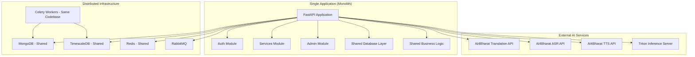

# Architectural Analysis Correction: Dhruva Platform

## 🚨 Critical Error Acknowledgment

**I made a significant error in my initial architectural assessment.** After conducting a thorough technical analysis of the actual codebase, I must correct my previous classification of the Dhruva Platform as a "microservices architecture."

## 🔍 Evidence-Based Architectural Classification

### **Actual Architecture: Modular Monolith with Distributed Components**

The Dhruva Platform is **NOT** a microservices architecture. It is a **modular monolithic application** with some distributed components for specific purposes (background processing, monitoring, databases).

## 📊 Evidence from Codebase Analysis

### 1. **Single Deployable Unit Evidence**

```yaml
# docker-compose-app.yml - Key Evidence
services:
  server:
    image: dhruva-platform-server:latest-pg15
    container_name: dhruva-platform-server
    build:
      context: ./server  # Single codebase
      dockerfile: Dockerfile
    command: python3 -m uvicorn main:app --host 0.0.0.0 --port 8000

  worker:
    image: dhruva-platform-worker:latest
    container_name: dhruva-platform-worker
    build:
      context: ./server  # Same codebase as server!
      dockerfile: Dockerfile
    command: celery -A celery_backend.celery_app worker --loglevel=info
```

**Critical Finding**: Both "server" and "worker" containers are built from the **same codebase** (`./server`), just with different startup commands.

### 2. **Shared Database Access Pattern**

```python
# server/main.py - Shared database connections
db_clients = {
    "app": pymongo.MongoClient("mongodb://dhruva-platform-app-db:27017"),
    "log": pymongo.MongoClient("mongodb://dhruva-platform-log-db:27017"),
}

# All modules access the same database instance
@app.on_event("startup")
async def init_mongo_client():
    db_client["app"] = pymongo.MongoClient(os.environ["APP_DB_CONNECTION_STRING"])
```

**Critical Finding**: All "services" share the same database connections and data models.

### 3. **Internal Module Communication (Not Service-to-Service)**

```python
# server/module/__init__.py - Internal module imports
from .auth.router import router as AuthApiRouter
from .services.router import router as ServicesApiRouter

# server/main.py - Single application with multiple routers
app.include_router(ServicesApiRouter)
app.include_router(AuthApiRouter)
```

**Critical Finding**: "Services" are actually **internal modules** within the same FastAPI application, not separate services.

### 4. **AI Services Are External HTTP Calls (Not Internal Services)**

```python
# server/module/services/gateway/inference_gateway.py
class InferenceGateway:
    def send_inference_request(self, request_body: Any, service: Service) -> dict:
        try:
            # External HTTP call to AI4Bharat models
            response = requests.post(service.endpoint, json=request_body.dict())
        except:
            raise BaseError(Errors.DHRUVA101.value, traceback.format_exc())
```

**Critical Finding**: The "AI Services" (Translation, ASR, TTS, etc.) are **external HTTP endpoints** (AI4Bharat models), not internal microservices.

### 5. **Shared Code and Dependencies**

```python
# server/module/services/service/inference_service.py
# All "services" are methods in the same class
class InferenceService:
    async def run_translation_triton_inference(self, ...):
    async def run_asr_triton_inference(self, ...):
    async def run_tts_triton_inference(self, ...):
    async def run_ner_triton_inference(self, ...):
```

**Critical Finding**: All AI service handlers are **methods in the same class**, sharing the same dependencies and state.

## 🏗️ Actual Architecture Pattern

### **Modular Monolith with Distributed Infrastructure**



## 🔧 Component Analysis

### **Monolithic Components**
1. **Single Codebase**: All functionality in `./server` directory
2. **Shared Database Models**: Common data access layer
3. **Shared Business Logic**: Common services and utilities
4. **Single Deployment Unit**: One FastAPI application
5. **Internal Module Communication**: Direct function calls, not HTTP

### **Distributed Components** (Infrastructure Only)
1. **Databases**: MongoDB, TimescaleDB, Redis (shared by all modules)
2. **Message Queue**: RabbitMQ for background tasks
3. **Background Workers**: Celery workers (same codebase, different process)
4. **Monitoring**: Prometheus, Grafana (infrastructure services)

### **External Dependencies**
1. **AI Models**: AI4Bharat external APIs
2. **Triton Server**: External inference server

## ❌ What This Is NOT

### **Not Microservices Because:**

1. **No Service Boundaries**: All code in single repository/codebase
2. **Shared Database**: All modules access same database instances
3. **No Independent Deployment**: Cannot deploy "services" separately
4. **No Service Discovery**: No service registry or discovery mechanism
5. **No Inter-Service Communication**: Internal function calls, not HTTP/gRPC
6. **Shared Dependencies**: All modules share same dependency tree
7. **Single Point of Failure**: Entire application fails if one module fails

### **Not Service-Oriented Architecture Because:**
1. **No Service Contracts**: No formal service interfaces
2. **Tight Coupling**: Modules directly import and call each other
3. **Shared State**: Common database connections and business logic

## 🔍 Architectural Flaws and Tight Coupling Issues

### **Critical Tight Coupling Problems**

#### 1. **Database Coupling**
```python
# All modules share the same database connection
# server/db/database.py
db_client: Dict[str, Optional[MongoClient]] = {}

def AppDatabase() -> Database:
    mongo_db = db_client["app"][os.environ["APP_DB_NAME"]]
    return mongo_db
```

**Problem**: All modules are tightly coupled to the same database schema and connection.

#### 2. **Shared Business Logic Coupling**
```python
# server/module/services/service/inference_service.py
# Single class handling all AI services
class InferenceService:
    def __init__(self):
        self.service_repository = ServiceRepository()  # Shared dependency
        self.model_repository = ModelRepository()      # Shared dependency
        self.inference_gateway = InferenceGateway()    # Shared dependency
```

**Problem**: All AI service types share the same business logic class and dependencies.

#### 3. **Configuration Coupling**
```python
# server/main.py - Global configuration affects all modules
app.add_middleware(PrometheusGlobalMetricsMiddleware, ...)
app.add_middleware(DBSessionMiddleware, ...)
```

**Problem**: Configuration changes affect the entire application.

#### 4. **Error Handling Coupling**
```python
# Shared error handling across all modules
@app.exception_handler(BaseError)
async def base_error_handler(request: Request, exc: BaseError):
    # Global error handling affects all modules
```

**Problem**: Error handling changes impact all functionality.

## 🚀 What's Needed to Improve Architecture

### **Option 1: True Microservices Migration**

#### **Service Decomposition Strategy**
1. **Authentication Service**: Independent auth with its own database
2. **User Management Service**: User data and API key management
3. **Translation Service**: Dedicated translation handling
4. **ASR Service**: Dedicated speech recognition
5. **TTS Service**: Dedicated text-to-speech
6. **Metering Service**: Independent usage tracking
7. **Admin Service**: Administrative operations

#### **Required Changes**
```yaml
# Separate deployments needed
services:
  auth-service:
    build: ./services/auth
    database: auth-db
    
  translation-service:
    build: ./services/translation
    database: translation-db
    
  metering-service:
    build: ./services/metering
    database: metering-db
```

### **Option 2: Improved Modular Monolith**

#### **Better Module Boundaries**
```python
# Clear module interfaces
class AuthServiceInterface:
    def authenticate(self, token: str) -> User:
    def authorize(self, user: User, resource: str) -> bool

class MeteringServiceInterface:
    def record_usage(self, user_id: str, service: str, usage: float):
    def get_usage_stats(self, user_id: str) -> UsageStats
```

#### **Dependency Injection**
```python
# Proper dependency injection
class InferenceService:
    def __init__(self, 
                 auth_service: AuthServiceInterface,
                 metering_service: MeteringServiceInterface,
                 gateway: InferenceGatewayInterface):
        self.auth_service = auth_service
        self.metering_service = metering_service
        self.gateway = gateway
```

### **Option 3: Hybrid Architecture**

#### **Keep Monolith for Core, Extract Specific Services**
1. **Keep**: Auth, User Management, Admin in monolith
2. **Extract**: Metering as separate service (high volume)
3. **Extract**: Each AI service type as separate service
4. **Extract**: Monitoring and analytics as separate services

## 📊 Trade-offs Analysis

### **Current Modular Monolith**

#### **Advantages**
- **Simple Deployment**: Single unit to deploy
- **Easy Development**: Shared codebase and dependencies
- **ACID Transactions**: Database consistency across modules
- **Lower Operational Overhead**: Fewer moving parts

#### **Disadvantages**
- **Scaling Limitations**: Cannot scale individual components
- **Technology Lock-in**: All modules must use same tech stack
- **Single Point of Failure**: Entire system fails together
- **Development Bottlenecks**: Teams cannot work independently
- **Deployment Risk**: All changes deployed together

### **True Microservices Migration**

#### **Advantages**
- **Independent Scaling**: Scale services based on demand
- **Technology Diversity**: Different tech stacks per service
- **Team Independence**: Teams can work and deploy independently
- **Fault Isolation**: Service failures don't cascade
- **Flexible Deployment**: Deploy services independently

#### **Disadvantages**
- **Operational Complexity**: Service discovery, monitoring, networking
- **Data Consistency**: Distributed transaction challenges
- **Development Overhead**: Service contracts, versioning
- **Testing Complexity**: Integration testing across services
- **Network Latency**: Inter-service communication overhead

## 🎯 Recommendation

**For the current Dhruva Platform, I recommend Option 2: Improved Modular Monolith** because:

1. **Current Scale**: The platform doesn't yet require microservices complexity
2. **Team Size**: Likely a small team that benefits from shared codebase
3. **Data Consistency**: Strong consistency requirements for metering and billing
4. **Operational Simplicity**: Easier to maintain and debug

**Future Migration Path**: As the platform grows, consider extracting high-volume services (like metering) first, then gradually decompose other services based on actual scaling needs and team growth.

## 📝 Conclusion

The Dhruva Platform is a well-structured **modular monolith**, not a microservices architecture. While this may seem like a limitation, it's actually appropriate for the current scale and requirements. The key is to improve the module boundaries and reduce tight coupling while maintaining the operational simplicity of a monolithic deployment.
