# Data Flow Architecture

## 🌊 Overview

This document describes the comprehensive data flow architecture of the Dhruva Platform, detailing how data moves through the system from client requests to final storage and analytics.

## 🔄 High-Level Data Flow

### Complete System Data Flow

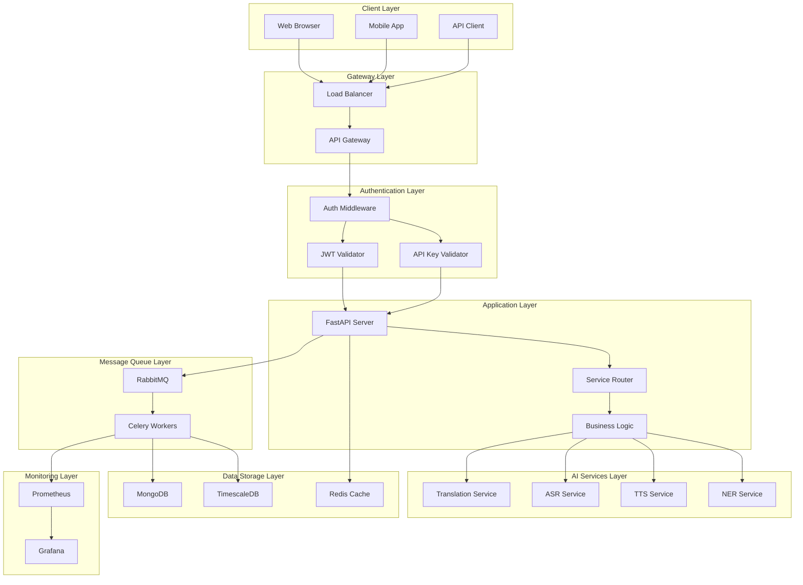
```mermaid
graph TB
    subgraph "Client Layer"
        A[Web Browser]
        B[Mobile App]
        C[API Client]
    end
    
    subgraph "Gateway Layer"
        D[Load Balancer]
        E[API Gateway]
    end
    
    subgraph "Authentication Layer"
        F[Auth Middleware]
        G[JWT Validator]
        H[API Key Validator]
    end
    
    subgraph "Application Layer"
        I[FastAPI Server]
        J[Service Router]
        K[Business Logic]
    end
    
    subgraph "AI Services Layer"
        L[Translation Service]
        M[ASR Service]
        N[TTS Service]
        O[NER Service]
    end
    
    subgraph "Message Queue Layer"
        P[RabbitMQ]
        Q[Celery Workers]
    end
    
    subgraph "Data Storage Layer"
        R[MongoDB]
        S[TimescaleDB]
        T[Redis Cache]
    end
    
    subgraph "Monitoring Layer"
        U[Prometheus]
        V[Grafana]
    end
    
    A --> D
    B --> D
    C --> D
    D --> E
    E --> F
    F --> G
    F --> H
    G --> I
    H --> I
    I --> J
    J --> K
    K --> L
    K --> M
    K --> N
    K --> O
    
    I --> P
    P --> Q
    Q --> R
    Q --> S
    I --> T
    
    Q --> U
    U --> V
```

## 📊 Request Processing Flow

### 1. API Request Flow

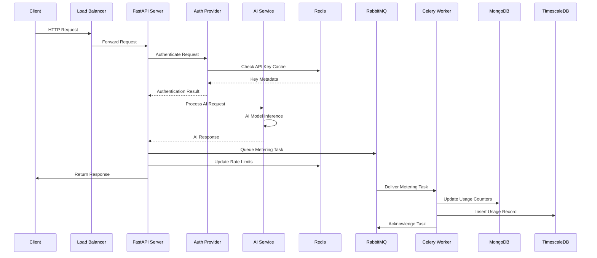
```mermaid
sequenceDiagram
    participant C as Client
    participant LB as Load Balancer
    participant API as FastAPI Server
    participant Auth as Auth Provider
    participant Service as AI Service
    participant Cache as Redis
    participant Queue as RabbitMQ
    participant Worker as Celery Worker
    participant MongoDB as MongoDB
    participant TimescaleDB as TimescaleDB
    
    C->>LB: HTTP Request
    LB->>API: Forward Request
    
    API->>Auth: Authenticate Request
    Auth->>Cache: Check API Key Cache
    Cache-->>Auth: Key Metadata
    Auth-->>API: Authentication Result
    
    API->>Service: Process AI Request
    Service->>Service: AI Model Inference
    Service-->>API: AI Response
    
    API->>Queue: Queue Metering Task
    API->>Cache: Update Rate Limits
    API->>C: Return Response
    
    Queue->>Worker: Deliver Metering Task
    Worker->>MongoDB: Update Usage Counters
    Worker->>TimescaleDB: Insert Usage Record
    Worker->>Queue: Acknowledge Task
```

### 2. Authentication Data Flow

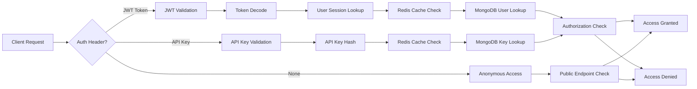
```mermaid
graph LR
    A[Client Request] --> B{Auth Header?}
    B -->|JWT Token| C[JWT Validation]
    B -->|API Key| D[API Key Validation]
    B -->|None| E[Anonymous Access]
    
    C --> F[Token Decode]
    F --> G[User Session Lookup]
    G --> H[Redis Cache Check]
    H --> I[MongoDB User Lookup]
    
    D --> J[API Key Hash]
    J --> K[Redis Cache Check]
    K --> L[MongoDB Key Lookup]
    
    I --> M[Authorization Check]
    L --> M
    E --> N[Public Endpoint Check]
    
    M --> O[Access Granted]
    N --> O
    M --> P[Access Denied]
    N --> P
```

### 3. AI Service Processing Flow

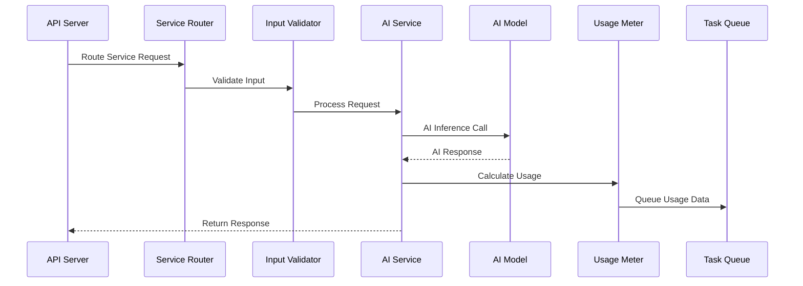
```mermaid
sequenceDiagram
    participant API as API Server
    participant Router as Service Router
    participant Validator as Input Validator
    participant Service as AI Service
    participant Model as AI Model
    participant Meter as Usage Meter
    participant Queue as Task Queue
    
    API->>Router: Route Service Request
    Router->>Validator: Validate Input
    Validator->>Service: Process Request
    
    Service->>Model: AI Inference Call
    Model-->>Service: AI Response
    
    Service->>Meter: Calculate Usage
    Meter->>Queue: Queue Usage Data
    
    Service-->>API: Return Response
```

## 🗄️ Data Storage Patterns

### 1. MongoDB Data Flow

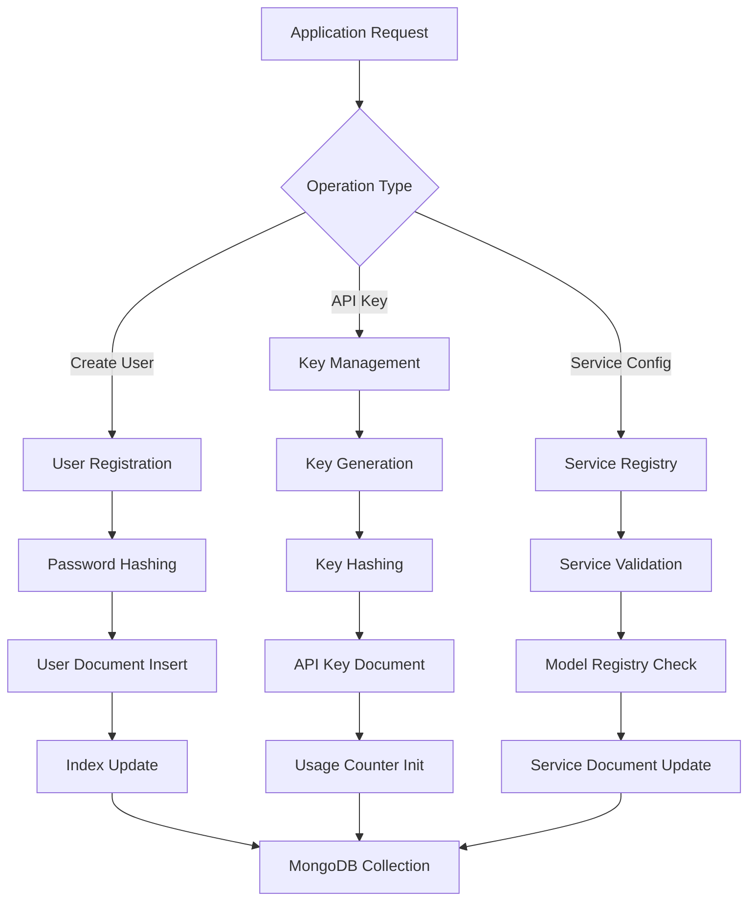
```mermaid
graph TD
    A[Application Request] --> B{Operation Type}
    B -->|Create User| C[User Registration]
    B -->|API Key| D[Key Management]
    B -->|Service Config| E[Service Registry]
    
    C --> F[Password Hashing]
    F --> G[User Document Insert]
    G --> H[Index Update]
    
    D --> I[Key Generation]
    I --> J[Key Hashing]
    J --> K[API Key Document]
    K --> L[Usage Counter Init]
    
    E --> M[Service Validation]
    M --> N[Model Registry Check]
    N --> O[Service Document Update]
    
    H --> P[MongoDB Collection]
    L --> P
    O --> P
```

### 2. TimescaleDB Data Flow

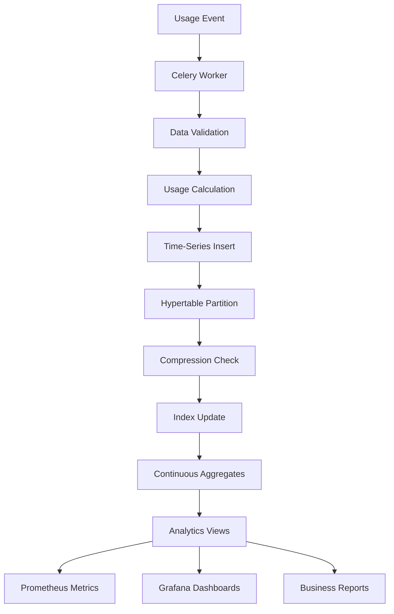
```mermaid
graph TD
    A[Usage Event] --> B[Celery Worker]
    B --> C[Data Validation]
    C --> D[Usage Calculation]
    D --> E[Time-Series Insert]
    
    E --> F[Hypertable Partition]
    F --> G[Compression Check]
    G --> H[Index Update]
    
    H --> I[Continuous Aggregates]
    I --> J[Analytics Views]
    
    J --> K[Prometheus Metrics]
    J --> L[Grafana Dashboards]
    J --> M[Business Reports]
```

### 3. Redis Cache Data Flow

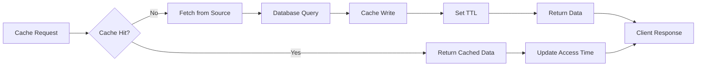
```mermaid
graph LR
    A[Cache Request] --> B{Cache Hit?}
    B -->|Yes| C[Return Cached Data]
    B -->|No| D[Fetch from Source]
    
    D --> E[Database Query]
    E --> F[Cache Write]
    F --> G[Set TTL]
    G --> H[Return Data]
    
    C --> I[Update Access Time]
    H --> J[Client Response]
    I --> J
```

## 🔄 Background Processing Flow

### 1. Celery Task Processing

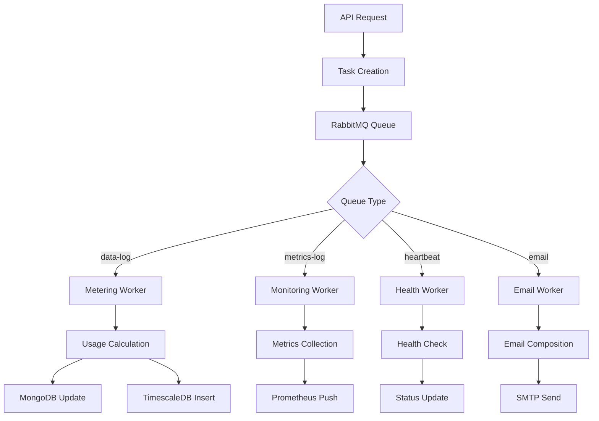
```mermaid
graph TD
    A[API Request] --> B[Task Creation]
    B --> C[RabbitMQ Queue]
    
    C --> D{Queue Type}
    D -->|data-log| E[Metering Worker]
    D -->|metrics-log| F[Monitoring Worker]
    D -->|heartbeat| G[Health Worker]
    D -->|email| H[Email Worker]
    
    E --> I[Usage Calculation]
    I --> J[MongoDB Update]
    I --> K[TimescaleDB Insert]
    
    F --> L[Metrics Collection]
    L --> M[Prometheus Push]
    
    G --> N[Health Check]
    N --> O[Status Update]
    
    H --> P[Email Composition]
    P --> Q[SMTP Send]
```

### 2. Metering Data Flow

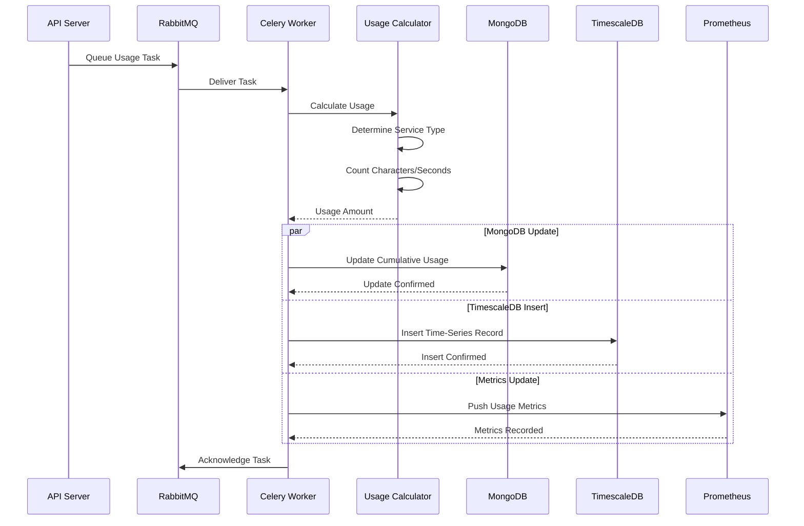
```mermaid
sequenceDiagram
    participant API as API Server
    participant Queue as RabbitMQ
    participant Worker as Celery Worker
    participant Calc as Usage Calculator
    participant Mongo as MongoDB
    participant TS as TimescaleDB
    participant Metrics as Prometheus
    
    API->>Queue: Queue Usage Task
    Queue->>Worker: Deliver Task
    
    Worker->>Calc: Calculate Usage
    Calc->>Calc: Determine Service Type
    Calc->>Calc: Count Characters/Seconds
    Calc-->>Worker: Usage Amount
    
    par MongoDB Update
        Worker->>Mongo: Update Cumulative Usage
        Mongo-->>Worker: Update Confirmed
    and TimescaleDB Insert
        Worker->>TS: Insert Time-Series Record
        TS-->>Worker: Insert Confirmed
    and Metrics Update
        Worker->>Metrics: Push Usage Metrics
        Metrics-->>Worker: Metrics Recorded
    end
    
    Worker->>Queue: Acknowledge Task
```

## 🌊 Streaming Data Flow

### Real-time ASR Streaming

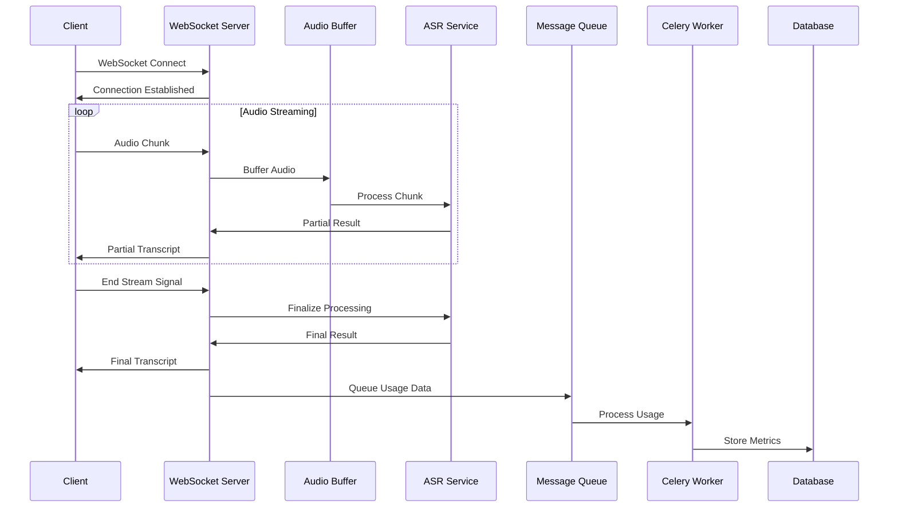
```mermaid
sequenceDiagram
    participant C as Client
    participant WS as WebSocket Server
    participant Buffer as Audio Buffer
    participant ASR as ASR Service
    participant Queue as Message Queue
    participant Worker as Celery Worker
    participant DB as Database
    
    C->>WS: WebSocket Connect
    WS->>C: Connection Established
    
    loop Audio Streaming
        C->>WS: Audio Chunk
        WS->>Buffer: Buffer Audio
        Buffer->>ASR: Process Chunk
        ASR->>WS: Partial Result
        WS->>C: Partial Transcript
    end
    
    C->>WS: End Stream Signal
    WS->>ASR: Finalize Processing
    ASR->>WS: Final Result
    WS->>C: Final Transcript
    
    WS->>Queue: Queue Usage Data
    Queue->>Worker: Process Usage
    Worker->>DB: Store Metrics
```

## 📊 Analytics Data Flow

### 1. Real-time Analytics

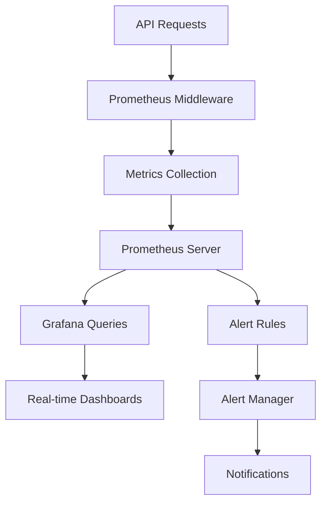
```mermaid
graph TD
    A[API Requests] --> B[Prometheus Middleware]
    B --> C[Metrics Collection]
    C --> D[Prometheus Server]
    
    D --> E[Grafana Queries]
    E --> F[Real-time Dashboards]
    
    D --> G[Alert Rules]
    G --> H[Alert Manager]
    H --> I[Notifications]
```

### 2. Historical Analytics

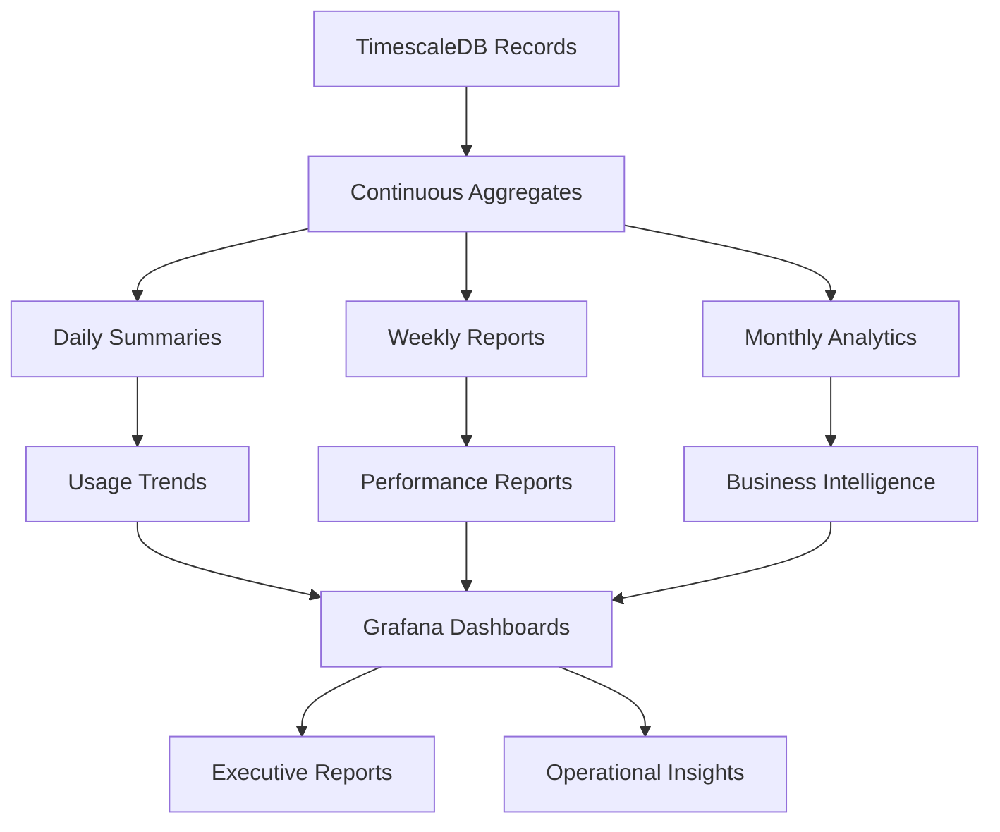
```mermaid
graph TD
    A[TimescaleDB Records] --> B[Continuous Aggregates]
    B --> C[Daily Summaries]
    B --> D[Weekly Reports]
    B --> E[Monthly Analytics]
    
    C --> F[Usage Trends]
    D --> G[Performance Reports]
    E --> H[Business Intelligence]
    
    F --> I[Grafana Dashboards]
    G --> I
    H --> I
    
    I --> J[Executive Reports]
    I --> K[Operational Insights]
```

## 🔒 Security Data Flow

### 1. Authentication Flow

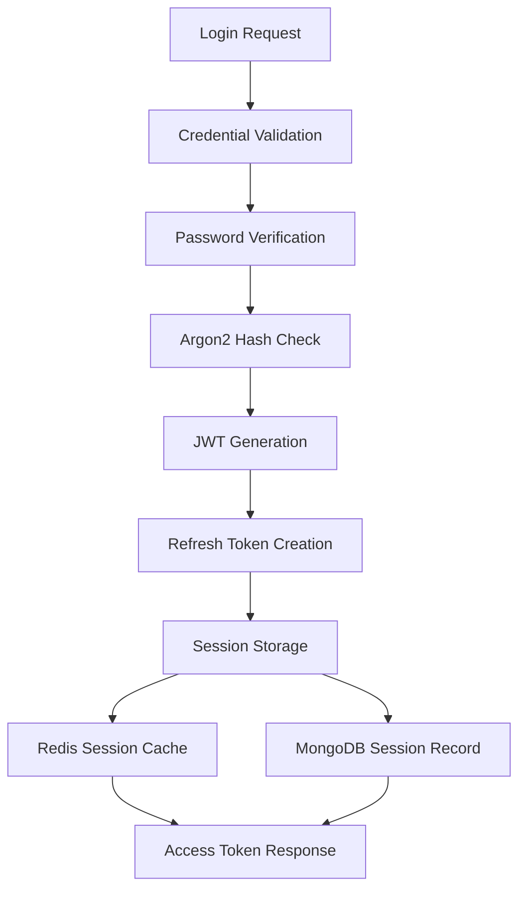
```mermaid
graph TD
    A[Login Request] --> B[Credential Validation]
    B --> C[Password Verification]
    C --> D[Argon2 Hash Check]
    
    D --> E[JWT Generation]
    E --> F[Refresh Token Creation]
    F --> G[Session Storage]
    
    G --> H[Redis Session Cache]
    G --> I[MongoDB Session Record]
    
    H --> J[Access Token Response]
    I --> J
```

### 2. API Key Flow

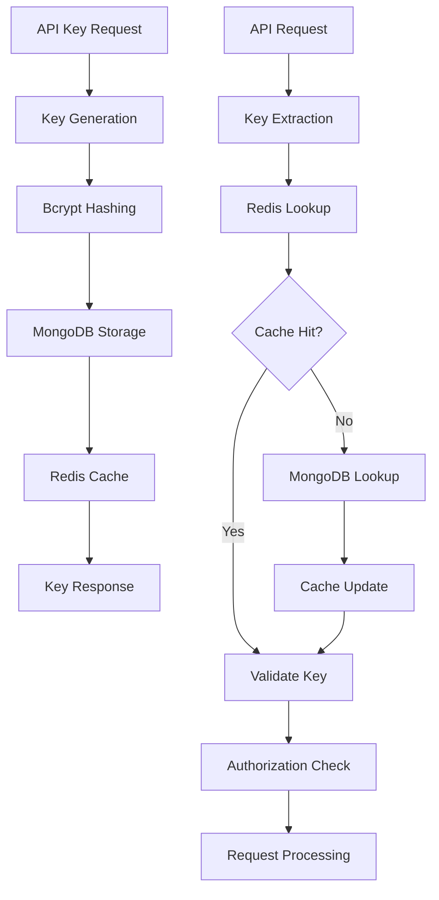
```mermaid
graph TD
    A[API Key Request] --> B[Key Generation]
    B --> C[Bcrypt Hashing]
    C --> D[MongoDB Storage]
    
    D --> E[Redis Cache]
    E --> F[Key Response]
    
    G[API Request] --> H[Key Extraction]
    H --> I[Redis Lookup]
    I --> J{Cache Hit?}
    J -->|Yes| K[Validate Key]
    J -->|No| L[MongoDB Lookup]
    L --> M[Cache Update]
    M --> K
    
    K --> N[Authorization Check]
    N --> O[Request Processing]
```

## 📈 Monitoring Data Flow

### 1. Metrics Collection Flow

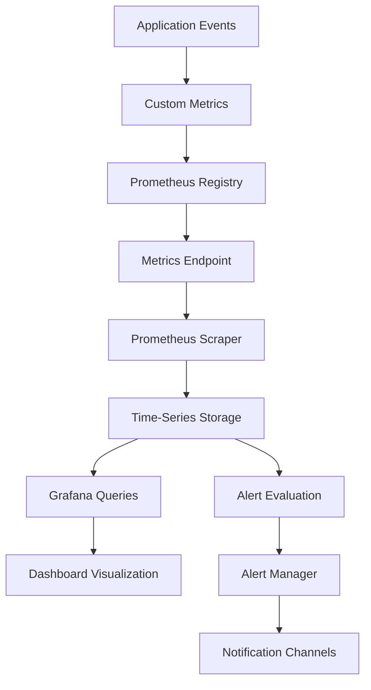
```mermaid
graph TD
    A[Application Events] --> B[Custom Metrics]
    B --> C[Prometheus Registry]
    C --> D[Metrics Endpoint]
    
    D --> E[Prometheus Scraper]
    E --> F[Time-Series Storage]
    
    F --> G[Grafana Queries]
    G --> H[Dashboard Visualization]
    
    F --> I[Alert Evaluation]
    I --> J[Alert Manager]
    J --> K[Notification Channels]
```

### 2. Log Data Flow

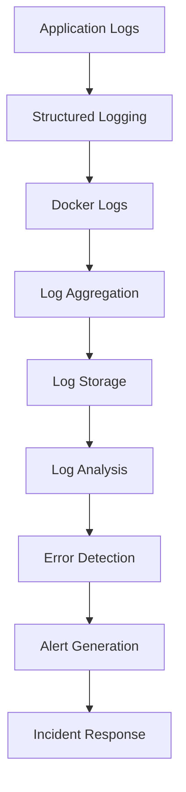
```mermaid
graph TD
    A[Application Logs] --> B[Structured Logging]
    B --> C[Docker Logs]
    C --> D[Log Aggregation]
    
    D --> E[Log Storage]
    E --> F[Log Analysis]
    F --> G[Error Detection]
    
    G --> H[Alert Generation]
    H --> I[Incident Response]
```

## 🔄 Data Consistency Patterns

### 1. Eventual Consistency Model

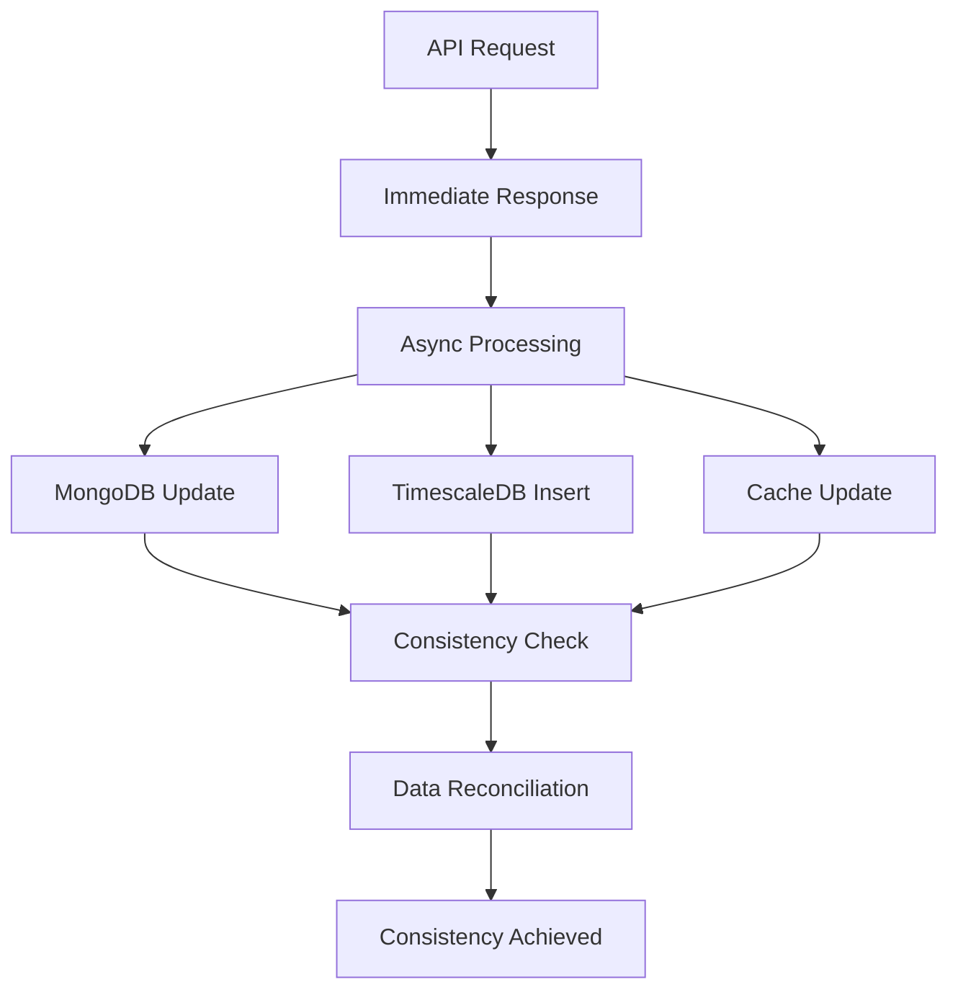
```mermaid
graph TD
    A[API Request] --> B[Immediate Response]
    B --> C[Async Processing]
    
    C --> D[MongoDB Update]
    C --> E[TimescaleDB Insert]
    C --> F[Cache Update]
    
    D --> G[Consistency Check]
    E --> G
    F --> G
    
    G --> H[Data Reconciliation]
    H --> I[Consistency Achieved]
```

### 2. Transaction Management

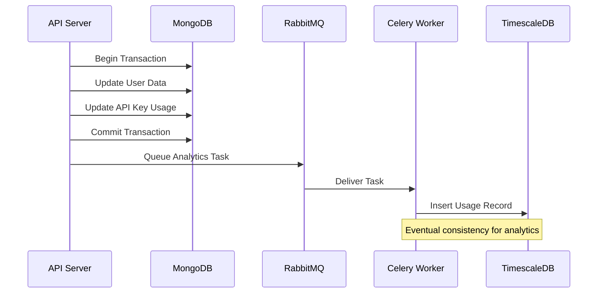
```mermaid
sequenceDiagram
    participant API as API Server
    participant Mongo as MongoDB
    participant Queue as RabbitMQ
    participant Worker as Celery Worker
    participant TS as TimescaleDB
    
    API->>Mongo: Begin Transaction
    API->>Mongo: Update User Data
    API->>Mongo: Update API Key Usage
    API->>Mongo: Commit Transaction
    
    API->>Queue: Queue Analytics Task
    Queue->>Worker: Deliver Task
    Worker->>TS: Insert Usage Record
    
    Note over Worker,TS: Eventual consistency for analytics
```

## 🚀 Performance Optimization Flow

### 1. Caching Strategy

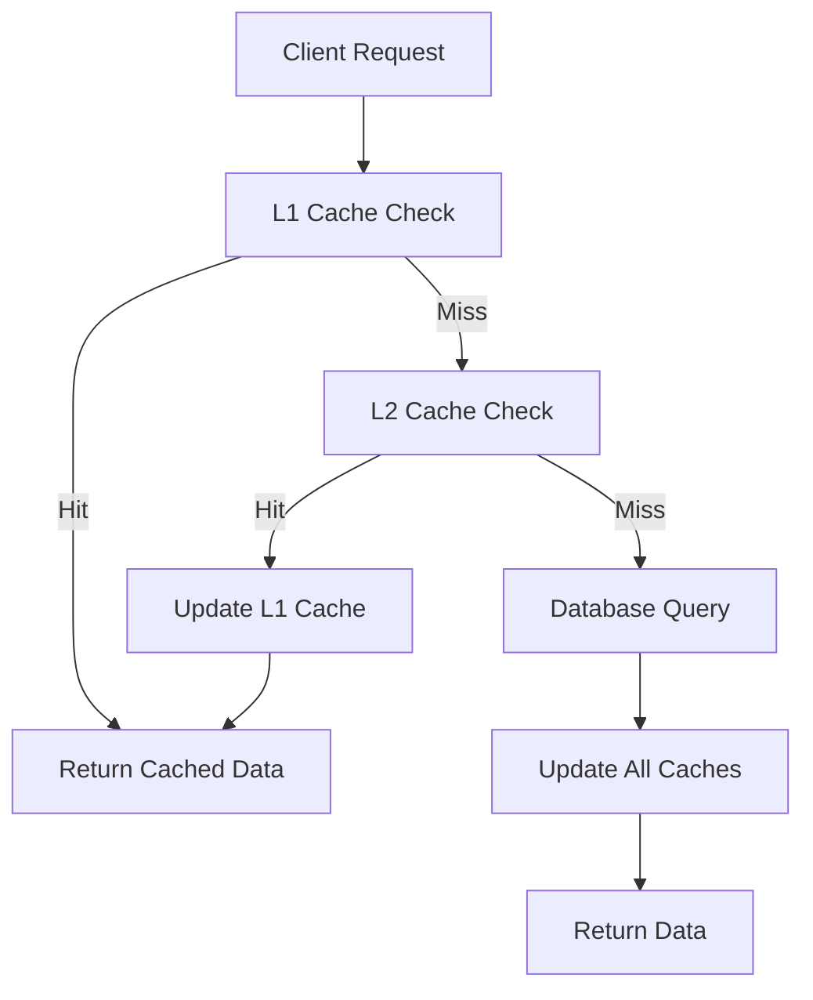
```mermaid
graph TD
    A[Client Request] --> B[L1 Cache Check]
    B -->|Hit| C[Return Cached Data]
    B -->|Miss| D[L2 Cache Check]
    
    D -->|Hit| E[Update L1 Cache]
    D -->|Miss| F[Database Query]
    
    E --> C
    F --> G[Update All Caches]
    G --> H[Return Data]
```

### 2. Load Balancing Flow

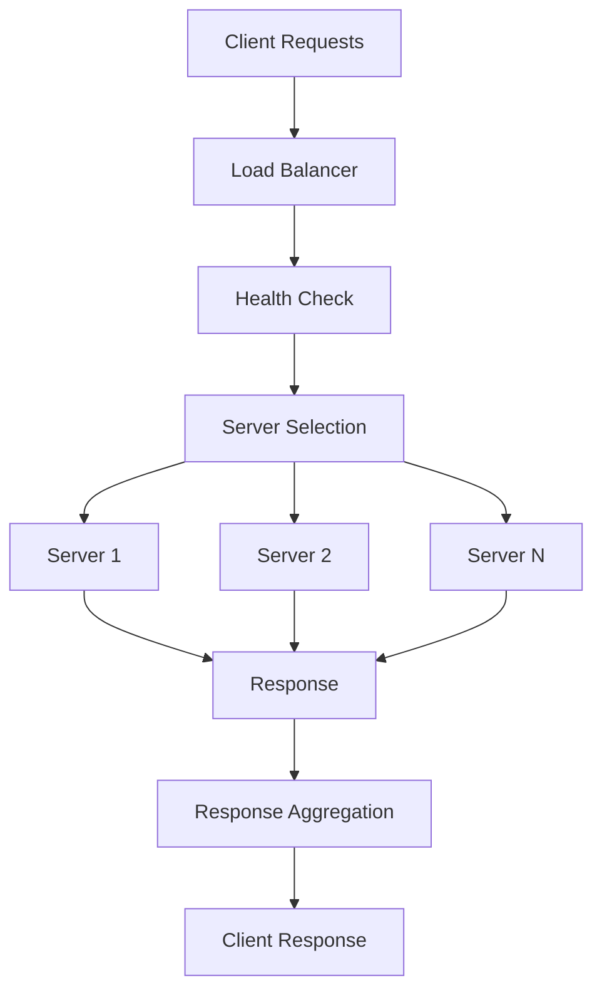
```mermaid
graph TD
    A[Client Requests] --> B[Load Balancer]
    B --> C[Health Check]
    C --> D[Server Selection]
    
    D --> E[Server 1]
    D --> F[Server 2]
    D --> G[Server N]
    
    E --> H[Response]
    F --> H
    G --> H
    
    H --> I[Response Aggregation]
    I --> J[Client Response]
```

## 🔍 Error Handling Flow

### 1. Error Propagation

```mermaid
graph TD
    A[Error Occurrence] --> B[Error Capture]
    B --> C[Error Classification]
    
    C --> D{Error Type}
    D -->|Client Error| E[4xx Response]
    D -->|Server Error| F[5xx Response]
    D -->|System Error| G[Alert Generation]
    
    E --> H[Client Notification]
    F --> I[Error Logging]
    G --> J[Incident Response]
    
    I --> K[Error Analytics]
    J --> K
    K --> L[System Improvement]
```

### 2. Retry Mechanism

```mermaid
sequenceDiagram
    participant Client as Client
    participant API as API Server
    participant Service as External Service
    participant Queue as Retry Queue
    
    Client->>API: Request
    API->>Service: Service Call
    Service-->>API: Error Response
    
    API->>Queue: Queue Retry Task
    API->>Client: Temporary Error Response
    
    Queue->>API: Retry Attempt
    API->>Service: Retry Service Call
    Service-->>API: Success Response
    
    API->>Client: Success Notification (if applicable)
```

This comprehensive data flow architecture ensures reliable, scalable, and observable data processing throughout the Dhruva Platform, supporting both real-time operations and analytical workloads.
