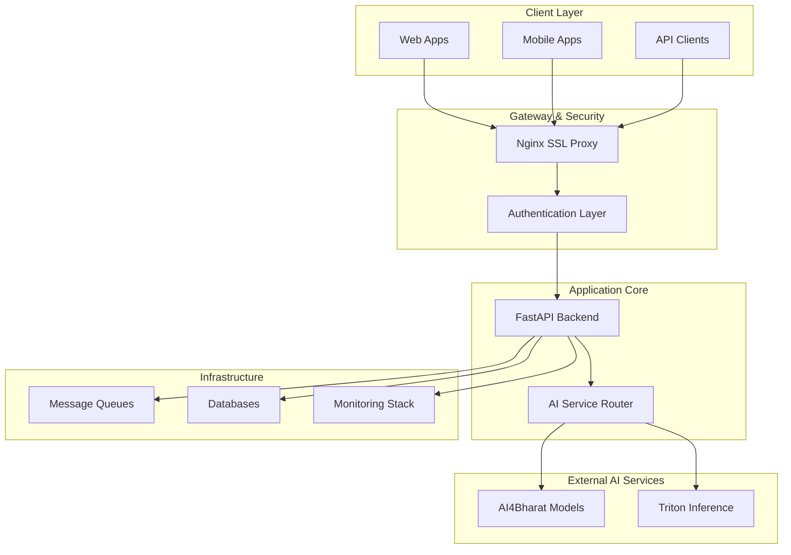

# Dhruva Platform - Executive Architecture Summary

## 🎯 System Overview

### Core Mission
**AI/ML Model Serving Platform for Indian Language Processing**
- Unified API gateway for translation, speech recognition, text-to-speech, and NER services
- Production-ready platform serving 22+ Indian languages
- Enterprise-grade monitoring, metering, and usage analytics

### Key Business Value
- **Simplified AI Integration**: Single API for multiple AI services
- **Cost-Effective Scaling**: Modular monolith reduces operational complexity
- **Comprehensive Analytics**: Real-time usage tracking and performance monitoring
- **Enterprise Security**: Multi-layer authentication with API key and JWT support

---

## 🏗️ High-Level Architecture

### Architecture Pattern: **Modular Monolith with Distributed Infrastructure**

### Why Modular Monolith?
- **Reduced Operational Complexity**: Single deployment unit vs. managing dozens of microservices
- **Simplified Development**: Shared codebase with clear module boundaries
- **Cost Efficiency**: Lower infrastructure overhead compared to distributed microservices
- **Performance**: No network latency between internal service calls

---

## 🔧 Core Components

### 1. **FastAPI Application Server**
- **Async Request Processing**: High-concurrency handling for AI workloads
- **Modular Router Architecture**: Clean separation of authentication, services, and admin functions
- **Real-time Streaming**: WebSocket support for live audio processing
- **Auto-documentation**: Built-in API documentation and testing interfaces

### 2. **AI Service Integration Layer**
- **Multi-Provider Support**: AI4Bharat models + Triton Inference Server
- **Intelligent Routing**: Automatic service selection based on language and task type
- **Health Monitoring**: Continuous service availability checks every 5 minutes
- **Failure Resilience**: Automatic failover and error handling

### 3. **Authentication & Security**
- **Dual Authentication**: API keys for programmatic access, JWT for user sessions
- **Role-Based Access**: Admin, user, and service-level permissions
- **SSL/TLS Encryption**: End-to-end security with certificate management
- **Rate Limiting**: Redis-based request throttling and quota management

---

## 📊 Monitoring & Observability

### Comprehensive Monitoring Stack
- **Prometheus**: Real-time metrics collection and alerting
- **Grafana**: Executive dashboards and performance visualization
- **Custom Metrics**: API usage, response times, error rates by user/service
- **Health Checks**: Multi-layer system health monitoring

### Key Performance Indicators
- **Request Volume**: Total API calls per service type
- **Response Times**: P95/P99 latency tracking across all endpoints
- **Error Rates**: Service availability and failure analysis
- **Usage Analytics**: Per-user consumption and cost tracking

### Business Intelligence Features
- **Usage Metering**: Automatic calculation of service consumption
- **Cost Tracking**: Real-time usage analytics for billing and optimization
- **Performance Analytics**: Service efficiency and bottleneck identification
- **Compliance Reporting**: Audit trails and data governance metrics

---

## ⚡ Performance & Scalability

### Current Performance Characteristics
- **Concurrent Users**: Supports high-concurrency async processing
- **Request Timeout**: 24-hour support for long-running AI inference
- **Multi-Language Support**: 22+ Indian languages with optimized routing
- **Real-time Processing**: WebSocket streaming for live audio/speech

### Scalability Features
- **Horizontal Scaling**: Load balancer ready with multiple server instances
- **Database Scaling**: Dual-database architecture (MongoDB + TimescaleDB)
- **Queue-Based Processing**: Asynchronous background task handling
- **Caching Layer**: Redis-based performance optimization

### Infrastructure Resilience
- **Health Monitoring**: Automated service health checks and status updates
- **Graceful Degradation**: Intelligent error handling and service fallbacks
- **Data Redundancy**: Separate databases for application data and analytics
- **Container Orchestration**: Docker-based deployment with service dependencies

---

## 🚀 Deployment Architecture

### Production-Ready Infrastructure
- **4-Layer Docker Compose**: Database, Application, Metering, Monitoring
- **SSL/TLS Ready**: Let's Encrypt integration with automatic renewal
- **Cloud Agnostic**: Deployable on AWS, Azure, GCP, or on-premises
- **Environment Flexibility**: Development, staging, and production configurations

### Operational Benefits
- **Single Command Deployment**: Complete stack deployment with dependency management
- **Automated Scaling**: Container-based scaling with health check integration
- **Zero-Downtime Updates**: Rolling deployment support with service continuity
- **Backup & Recovery**: Automated data backup with point-in-time recovery

---

## 📈 Business Impact & ROI

### Cost Optimization
- **Reduced Infrastructure Costs**: Monolith efficiency vs. microservices overhead
- **Operational Simplicity**: Single deployment reduces DevOps complexity
- **Shared Resources**: Efficient resource utilization across all AI services
- **Predictable Scaling**: Clear scaling patterns with measurable performance metrics

### Developer Productivity
- **Unified API**: Single integration point for multiple AI services
- **Comprehensive Documentation**: Auto-generated API docs and testing tools
- **Real-time Debugging**: Integrated logging and monitoring for rapid issue resolution
- **Flexible Authentication**: Multiple auth methods for different use cases

### Enterprise Readiness
- **Production Monitoring**: 24/7 observability with alerting and dashboards
- **Security Compliance**: Enterprise-grade authentication and encryption
- **Usage Analytics**: Detailed consumption tracking for cost management
- **Audit Capabilities**: Complete request/response logging for compliance

---

## 🎯 Strategic Advantages

### Technical Excellence
- **Modern Architecture**: FastAPI + async processing for high performance
- **Proven Technologies**: Battle-tested components (Nginx, PostgreSQL, Redis, RabbitMQ)
- **Observability First**: Built-in monitoring and analytics from day one
- **API-First Design**: Clean, documented interfaces for easy integration

### Business Agility
- **Rapid Feature Development**: Modular architecture enables fast iteration
- **Market Responsiveness**: Easy addition of new AI services and capabilities
- **Cost Transparency**: Real-time usage tracking enables accurate pricing
- **Scalable Growth**: Architecture supports expansion without major rewrites

### Competitive Positioning
- **Multi-Language AI Platform**: Comprehensive Indian language support
- **Enterprise Integration**: Production-ready with monitoring and security
- **Developer Experience**: Superior API design and documentation
- **Operational Excellence**: Automated deployment and monitoring capabilities
