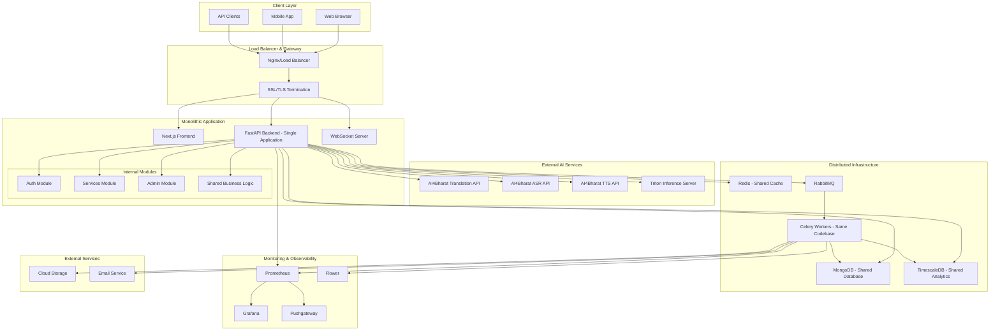
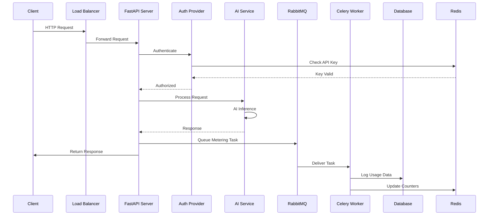
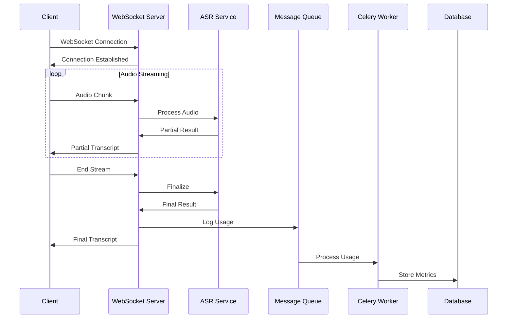
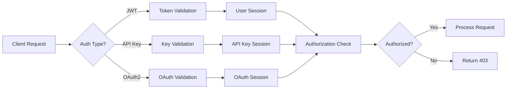
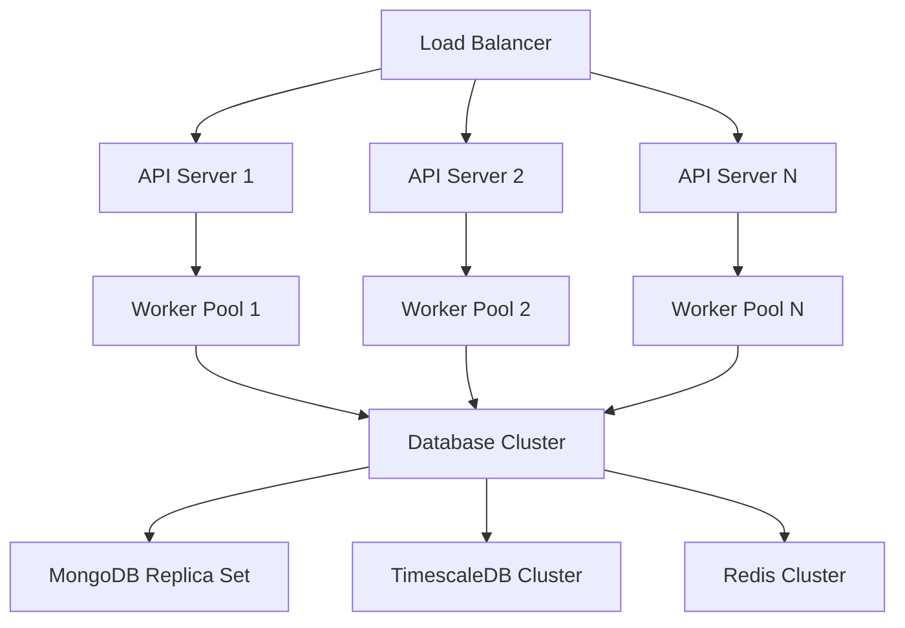
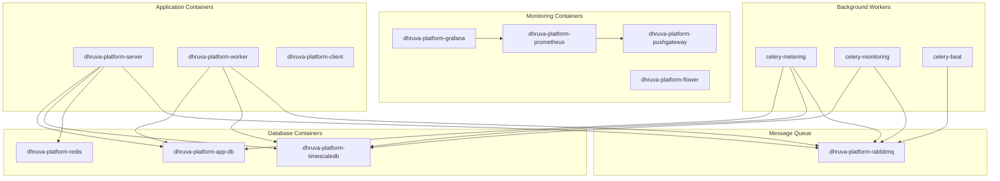

# System Architecture Overview

## 🏗️ High-Level Architecture

The Dhruva Platform is a comprehensive AI/ML model serving platform built on a **modular monolithic architecture** with distributed infrastructure components, designed for reliability and performance in serving Indian language processing models.

## ⚠️ Architecture Clarification

**Important**: This platform follows a **modular monolith pattern**, not microservices. All application logic resides in a single codebase with well-defined internal modules, supported by distributed infrastructure services (databases, message queues, monitoring).

## 🌐 System Architecture Diagram

## 🔧 Core Components

### 1. Monolithic Application Core
- **Single Codebase**: All application logic in unified codebase
- **FastAPI Backend**: Single application with multiple internal modules
- **Shared Dependencies**: Common database connections and business logic
- **Internal Routing**: Module-to-module communication via direct function calls

### 2. Frontend Layer (Next.js)
- **Purpose**: User interface and experience
- **Technology**: Next.js 13, TypeScript, Chakra UI
- **Features**:
  - Responsive web interface
  - Real-time AI service testing
  - Admin dashboard
  - User management
  - Service monitoring

### 3. Internal Modules (Within Monolith)
- **Auth Module**: JWT tokens, API keys, OAuth2 authentication
- **Services Module**: AI service routing and management
- **Admin Module**: Administrative operations and user management
- **Shared Business Logic**: Common utilities and data access

### 4. External AI Services (Not Internal)
- **AI4Bharat APIs**: External HTTP endpoints for AI models
- **Translation**: Multi-language neural machine translation
- **ASR**: Automatic speech recognition with streaming
- **TTS**: Text-to-speech synthesis
- **NER**: Named entity recognition
- **Transliteration**: Script conversion

### 5. Distributed Infrastructure
- **MongoDB**: Shared application database
- **TimescaleDB**: Shared time-series analytics database
- **Redis**: Shared caching and session storage
- **RabbitMQ**: Message queue for background tasks
- **Celery Workers**: Background processing (same codebase as main app)

### 6. Monitoring Stack
- **Prometheus**: Metrics collection and storage
- **Grafana**: Visualization and dashboards
- **Pushgateway**: Batch job metrics
- **Flower**: Celery task monitoring

## 🔄 Data Flow Architecture

### Request Processing Flow

### Streaming Data Flow

## 🏛️ Architectural Patterns

### 1. Modular Monolith Architecture
- **Single Deployment Unit**: All application logic deployed together
- **Module Separation**: Clear internal boundaries between functional areas
- **Shared Infrastructure**: Common database connections and utilities
- **Internal Communication**: Direct function calls between modules

### 2. Event-Driven Background Processing
- **Message Queues**: Asynchronous task processing via RabbitMQ
- **Event Sourcing**: Audit trail and data consistency for usage tracking
- **CQRS Pattern**: Separate read (TimescaleDB) and write (MongoDB) models

### 3. Layered Architecture
- **Presentation Layer**: Next.js frontend and FastAPI endpoints
- **Business Logic Layer**: Internal modules with shared services
- **Data Access Layer**: Repository pattern with shared database connections
- **Infrastructure Layer**: External AI services and distributed components

### 4. Distributed Infrastructure Pattern
- **Shared Databases**: MongoDB and TimescaleDB accessed by all modules
- **Distributed Caching**: Redis for application-wide caching
- **External Service Integration**: HTTP calls to AI4Bharat APIs
- **Background Processing**: Celery workers for asynchronous tasks

## 🔒 Security Architecture

### Authentication Flow

### Security Layers
1. **Network Security**: SSL/TLS encryption, firewall rules
2. **Application Security**: Input validation, SQL injection prevention
3. **Authentication**: Multi-factor authentication options
4. **Authorization**: Role-based and resource-based access control
5. **Data Security**: Encryption at rest and in transit

## 📊 Scalability Design

### Horizontal Scaling

### Scaling Strategies
- **API Servers**: Stateless design for easy horizontal scaling
- **Worker Processes**: Auto-scaling based on queue depth
- **Database Sharding**: Horizontal partitioning for large datasets
- **Caching**: Distributed caching for improved performance

## 🔧 Technology Stack

### Backend Technologies
- **Runtime**: Python 3.12
- **Web Framework**: FastAPI
- **Task Queue**: Celery with RabbitMQ
- **ORM**: SQLAlchemy (TimescaleDB), PyMongo (MongoDB)
- **Authentication**: PyJWT, Argon2, OAuth2

### Frontend Technologies
- **Framework**: Next.js 13
- **Language**: TypeScript
- **UI Library**: Chakra UI
- **State Management**: TanStack React Query
- **Real-time**: Socket.IO

### Infrastructure Technologies
- **Containerization**: Docker, Docker Compose
- **Orchestration**: Kubernetes (optional)
- **Monitoring**: Prometheus, Grafana
- **Databases**: MongoDB, TimescaleDB, Redis
- **Message Queue**: RabbitMQ

### External Integrations
- **AI Models**: AI4Bharat model endpoints
- **Cloud Storage**: AWS S3 (configurable)
- **Email Service**: SMTP/SendGrid
- **OAuth Providers**: Google, GitHub

## 🚀 Deployment Architecture

### Container Architecture

### Environment Separation
- **Development**: Local Docker Compose setup
- **Staging**: Kubernetes cluster with reduced resources
- **Production**: Full Kubernetes deployment with HA

## 📈 Performance Characteristics

### Throughput Targets
- **API Requests**: 1000+ requests/second
- **Concurrent Users**: 500+ simultaneous users
- **Streaming Connections**: 100+ concurrent streams
- **Background Tasks**: 10,000+ tasks/hour

### Latency Targets
- **API Response Time**: < 200ms (95th percentile)
- **Database Queries**: < 50ms (average)
- **Cache Access**: < 5ms (average)
- **AI Inference**: < 2s (service dependent)

### Availability Targets
- **System Uptime**: 99.9% availability
- **Database Availability**: 99.95% availability
- **Recovery Time**: < 5 minutes (RTO)
- **Data Loss**: < 1 minute (RPO)

## 🔄 Data Consistency Model

### Consistency Patterns
- **Strong Consistency**: User authentication and authorization
- **Eventual Consistency**: Usage metrics and analytics
- **Weak Consistency**: Caching and temporary data

### Transaction Management
- **ACID Transactions**: Critical user data operations
- **Saga Pattern**: Distributed transaction coordination
- **Idempotency**: Safe retry mechanisms for all operations

## 🛠️ Development & Operations

### CI/CD Pipeline
1. **Code Commit**: Git-based version control
2. **Automated Testing**: Unit, integration, and E2E tests
3. **Build Process**: Docker image creation
4. **Deployment**: Automated deployment to environments
5. **Monitoring**: Health checks and performance monitoring

### Operational Procedures
- **Health Monitoring**: Automated health checks
- **Log Aggregation**: Centralized logging system
- **Backup Strategy**: Automated database backups
- **Disaster Recovery**: Multi-region deployment capability

## 🔮 Future Architecture Considerations

### Planned Enhancements
- **Multi-region Deployment**: Global distribution for reduced latency
- **Advanced Caching**: CDN integration for static content
- **ML Pipeline**: Automated model training and deployment
- **API Versioning**: Backward compatibility management
- **Service Mesh**: Advanced microservices communication

### Scalability Roadmap
- **Auto-scaling**: Dynamic resource allocation
- **Database Sharding**: Horizontal database scaling
- **Edge Computing**: Regional AI model deployment
- **Event Streaming**: Real-time data processing pipeline
