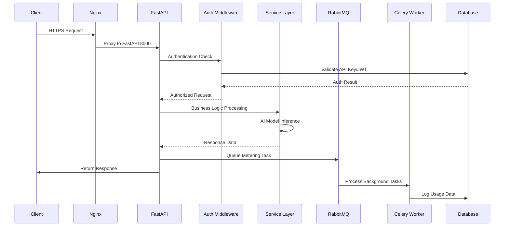
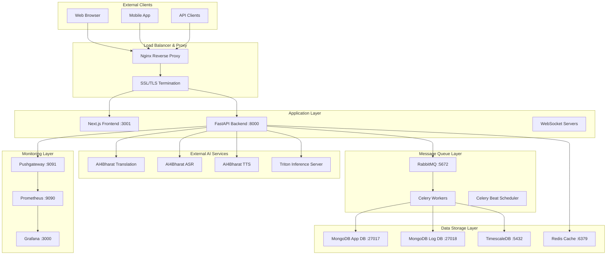
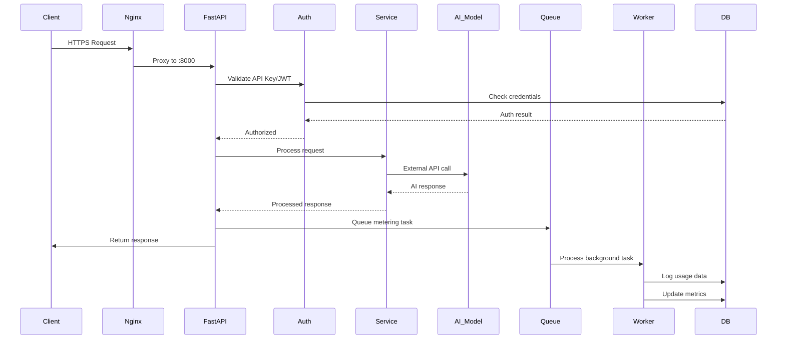

# Dhruva Platform Technical Architecture Analysis

## Executive Summary

The Dhruva Platform implements a **modular monolith architecture** with distributed infrastructure components, designed for AI/ML model serving with comprehensive monitoring, metering, and observability. The system processes requests through a sophisticated pipeline involving reverse proxy routing, authentication middleware, async request processing, background task queues, and multi-database storage.

## 1. Request Routing & Processing Architecture

### 1.1 Nginx Reverse Proxy Configuration

The platform uses Nginx as the primary entry point with SSL/TLS termination and request routing:

**Configuration Structure:**
```nginx
# HTTPS Server Block (Port 443)
server {
    listen 443 ssl http2 default_server;
    listen [::]:443 ssl http2 default_server;
    
    # SSL Configuration
    ssl_protocols TLSv1.2 TLSv1.3;
    ssl_ciphers ECDHE-RSA-AES128-GCM-SHA256:ECDHE-RSA-AES256-GCM-SHA384;
    ssl_session_cache shared:SSL:10m;
    ssl_session_timeout 10m;
    
    # Next.js Frontend Proxy
    location /dhruva {
        proxy_pass http://localhost:3001;
        proxy_http_version 1.1;
        proxy_set_header Upgrade $http_upgrade;
        proxy_set_header Connection 'upgrade';
        proxy_set_header Host $host;
        proxy_set_header X-Real-IP $remote_addr;
        proxy_set_header X-Forwarded-For $proxy_add_x_forwarded_for;
        proxy_set_header X-Forwarded-Proto $scheme;
        proxy_cache_bypass $http_upgrade;
        proxy_read_timeout 86400;  # 24-hour timeout for long requests
    }
}
```

**Key Features:**
- **SSL/TLS Termination**: Handles HTTPS encryption/decryption
- **HTTP to HTTPS Redirect**: Automatic 301 redirects for security
- **WebSocket Support**: Upgrade headers for real-time streaming
- **Long Request Timeout**: 86400 seconds for AI inference operations
- **Health Check Endpoint**: `/health` for load balancer monitoring

### 1.2 FastAPI Application Structure

**Main Application Setup:**
```python
# server/main.py
app = FastAPI(
    title="Dhruva API",
    description="Backend API for communicating with the Dhruva platform",
)

# Middleware Stack (Order Matters)
app.add_middleware(CORSMiddleware, allow_origins=["*"])
app.add_middleware(PrometheusGlobalMetricsMiddleware, 
                   app_name="Dhruva", 
                   custom_labels=["api_key_name", "user_id"])
app.add_middleware(DBSessionMiddleware, custom_engine=engine)

# Router Registration
app.include_router(ServicesApiRouter)  # /services/*
app.include_router(AuthApiRouter)      # /auth/*

# Mounted Applications
app.mount("/metrics", metrics_app)           # Prometheus metrics
app.mount("/socket.io", streamer.app)        # Real-time streaming
app.mount("/socket_asr.io", streamer_asr.app) # ASR streaming
```

### 1.3 Request Lifecycle Flow



### 1.4 Router Architecture

**Hierarchical Router Structure:**
```python
# Services Router (/services)
ServicesApiRouter
├── AdminApiRouter      (/admin)     - Admin dashboard, health management
├── DetailsApiRouter    (/details)   - Service/model metadata
├── InferenceApiRouter  (/inference) - AI model inference endpoints
└── FeedbackApiRouter   (/feedback)  - User feedback collection

# Authentication Router (/auth)
AuthApiRouter
├── AuthApiRouter       (/auth)      - Login/logout, JWT management
├── ApiKeyApiRouter     (/api-key)   - API key CRUD operations
└── UserApiRouter       (/user)      - User management
```

**Endpoint Mapping Examples:**
- `POST /services/inference/translation` → Translation AI service
- `POST /services/inference/asr` → Automatic Speech Recognition
- `GET /services/details/list_services` → Available services metadata
- `POST /auth/signin` → JWT token authentication
- `GET /auth/api-key/list` → User's API keys

## 2. Latency Management & Performance Optimization

### 2.1 Async/Await Implementation

**FastAPI Async Endpoints:**
```python
# server/module/services/router/inference_router.py
@router.post("/translation", response_model=ULCATranslationInferenceResponse)
async def _run_inference_translation(
    request: ULCATranslationInferenceRequest,
    request_state: Request,
    params: ULCAInferenceQuery = Depends(),
    inference_service: InferenceService = Depends(InferenceService),
):
    return await inference_service.run_translation_triton_inference(
        request, request_state.state.api_key_name, request_state.state.user_id
    )
```

**Benefits:**
- **Non-blocking I/O**: Concurrent request handling
- **Resource Efficiency**: Single thread handles multiple requests
- **Scalability**: Supports high-concurrency workloads

### 2.2 Timeout Configurations

**Current Timeout Settings:**
```python
# Nginx Proxy Timeout
proxy_read_timeout 86400;  # 24 hours for long AI inference

# Triton Client Timeout
response = triton_client.async_infer(
    model_name, inputs=input_list, outputs=output_list,
    headers=headers
).get_result(block=True, timeout=20)  # 20 seconds for model inference
```

**Recommended Enhancements:**
```python
# server/config/timeout_config.py (PROPOSED)
class TimeoutConfig:
    NGINX_PROXY_TIMEOUT = 86400      # 24 hours
    TRITON_INFERENCE_TIMEOUT = 120   # 2 minutes
    HTTP_CLIENT_TIMEOUT = 30         # 30 seconds
    DATABASE_QUERY_TIMEOUT = 10      # 10 seconds
    REDIS_OPERATION_TIMEOUT = 5      # 5 seconds
```

### 2.3 Connection Pooling & Caching

**MongoDB Connection Management:**
```python
# server/db/database.py
db_client: Dict[str, Optional[MongoClient]] = {}

def AppDatabase() -> Database:
    mongo_db = db_client["app"][os.environ["APP_DB_NAME"]]
    return mongo_db
```

**Redis Caching Implementation:**
```python
# server/cache/app_cache.py
def get_cache_connection():
    return get_redis_connection(
        host=os.environ.get("REDIS_HOST"),
        port=os.environ.get("REDIS_PORT"),
        db=os.environ.get("REDIS_DB"),
        password=os.environ.get("REDIS_PASSWORD"),
        ssl=os.environ.get("REDIS_SECURE") == "true",
    )
```

**Performance Optimization Opportunities:**
1. **Connection Pool Configuration**: Implement proper pool sizing
2. **Async Database Drivers**: Migrate to Motor for MongoDB async operations
3. **Request-level Caching**: Cache frequently accessed service metadata
4. **HTTP Client Pooling**: Implement httpx.AsyncClient with connection limits

### 2.4 Concurrent Request Processing

**Uvicorn Server Configuration:**
```python
# Production deployment
uvicorn.run("main:app", host="0.0.0.0", port=8000, workers=2)
```

**Streaming Server Configuration:**
```python
# server/main.py
streamer = StreamingServerTaskSequence(
    max_connections=int(os.environ.get("MAX_SOCKET_CONNECTIONS_PER_WORKER", -1))
)
```

## 3. Task Queue & Background Processing Architecture

### 3.1 Celery Configuration

**Celery Application Setup:**
```python
# server/celery_backend/celery_app.py
app = Celery("dhruva_celery")
app.config_from_object("celery_backend.celeryconfig")

# Queue Configuration
app.conf.task_queues = (
    Queue("data-log", exchange=Exchange("logs", type="direct")),
    Queue("metrics-log", exchange=Exchange("metrics", type="direct")),
    Queue("heartbeat", exchange=Exchange("heartbeat", type="direct")),
    Queue("upload-feedback-dump", exchange=Exchange("upload-feedback-dump", type="direct")),
    Queue("send-usage-email", exchange=Exchange("send-usage-email", type="direct")),
)

# Task Routing
app.conf.task_routes = {
    'push.metrics': {'queue': 'metrics-log'},
    'log.data': {'queue': 'data-log'},
    'heartbeat': {'queue': 'heartbeat'},
    'upload.feedback.dump': {'queue': 'upload-feedback-dump'},
    'send.usage.email': {'queue': 'send-usage-email'},
}
```

### 3.2 Worker Distribution Strategy

**Container-based Worker Separation:**
```yaml
# docker-compose-metering.yml
celery-metering:
  command: celery -A celery_backend.celery_app worker -Q data-log,heartbeat,upload-feedback-dump,send-usage-email

celery-monitoring:
  command: celery -A celery_backend.celery_app worker -Q metrics-log

celery_beat:
  command: celery -A celery_backend.celery_app beat --loglevel DEBUG
```

**Queue Specialization:**
- **data-log**: Usage metering, request logging
- **metrics-log**: Prometheus metrics pushing
- **heartbeat**: Service health monitoring
- **upload-feedback-dump**: Monthly feedback aggregation
- **send-usage-email**: Weekly usage reports

### 3.3 RabbitMQ Message Routing

**RabbitMQ Configuration:**
```json
{
  "users": [{"name": "admin", "password": "admin123", "tags": "administrator"}],
  "vhosts": [{"name": "dhruva_host"}],
  "permissions": [{
    "user": "admin", "vhost": "dhruva_host",
    "configure": ".*", "write": ".*", "read": ".*"
  }]
}
```

**Exchange and Queue Topology:**
- **Direct Exchanges**: One exchange per task type for precise routing
- **Durable Queues**: Persistent message storage
- **Manual Acknowledgment**: Ensures task completion before removal

### 3.4 Background Task Workflows

**Metering Pipeline:**
```python
# server/module/services/router/inference_router.py
log_data.apply_async(
    (usage_type, service_id, client_ip, enable_tracking, 
     error_msg, api_key_id, req_body, res_body, response_time),
    queue="data-log"
)
```

**Scheduled Tasks:**
```python
# server/celery_backend/celery_app.py
app.conf.beat_schedule = {
    "heartbeat": {
        "task": "heartbeat",
        "schedule": 300.0,  # Every 5 minutes
        "options": {"queue": "heartbeat"},
    },
    "send-usage-email": {
        "task": "send.usage.email",
        "schedule": crontab(day_of_week="1", hour="3", minute="0"),  # Weekly
        "options": {"queue": "send-usage-email"},
    },
}
```

## 4. Service Architecture & Inter-Service Communication

### 4.1 Modular Monolith Pattern

**Architecture Classification:**
The Dhruva Platform implements a **modular monolith** rather than true microservices:

```python
# server/module/services/service/inference_service.py
class InferenceService:
    async def run_translation_triton_inference(self, ...): pass
    async def run_asr_triton_inference(self, ...): pass
    async def run_tts_triton_inference(self, ...): pass
    async def run_ner_triton_inference(self, ...): pass
```

**Key Characteristics:**
- **Single Deployment Unit**: All services in one FastAPI application
- **Shared Database Connections**: Common MongoDB and Redis instances
- **Internal Method Calls**: No network overhead between "services"
- **Unified Error Handling**: Consistent exception management across modules

### 4.2 External Service Integration

**AI4Bharat Model Gateway:**
```python
# server/module/services/gateway/inference_gateway.py
class InferenceGateway:
    def send_inference_request(self, request_body: Any, service: Service) -> dict:
        try:
            response = requests.post(service.endpoint, json=request_body.dict())
        except:
            raise BaseError(Errors.DHRUVA101.value, traceback.format_exc())

        if response.status_code >= 400:
            raise BaseError(Errors.DHRUVA102.value)

        return response.json()
```

**Triton Inference Server Integration:**
```python
def send_triton_request(self, url: str, headers: dict, model_name: str,
                       input_list: list, output_list: list):
    triton_client = http_client.InferenceServerClient(
        url=endpoint, ssl=False, concurrency=20
    )

    response = triton_client.async_infer(
        model_name, model_version="1",
        inputs=input_list, outputs=output_list, headers=headers
    )
    return response.get_result(block=True, timeout=20)
```

### 4.3 Service Discovery & Configuration

**Service Registry Pattern:**
```python
# server/module/services/service/details_service.py
def list_services(self) -> List[ServiceListResponse]:
    services_list = self.service_repository.find_all()

    for service in services_list:
        model = self.model_repository.get_one({"modelId": service.modelId})
        response_list.append(ServiceListResponse(
            **service.dict(), task=model.task, languages=model.languages
        ))
```

**Auto-Service Selection:**
```python
def __auto_select_service_id(self, task_type: _ULCATaskType, config: Dict[str, Any]) -> str:
    match task_type:
        case _ULCATaskType.ASR:
            if config["language"]["sourceLanguage"] == "en":
                return "ai4bharat/whisper-medium-en--gpu--t4"
            elif config["language"]["sourceLanguage"] == "hi":
                return "ai4bharat/conformer-hi-gpu--t4"
        case _ULCATaskType.TRANSLATION:
            return "ai4bharat/indictrans-v2-all-gpu--t4"
```

### 4.4 Failure Handling & Retry Mechanisms

**Error Classification System:**
```python
# server/module/services/error/errors.py
class Errors(Enum):
    DHRUVA101 = {"kind": "DHRUVA-101", "message": "Failed to send request"}
    DHRUVA102 = {"kind": "DHRUVA-102", "message": "Request responded with failed status"}
    DHRUVA107 = {"kind": "DHRUVA-107", "message": "Failed to get triton ready"}
```

**Request-Level Error Handling:**
```python
# server/module/services/router/inference_router.py
try:
    response: Response = await original_route_handler(request)
except BaseError as exc:
    if exc.error_kind in (Errors.DHRUVA101.value["kind"], Errors.DHRUVA102.value["kind"]):
        error_msg = exc.error_kind + "_" + exc.error_message
    raise exc
except Exception as other_exception:
    error_msg = str(other_exception)
    raise other_exception
```

**Health Check Implementation:**
```python
# server/celery_backend/tasks/heartbeat.py
@app.task(name="heartbeat", queue="heartbeat")
def inference_heartbeat():
    for service in services:
        try:
            response = requests.post(
                f"{BASE_URL}/services/inference/{service['task']['type']}",
                headers=HEADERS, json=body
            )
            if response.status_code == 200:
                set_health_status(service["serviceId"], "healthy")
            else:
                set_health_status(service["serviceId"], "unhealthy")
        except Exception as e:
            set_health_status(service["serviceId"], "unhealthy")
```

## 5. Monitoring & Observability Infrastructure

### 5.1 Prometheus Metrics Collection

**Custom Metrics Registry:**
```python
# server/custom_metrics.py
registry = CollectorRegistry()

INFERENCE_REQUEST_COUNT = Counter(
    "dhruva_inference_request_total",
    "Total requests made to inference services",
    registry=registry,
    labelnames=("api_key_name", "user_id", "inference_service",
                "task_type", "source_language", "target_language")
)

INFERENCE_REQUEST_DURATION_SECONDS = Histogram(
    "dhruva_inference_request_duration_seconds",
    "Inference Request Duration Seconds",
    registry=registry,
    labelnames=("api_key_name", "user_id", "inference_service",
                "task_type", "source_language", "target_language")
)
```

**Global Metrics Middleware:**
```python
# server/middleware/prometheus_global_metrics_middleware.py
class PrometheusGlobalMetricsMiddleware(BaseHTTPMiddleware):
    async def dispatch(self, request: Request, call_next):
        begin = time.perf_counter()
        response = await call_next(request)

        labels = [request.method, request.url.components.path,
                 int(response.status_code), self.app_name,
                 *self._get_custom_labels_values(request)]

        self.request_count.labels(*labels).inc()
        end = time.perf_counter()
        self.request_duration_seconds.labels(*labels).observe(end - begin)

        # Async metrics pushing to avoid blocking
        push_metrics.apply_async(
            (jsonpickle.encode(self.registry, keys=True),),
            queue="metrics-log"
        )

        return response
```

### 5.2 Monitoring Stack Configuration

**Prometheus Configuration:**
```yaml
# prometheus/prometheus.yml
global:
  scrape_interval: 15s
  external_labels:
    monitor: "codelab-monitor"

scrape_configs:
  - job_name: "prometheus"
    scrape_interval: 5s
    static_configs:
      - targets: ["dhruva-platform-pushgateway:9091"]

  - job_name: "prom-aggregation-gateway"
    scrape_interval: 5s
    static_configs:
      - targets: ["dhruva-platform-pushgateway:9091"]
```

**Grafana Integration:**
```yaml
# docker-compose-monitoring.yml
grafana:
  image: grafana/grafana:latest
  environment:
    - GF_SECURITY_ADMIN_USER=${GRAFANA_ADMIN_USER}
    - GF_SECURITY_ADMIN_PASSWORD=${GRAFANA_ADMIN_PASSWORD}
    - GF_USERS_ALLOW_SIGN_UP=false
  volumes:
    - grafana_data:/var/lib/grafana
    - ./grafana/provisioning:/etc/grafana/provisioning
```

### 5.3 Health Check Mechanisms

**Container Health Checks:**
```yaml
# docker-compose-db.yml
app_db:
  healthcheck:
    test: echo 'db.runCommand("ping").ok' | mongosh localhost:27017/test --quiet
    interval: 10s
    timeout: 10s
    retries: 5

redis:
  healthcheck:
    test: ["CMD", "redis-cli", "ping"]
    interval: 10s
    timeout: 5s
    retries: 5
```

**Application Health Endpoints:**
```nginx
# Nginx health check
location /health {
    access_log off;
    return 200 "healthy\n";
    add_header Content-Type text/plain;
}
```

**Service-Level Health Monitoring:**
```python
# Automated service health checks every 5 minutes
def send_heartbeat(services: List[Dict[str, Any]], models: Dict[str, Any]):
    success = 0
    failure = 0

    for service in services:
        try:
            response = requests.post(inference_endpoint, headers=HEADERS, json=body)
            if response.status_code == 200:
                success += 1
                set_health_status(service["serviceId"], "healthy")
            else:
                failure += 1
                set_health_status(service["serviceId"], "unhealthy")
        except Exception:
            failure += 1
            set_health_status(service["serviceId"], "unhealthy")

    return (success, failure)
```

### 5.4 Logging Strategy

**Structured Logging Configuration:**
```python
# server/log/logger.py
class LogConfig:
    LOGGER_NAME: str = "dhruva"
    LOG_FORMAT: str = "%(levelprefix)s | %(asctime)s | %(message)s"
    LOG_LEVEL: str = "DEBUG"
```

**Request Logging Pipeline:**
```python
# server/module/services/router/inference_router.py
class InferenceLoggingRoute(APIRoute):
    def get_route_handler(self) -> Callable:
        async def logging_route_handler(request: Request) -> Response:
            start_time = time.time()

            # Capture request/response for logging
            req_body_bytes = await request.body()
            response = await original_route_handler(request)

            # Queue logging task asynchronously
            log_data.apply_async(
                (usage_type, service_id, client_ip, enable_tracking,
                 error_msg, api_key_id, req_body, res_body,
                 time.time() - start_time),
                queue="data-log"
            )

            return response
```

## 6. Performance Bottlenecks & Optimization Opportunities

### 6.1 Identified Performance Issues

**Critical Bottlenecks:**

1. **Synchronous Database Operations**
   - **Location**: `server/auth/auth_token_provider.py`, `server/auth/api_key_provider.py`
   - **Impact**: Blocking async event loop during authentication
   - **Solution**: Migrate to Motor (async MongoDB driver)

2. **Missing Connection Pooling**
   - **Location**: `server/db/database.py`
   - **Current**: Single MongoDB client per request
   - **Recommended**: Connection pool with min/max size configuration

3. **No Request Size Limits**
   - **Location**: `server/main.py`
   - **Risk**: Memory exhaustion from large payloads
   - **Solution**: Add RequestSizeLimitMiddleware (50MB limit)

4. **Inefficient Metrics Pushing**
   - **Location**: `server/middleware/prometheus_global_metrics_middleware.py`
   - **Issue**: Metrics pushed on every request
   - **Solution**: Batch metrics or use pull-based collection

### 6.2 Recommended Optimizations

**Database Connection Pool Enhancement:**
```python
# server/db/async_database.py (PROPOSED)
import motor.motor_asyncio

class AsyncAppDatabase:
    def __init__(self):
        self.client = motor.motor_asyncio.AsyncIOMotorClient(
            os.environ["APP_DB_CONNECTION_STRING"],
            maxPoolSize=50,
            minPoolSize=10,
            maxIdleTimeMS=30000,
            serverSelectionTimeoutMS=5000
        )
        self.db = self.client[os.environ["APP_DB_NAME"]]
```

**HTTP Client Connection Pooling:**
```python
# server/module/services/gateway/llm_gateway.py (PROPOSED)
import httpx

class OptimizedInferenceGateway:
    def __init__(self):
        self.client = httpx.AsyncClient(
            timeout=httpx.Timeout(connect=30.0, read=180.0, write=30.0, pool=300.0),
            limits=httpx.Limits(
                max_keepalive_connections=20,
                max_connections=100,
                keepalive_expiry=30.0
            )
        )
```

**Request Size Middleware:**
```python
# server/middleware/request_size_limit.py (PROPOSED)
class RequestSizeLimitMiddleware(BaseHTTPMiddleware):
    def __init__(self, app, max_size: int = 50 * 1024 * 1024):  # 50MB
        super().__init__(app)
        self.max_size = max_size

    async def dispatch(self, request: Request, call_next):
        content_length = request.headers.get("content-length")
        if content_length and int(content_length) > self.max_size:
            raise HTTPException(status_code=413, detail="Request too large")
        return await call_next(request)
```

## 7. System Architecture Diagrams

### 7.1 High-Level System Architecture



### 7.2 Request Processing Flow



## 8. Deployment Architecture

### 8.1 Docker Compose Multi-Service Setup

**Service Distribution:**
```yaml
# 4-file Docker Compose architecture
docker-compose-db.yml:      # Data layer
  - MongoDB (app_db, log_db)
  - Redis cache
  - TimescaleDB
  - Mongo Express

docker-compose-app.yml:     # Application layer
  - FastAPI server
  - Celery worker
  - Flower monitoring

docker-compose-metering.yml: # Background processing
  - RabbitMQ
  - Celery metering workers
  - Celery monitoring workers
  - Celery beat scheduler

docker-compose-monitoring.yml: # Observability
  - Prometheus
  - Grafana
  - Pushgateway
```

**Network Configuration:**
```yaml
networks:
  dhruva-network:
    name: dhruva-network
    driver: bridge
```

### 8.2 Production Deployment Considerations

**Scaling Recommendations:**
1. **Horizontal Scaling**: Multiple FastAPI instances behind load balancer
2. **Database Scaling**: MongoDB replica sets, TimescaleDB read replicas
3. **Queue Scaling**: RabbitMQ clustering, dedicated worker nodes
4. **Cache Scaling**: Redis Cluster for high availability

**Security Enhancements:**
1. **Network Segmentation**: Separate networks for different service tiers
2. **Secret Management**: External secret stores (HashiCorp Vault)
3. **Container Security**: Non-root users, minimal base images
4. **API Rate Limiting**: Redis-based rate limiting middleware

## 9. Key Technical Recommendations

### 9.1 Immediate Improvements (High Priority)

1. **Implement Async Database Operations**
   - Migrate to Motor for MongoDB async operations
   - Add connection pooling with proper sizing
   - Implement database query timeouts

2. **Add Request Size Limits**
   - Implement RequestSizeLimitMiddleware
   - Configure appropriate limits for AI inference payloads
   - Add request validation middleware

3. **Optimize Metrics Collection**
   - Batch metrics pushing to reduce overhead
   - Implement metrics sampling for high-volume endpoints
   - Add circuit breaker for metrics failures

### 9.2 Medium-Term Enhancements

1. **Implement Proper Load Balancing**
   - Add upstream server configuration in Nginx
   - Implement health check-based routing
   - Add session affinity for WebSocket connections

2. **Enhanced Monitoring**
   - Add distributed tracing (Jaeger/Zipkin)
   - Implement structured logging with correlation IDs
   - Add business metrics dashboards

3. **Performance Optimization**
   - Implement response caching for static data
   - Add CDN for static assets
   - Optimize database queries with proper indexing

### 9.3 Long-Term Architectural Evolution

1. **Microservices Migration Path**
   - Extract authentication service
   - Separate inference services by AI model type
   - Implement service mesh (Istio) for inter-service communication

2. **Cloud-Native Enhancements**
   - Kubernetes deployment with auto-scaling
   - Cloud-managed databases and message queues
   - Serverless functions for background processing

3. **Advanced AI/ML Features**
   - Model versioning and A/B testing
   - Real-time model performance monitoring
   - Automated model deployment pipelines

---

## Conclusion

The Dhruva Platform demonstrates a well-architected modular monolith with comprehensive monitoring and metering capabilities. The current architecture effectively handles AI inference workloads while maintaining observability and scalability. Key areas for improvement include async database operations, connection pooling, and enhanced error handling mechanisms.

The platform's strength lies in its unified approach to AI service management, comprehensive metering system, and robust monitoring infrastructure. With the recommended optimizations, it can scale to handle significantly higher loads while maintaining performance and reliability.
