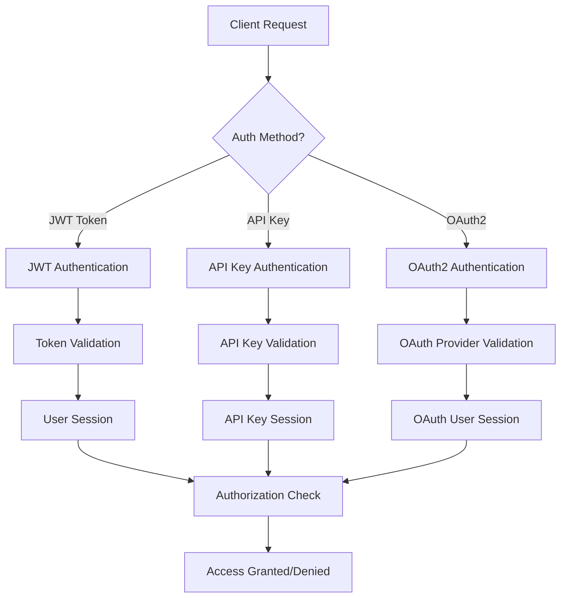
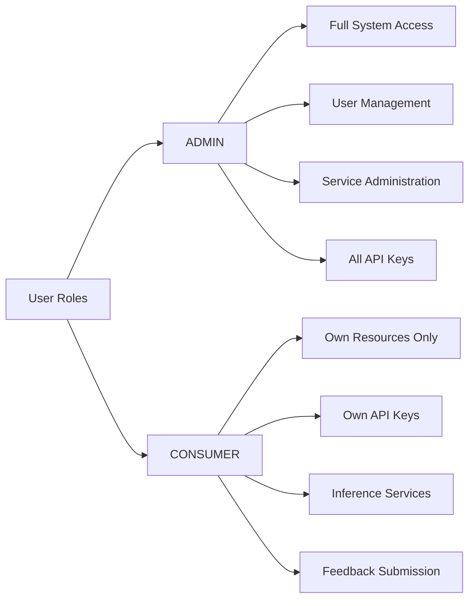

# Authentication & Authorization System

## 🔒 Overview

The Dhruva Platform implements a comprehensive dual authentication system supporting both JWT tokens and API keys, with role-based authorization and OAuth2 integration for secure access to AI services.

## 🏗️ Architecture

### Authentication Methods



### Core Components

1. **AuthProvider**: Central authentication dispatcher
2. **JWT Token Provider**: Handles JWT-based authentication
3. **API Key Provider**: Manages API key authentication
4. **OAuth Provider**: Handles OAuth2 flows (Google, etc.)
5. **Role Authorization**: Role-based access control
6. **Session Management**: User session tracking

## 🔑 Authentication Types

### 1. JWT Token Authentication

**Use Case**: Web application user authentication

**Flow**:
1. User login with email/password
2. Server generates refresh token (1 year expiry)
3. Client exchanges refresh token for access token (30 days expiry)
4. Access token used for API requests

**Headers**:
```http
Authorization: Bearer <access_token>
x-auth-source: AUTH_TOKEN
```

### 2. API Key Authentication

**Use Case**: Programmatic access to AI services

**Types**:
- **PLATFORM**: Administrative operations, user management
- **INFERENCE**: AI model inference, feedback submission

**Headers**:
```http
Authorization: <api_key>
x-auth-source: API_KEY
```

### 3. OAuth2 Authentication

**Use Case**: Third-party authentication (Google, GitHub)

**Features**:
- PKCE (Proof Key for Code Exchange) for security
- State parameter for CSRF protection
- Automatic user creation/linking
- Token encryption and secure storage

## 👥 Authorization System

### User Roles



### API Key Types & Permissions

| API Key Type | Allowed Endpoints | Use Case |
|--------------|------------------|----------|
| **PLATFORM** | `/admin/*`, `/auth/user/*` | User management, admin operations |
| **INFERENCE** | `/services/inference/*`, `/services/feedback/*` | AI model inference, feedback |

## 🔧 Configuration

### Environment Variables

```bash
# JWT Configuration
JWT_SECRET_KEY=your-secret-key
JWT_ALGORITHM=HS256
ACCESS_TOKEN_EXPIRE_MINUTES=43200  # 30 days
REFRESH_TOKEN_EXPIRE_MINUTES=525600  # 1 year

# OAuth2 Configuration
GOOGLE_CLIENT_ID=your-google-client-id
GOOGLE_CLIENT_SECRET=your-google-client-secret
OAUTH_REDIRECT_URI=http://localhost:8000/auth/oauth/google/callback

# Security
ARGON2_HASH_ROUNDS=12
SESSION_TIMEOUT_MINUTES=1440  # 24 hours
```

### Database Collections

**Users Collection**:
```javascript
{
  "_id": ObjectId,
  "name": "string",
  "email": "string",
  "password": "hashed_password",  // Argon2
  "role": "ADMIN|CONSUMER",
  "oauth_providers": [
    {
      "provider": "google",
      "provider_user_id": "string",
      "email": "string"
    }
  ],
  "created_at": Date,
  "updated_at": Date
}
```

**API Keys Collection**:
```javascript
{
  "_id": ObjectId,
  "name": "string",
  "key": "hashed_key",
  "user_id": ObjectId,
  "type": "PLATFORM|INFERENCE",
  "services": [
    {
      "service_id": "string",
      "usage": Number,
      "hits": Number
    }
  ],
  "created_at": Date,
  "is_active": Boolean
}
```

## 🔌 API Endpoints

### Authentication Endpoints

```http
POST /auth/signin
POST /auth/signup
POST /auth/refresh
GET  /auth/user
PATCH /auth/user/modify
POST /auth/logout
```

### OAuth2 Endpoints

```http
GET  /auth/oauth/google/login
GET  /auth/oauth/google/callback
POST /auth/oauth/link
POST /auth/oauth/unlink
```

### API Key Management

```http
GET    /auth/api-keys
POST   /auth/api-keys
DELETE /auth/api-keys/{key_id}
PATCH  /auth/api-keys/{key_id}
```

## 🛡️ Security Features

### Password Security
- **Argon2** hashing with configurable rounds
- **Salt** generation for each password
- **Password complexity** requirements

### Token Security
- **JWT** with configurable expiration
- **Refresh token** rotation
- **Token blacklisting** on logout

### OAuth2 Security
- **PKCE** implementation for authorization code flow
- **State parameter** for CSRF protection
- **Token encryption** for sensitive data storage
- **Scope validation** for permissions

### API Key Security
- **Hashed storage** of API keys
- **Rate limiting** per key
- **Usage tracking** and quotas
- **Automatic expiration** options

## 📊 Monitoring & Metrics

### Authentication Metrics
- Login success/failure rates
- Token refresh frequency
- API key usage patterns
- OAuth2 flow completion rates

### Security Metrics
- Failed authentication attempts
- Suspicious activity detection
- Token expiration events
- API key abuse detection

## 🚀 Usage Examples

### JWT Authentication Flow

```python
# Login
response = requests.post("/auth/signin", {
    "email": "user@example.com",
    "password": "password"
})
refresh_token = response.json()["token"]

# Get access token
response = requests.post("/auth/refresh", {
    "token": refresh_token
})
access_token = response.json()["token"]

# Use access token
headers = {
    "Authorization": f"Bearer {access_token}",
    "x-auth-source": "AUTH_TOKEN"
}
response = requests.get("/services/details/list_services", headers=headers)
```

### API Key Usage

```python
# Use API key for inference
headers = {
    "Authorization": "your-api-key-here",
    "x-auth-source": "API_KEY"
}
response = requests.post("/services/inference/translation", 
                        headers=headers, 
                        json=payload)
```

### OAuth2 Flow

```javascript
// Frontend: Initiate OAuth login
window.location.href = "/auth/oauth/google/login?redirect_uri=/dashboard";

// Backend handles callback and creates/links user
// User is redirected to dashboard with session established
```

## 🔍 Troubleshooting

### Common Issues

1. **Token Expired**: Refresh token or re-authenticate
2. **Invalid API Key**: Check key format and permissions
3. **OAuth Callback Error**: Verify redirect URI configuration
4. **Permission Denied**: Check user role and API key type

### Debug Commands

```bash
# Check user authentication
curl -H "Authorization: Bearer <token>" \
     -H "x-auth-source: AUTH_TOKEN" \
     http://localhost:8000/auth/user

# Validate API key
curl -H "Authorization: <api_key>" \
     -H "x-auth-source: API_KEY" \
     http://localhost:8000/services/details/list_services
```

## 📈 Performance Considerations

- **Redis Caching**: API keys cached for fast lookup
- **Session Management**: MongoDB-based with Redis caching
- **Token Validation**: Optimized JWT verification
- **Database Indexing**: Proper indexes on email, API keys

## 🔄 Migration & Upgrades

When upgrading authentication system:

1. **Backup** user and API key collections
2. **Test** authentication flows in staging
3. **Migrate** OAuth configurations
4. **Update** client applications
5. **Monitor** authentication metrics post-deployment
