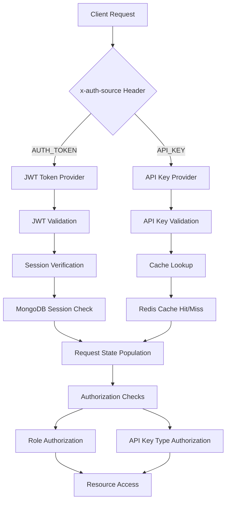
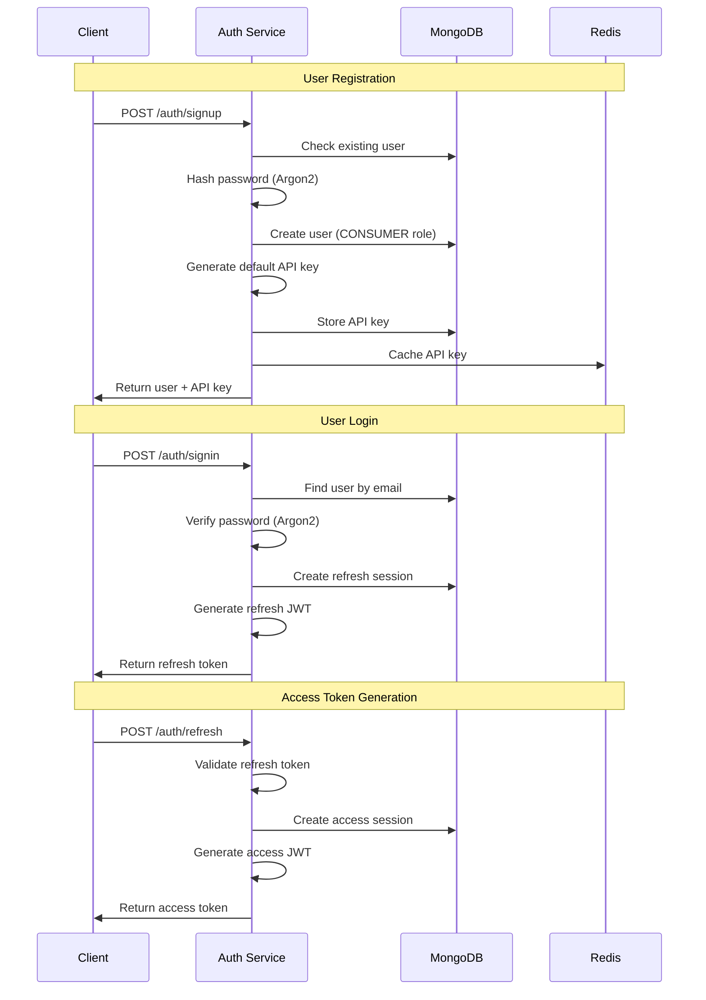
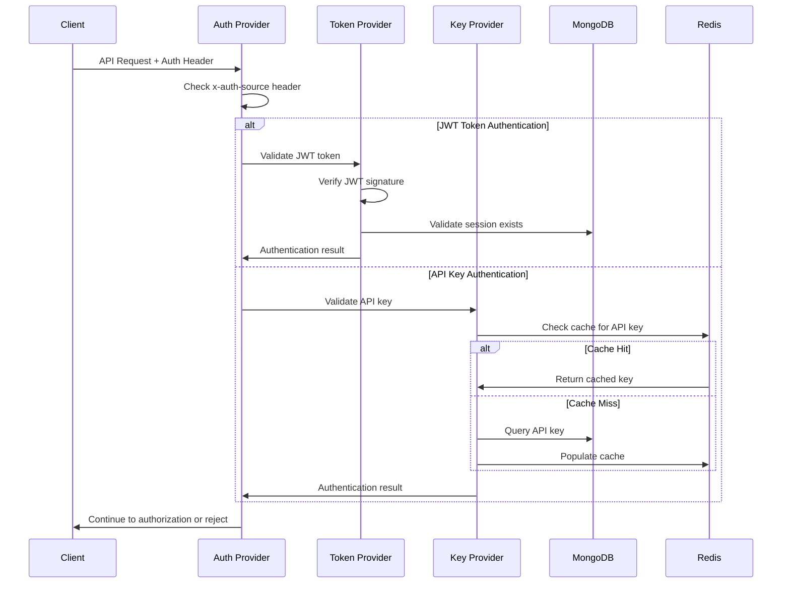
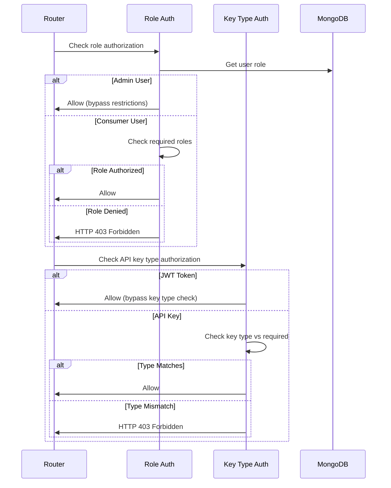

# Dhruva Platform Authentication & Authorization System
## Comprehensive Technical Analysis

### Table of Contents
1. [System Architecture Overview](#system-architecture-overview)
2. [Authentication Methods](#authentication-methods)
3. [Authorization Framework](#authorization-framework)
4. [Database Integration](#database-integration)
5. [API Documentation](#api-documentation)
6. [Technology Stack](#technology-stack)
7. [Security Analysis](#security-analysis)
8. [Performance & Scalability](#performance--scalability)
9. [Implementation Workflows](#implementation-workflows)
10. [Recommendations](#recommendations)

---

## 1. System Architecture Overview

### 1.1 Directory Structure
```
server/
├── auth/                                    # Core authentication providers
│   ├── auth_provider.py                     # Main authentication dispatcher
│   ├── auth_token_provider.py               # JWT token validation
│   ├── api_key_provider.py                  # API key validation
│   ├── role_authorization_provider.py       # Role-based access control
│   ├── api_key_type_authorization_provider.py # API key type validation
│   ├── request_session_provider.py          # Session injection
│   ├── token_type.py                        # Token type enumeration
│   └── errors.py                            # Authentication errors
├── module/auth/                             # Business logic layer
│   ├── model/                               # Data models
│   │   ├── user.py                          # User model
│   │   ├── api_key.py                       # API key model & cache
│   │   └── session.py                       # Session model
│   ├── repository/                          # Data access layer
│   │   ├── user_repository.py               # User CRUD operations
│   │   ├── api_key_repository.py            # API key CRUD operations
│   │   └── session_repository.py            # Session CRUD operations
│   ├── service/                             # Business services
│   │   ├── auth_service.py                  # Authentication business logic
│   │   └── user_service.py                  # User management logic
│   ├── router/                              # API endpoints
│   │   ├── auth_router.py                   # Auth endpoints (signin/signup/refresh)
│   │   ├── api_key_router.py                # API key management endpoints
│   │   └── user_router.py                   # User management endpoints
│   └── error/                               # Business logic errors
└── schema/auth/                             # Request/response schemas
    ├── common/                              # Shared schemas
    ├── request/                             # Request schemas
    └── response/                            # Response schemas
```

### 1.2 Core Components Architecture

The system implements a **dual authentication architecture** supporting:
- **JWT Token Authentication**: For web application users
- **API Key Authentication**: For programmatic access

**Authentication Flow Dispatcher**: `AuthProvider` acts as the central dispatcher, routing requests based on the `x-auth-source` header.

### 1.3 Data Flow Architecture



---

## 2. Authentication Methods

### 2.1 JWT Token Authentication

**Primary Use Case**: Web application user authentication

**Token Types**:
- **Refresh Token**: 1 year expiry, used for obtaining access tokens
- **Access Token**: 30 days expiry, used for API requests

**Implementation Details**:
- **Algorithm**: HS256
- **Secret**: Environment variable `JWT_SECRET_KEY`
- **Header Structure**: `{"tok": "refresh"}` or `{"tok": "access"}`
- **Claims**: `sub` (user_id), `name`, `exp`, `iat`, `sess_id`

**Validation Process** (`auth_token_provider.py`):
1. Extract and verify JWT header
2. Decode token using secret key
3. Validate session exists in MongoDB
4. For inference/feedback endpoints: retrieve default API key
5. Populate request state with user context

### 2.2 API Key Authentication

**Primary Use Case**: Programmatic access to services

**Key Features**:
- **Generation**: 48-byte URL-safe tokens using `secrets.token_urlsafe(48)`
- **Masking**: First 4 + last 4 characters visible, middle masked with asterisks
- **Types**: `PLATFORM` (admin operations) and `INFERENCE` (service access)
- **Caching**: Redis-based caching for performance optimization

**Validation Process** (`api_key_provider.py`):
1. Check Redis cache for API key
2. If cache miss, query MongoDB and populate cache
3. Verify API key is active
4. Populate request state with API key context

---

## 3. Authorization Framework

### 3.1 Role-Based Access Control (RBAC)

**Roles**:
- **ADMIN**: Full system access, can manage users and platform-level operations
- **CONSUMER**: Standard user access, limited to own resources

**Implementation** (`role_authorization_provider.py`):
- Dependency injection pattern using FastAPI
- Admin users bypass all role restrictions
- Consumer users restricted to specified role requirements

### 3.2 API Key Type Authorization

**API Key Types**:
- **PLATFORM**: Administrative operations, user management
- **INFERENCE**: Service access, AI model inference

**Authorization Logic**:
- JWT tokens bypass API key type restrictions
- API key requests validated against required type
- Enforced at router level through dependencies

### 3.3 Session Management

**Session Storage**: MongoDB with the following schema:
```python
class Session(MongoBaseModel):
    user_id: ObjectId      # Reference to user
    type: str             # "refresh" or "access"
    timestamp: datetime   # Creation timestamp
```

---

## 4. Database Integration

### 4.1 MongoDB (Primary Database)

**Connection**: 
- Environment variable: `APP_DB_CONNECTION_STRING`
- Database name: `APP_DB_NAME`

**Collections**:

**Users Collection**:
```python
{
    "_id": ObjectId,
    "name": str,
    "email": str,           # Unique identifier
    "password": str,        # Argon2 hashed
    "role": "ADMIN" | "CONSUMER"
}
```

**API Keys Collection**:
```python
{
    "_id": ObjectId,
    "name": str,            # User-defined name
    "api_key": str,         # 48-byte token
    "masked_key": str,      # Display version
    "active": bool,         # Enable/disable flag
    "user_id": ObjectId,    # Owner reference
    "type": "PLATFORM" | "INFERENCE",
    "created_timestamp": datetime,
    "usage": int,           # Usage counter
    "hits": int,            # Request counter
    "data_tracking": bool,  # Tracking enabled
    "services": [           # Per-service usage
        {
            "service_id": str,
            "usage": int,
            "hits": int
        }
    ]
}
```

**Sessions Collection**:
```python
{
    "_id": ObjectId,
    "user_id": ObjectId,
    "type": "refresh" | "access",
    "timestamp": datetime
}
```

### 4.2 Redis Cache

**Purpose**: High-performance API key validation
**Implementation**: Redis-OM (Object Mapping)
**Cache Model**: `ApiKeyCache` - mirrors API key structure
**Key Strategy**: API key value as primary key

### 4.3 TimescaleDB (Metrics Database)

**Purpose**: Performance metrics and usage tracking
**Connection**: PostgreSQL-compatible with time-series extensions
**Usage**: API key usage metrics, request tracking

---

## 5. API Documentation

### 5.1 Authentication Endpoints (`/auth`)

**POST /auth/signin**
- **Purpose**: User login
- **Request**: `{"email": "user@example.com", "password": "password"}`
- **Response**: `{"id": "user_id", "email": "email", "token": "refresh_token", "role": "CONSUMER"}`
- **Authentication**: None (public endpoint)

**POST /auth/signup**
- **Purpose**: User registration
- **Request**: `{"name": "User Name", "email": "user@example.com", "password": "password"}`
- **Response**: User details + auto-generated default API key
- **Authentication**: None (public endpoint)
- **Auto-creates**: Default INFERENCE API key

**POST /auth/refresh**
- **Purpose**: Exchange refresh token for access token
- **Request**: `{"token": "refresh_token"}`
- **Response**: `{"token": "access_token"}`
- **Authentication**: Valid refresh token

### 5.2 API Key Management Endpoints (`/auth/api-key`)

**GET /auth/api-key/list**
- **Purpose**: List user's API keys
- **Authentication**: Required (JWT or API key)
- **Authorization**: Own resources only (unless admin)

**POST /auth/api-key**
- **Purpose**: Create new API key
- **Request**: `{"name": "key_name", "type": "INFERENCE", "regenerate": false, "data_tracking": true}`
- **Authentication**: Required

**GET /auth/api-key**
- **Purpose**: Get specific API key details
- **Query**: `api_key_name`, `target_user_id` (optional)
- **Authentication**: Required

**PATCH /auth/api-key/modify**
- **Purpose**: Modify API key properties
- **Query**: `api_key_name`, `active`, `data_tracking`
- **Authentication**: Required

### 5.3 User Management Endpoints (`/auth/user`)

**GET /auth/user**
- **Purpose**: Get user details
- **Authentication**: Required + PLATFORM API key
- **Authorization**: Admin only

**POST /auth/user**
- **Purpose**: Create user (admin function)
- **Authentication**: Required + PLATFORM API key
- **Authorization**: Admin only

**GET /auth/user/list**
- **Purpose**: List all users
- **Authentication**: Required + PLATFORM API key
- **Authorization**: Admin only

---

## 6. Technology Stack

### 6.1 Core Technologies

**Web Framework**: FastAPI 0.93.0
- **Rationale**: High performance, automatic API documentation, type hints
- **Features Used**: Dependency injection, middleware, automatic validation

**Authentication Libraries**:
- **PyJWT 2.6.0**: JWT token handling
- **Argon2-cffi 21.3.0**: Password hashing (industry standard)

**Database Technologies**:
- **PyMongo 4.3.3**: MongoDB driver
- **Redis-OM 0.1.2**: Redis object mapping
- **SQLAlchemy 2.0.19**: TimescaleDB ORM
- **psycopg2-binary 2.9.6**: PostgreSQL driver

**Validation & Serialization**:
- **Pydantic 1.10.4**: Data validation and serialization
- **Email validation**: Built-in email validation

### 6.2 Security Libraries

**Password Security**: Argon2 (winner of Password Hashing Competition)
**Token Security**: HMAC-SHA256 for JWT signing
**Secret Management**: Environment variables via python-dotenv

---

## 7. Security Analysis

### 7.1 Current Security Measures

**Password Security**:
- ✅ Argon2 hashing (industry best practice)
- ✅ Automatic rehash checking
- ✅ No plaintext password storage

**Token Security**:
- ✅ JWT with HMAC-SHA256 signing
- ✅ Proper token expiration (refresh: 1 year, access: 30 days)
- ✅ Session validation in database

**API Key Security**:
- ✅ Cryptographically secure generation (48 bytes)
- ✅ Key masking for display
- ✅ Active/inactive status control
- ✅ Redis caching with proper invalidation

**Authorization Security**:
- ✅ Role-based access control
- ✅ API key type restrictions
- ✅ Request state isolation

### 7.2 Security Vulnerabilities & Gaps

**High Priority**:
- ❌ **No rate limiting**: Vulnerable to brute force attacks
- ❌ **No account lockout**: Unlimited login attempts
- ❌ **No password complexity requirements**: Weak passwords allowed
- ❌ **No session timeout**: Access tokens valid for 30 days
- ❌ **No API key rotation policy**: Keys never expire

**Medium Priority**:
- ⚠️ **Limited audit logging**: No comprehensive security event logging
- ⚠️ **No IP-based restrictions**: API keys usable from any location
- ⚠️ **No multi-factor authentication**: Single factor authentication only

**Low Priority**:
- ⚠️ **No CSRF protection**: Though API-first design mitigates risk
- ⚠️ **No request signing**: API keys transmitted in headers

### 7.3 Security Recommendations

**Immediate Actions**:
1. Implement rate limiting (e.g., 5 failed attempts per minute)
2. Add account lockout after failed attempts
3. Enforce password complexity requirements
4. Implement API key expiration and rotation

**Short-term Improvements**:
1. Add comprehensive audit logging
2. Implement session timeout and sliding expiration
3. Add IP-based API key restrictions
4. Implement request signing for sensitive operations

**Long-term Enhancements**:
1. Multi-factor authentication support
2. OAuth2 integration with external providers
3. Advanced threat detection and monitoring
4. Zero-trust security model implementation

---

## 8. Performance & Scalability

### 8.1 Current Performance Optimizations

**Caching Strategy**:
- ✅ Redis caching for API keys reduces database load
- ✅ Cache-first lookup pattern for frequent validations
- ✅ Automatic cache population on miss

**Database Optimization**:
- ✅ MongoDB indexes on email and API key fields
- ✅ Separate collections for different data types
- ✅ TimescaleDB for time-series metrics data

### 8.2 Performance Bottlenecks

**Database Queries**:
- Session validation requires MongoDB query on every request
- User role lookup requires additional database query
- No connection pooling configuration visible

**Cache Limitations**:
- Only API keys are cached, not user sessions
- No cache warming strategy
- No cache expiration policy defined

### 8.3 Scalability Limitations

**Single Points of Failure**:
- MongoDB dependency for all authentication
- Redis dependency for API key performance
- No horizontal scaling strategy documented

**Resource Constraints**:
- In-memory session storage not suitable for multi-instance deployment
- No load balancing considerations for authentication state

### 8.4 Performance Recommendations

**Immediate Optimizations**:
1. Implement session caching in Redis
2. Add database connection pooling
3. Implement cache warming for frequently used data
4. Add database query optimization and indexing

**Scalability Improvements**:
1. Implement distributed session storage
2. Add horizontal scaling support for authentication services
3. Implement database read replicas for authentication queries
4. Add circuit breaker patterns for external dependencies

---

## 9. Implementation Workflows

### 9.1 User Registration & Login Workflow



### 9.2 API Request Authentication Workflow



### 9.3 Authorization Workflow



---

## 10. Recommendations

### 10.1 Security Enhancements (Priority: High)

1. **Implement Rate Limiting**
   - Use Redis-based rate limiting
   - Different limits for different endpoints
   - Progressive delays for repeated failures

2. **Add Password Security**
   - Minimum 8 characters, complexity requirements
   - Password history to prevent reuse
   - Secure password reset flow

3. **Implement API Key Management**
   - Automatic expiration (e.g., 1 year)
   - Key rotation capabilities
   - Usage monitoring and alerts

### 10.2 Performance Improvements (Priority: Medium)

1. **Enhanced Caching Strategy**
   - Cache user sessions in Redis
   - Implement cache warming
   - Add cache metrics and monitoring

2. **Database Optimization**
   - Add proper indexing strategy
   - Implement connection pooling
   - Add query performance monitoring

### 10.3 Operational Excellence (Priority: Medium)

1. **Monitoring & Logging**
   - Comprehensive audit logging
   - Security event monitoring
   - Performance metrics dashboard

2. **Documentation & Testing**
   - API documentation with examples
   - Comprehensive test coverage
   - Security testing automation

### 10.4 Future Enhancements (Priority: Low)

1. **Advanced Authentication**
   - Multi-factor authentication
   - OAuth2 provider integration
   - Biometric authentication support

2. **Enterprise Features**
   - Single Sign-On (SSO)
   - LDAP/Active Directory integration
   - Advanced role management

---

## Appendix A: Complete API Reference

### Authentication Headers

All authenticated endpoints require one of the following header combinations:

**JWT Token Authentication:**
```http
Authorization: Bearer <access_token>
x-auth-source: AUTH_TOKEN
```

**API Key Authentication:**
```http
Authorization: <api_key>
x-auth-source: API_KEY
```

### Complete Endpoint List

#### Public Endpoints (No Authentication Required)

**POST /auth/signin**
```json
Request: {
  "email": "user@example.com",
  "password": "userpassword"
}

Response: {
  "id": "507f1f77bcf86cd799439011",
  "email": "user@example.com",
  "token": "eyJ0eXAiOiJKV1QiLCJhbGciOiJIUzI1NiJ9...",
  "role": "CONSUMER"
}
```

**POST /auth/signup**
```json
Request: {
  "name": "John Doe",
  "email": "john@example.com",
  "password": "securepassword"
}

Response: {
  "id": "507f1f77bcf86cd799439011",
  "name": "John Doe",
  "email": "john@example.com",
  "role": "CONSUMER",
  "api_key": "generated_api_key_here"
}
```

**POST /auth/refresh**
```json
Request: {
  "token": "refresh_token_here"
}

Response: {
  "token": "new_access_token_here"
}
```

#### Protected Endpoints (Authentication Required)

**GET /auth/api-key/list**
- **Query Parameters**: `target_user_id` (optional), `target_service_id` (optional)
- **Authorization**: Own resources (or admin for any user)

**POST /auth/api-key**
```json
Request: {
  "name": "my-inference-key",
  "type": "INFERENCE",
  "regenerate": false,
  "target_user_id": "507f1f77bcf86cd799439011",
  "data_tracking": true
}

Response: {
  "api_key": "generated_48_byte_token"
}
```

**GET /auth/api-key**
- **Query Parameters**: `api_key_name`, `target_user_id` (optional)

**PATCH /auth/api-key/modify**
- **Query Parameters**: `api_key_name`, `active` (boolean), `data_tracking` (boolean), `target_user_id` (optional)

#### Admin-Only Endpoints (PLATFORM API Key Required)

**GET /auth/user**
- **Query Parameters**: `email`
- **Authorization**: Admin role + PLATFORM API key

**POST /auth/user**
```json
Request: {
  "name": "Admin User",
  "email": "admin@example.com",
  "password": "adminpassword",
  "role": "ADMIN"
}
```

**GET /auth/user/list**
- **Authorization**: Admin role + PLATFORM API key

**PATCH /auth/user/modify**
- **Query Parameters**: `target_user_id`, `name`, `role`
- **Authorization**: Admin role + PLATFORM API key

#### ULCA Integration Endpoints (Hidden from Schema)

**POST /auth/api-key/ulca**
```json
Request: {
  "emailId": "user@example.com",
  "appName": "MyApp",
  "dataTracking": true
}
```

**DELETE /auth/api-key/ulca**
```json
Request: {
  "emailId": "user@example.com",
  "appName": "MyApp"
}
```

**PATCH /auth/api-key/ulca**
```json
Request: {
  "emailId": "user@example.com",
  "appName": "MyApp",
  "dataTracking": false
}
```

---

## Appendix B: Database Schema Details

### MongoDB Collections

#### Users Collection (`user`)
```javascript
{
  "_id": ObjectId("507f1f77bcf86cd799439011"),
  "name": "John Doe",
  "email": "john@example.com",
  "password": "$argon2id$v=19$m=65536,t=3,p=4$...", // Argon2 hash
  "role": "CONSUMER" // or "ADMIN"
}

// Indexes
db.user.createIndex({ "email": 1 }, { unique: true })
```

#### API Keys Collection (`api_key`)
```javascript
{
  "_id": ObjectId("507f1f77bcf86cd799439012"),
  "name": "default",
  "api_key": "48_byte_url_safe_token_here",
  "masked_key": "abcd****efgh",
  "active": true,
  "user_id": ObjectId("507f1f77bcf86cd799439011"),
  "type": "INFERENCE", // or "PLATFORM"
  "created_timestamp": ISODate("2023-01-01T00:00:00Z"),
  "usage": 1250,
  "hits": 500,
  "data_tracking": true,
  "services": [
    {
      "service_id": "asr-service",
      "usage": 800,
      "hits": 300
    },
    {
      "service_id": "tts-service",
      "usage": 450,
      "hits": 200
    }
  ]
}

// Indexes
db.api_key.createIndex({ "api_key": 1 }, { unique: true })
db.api_key.createIndex({ "user_id": 1, "name": 1 }, { unique: true })
db.api_key.createIndex({ "user_id": 1 })
```

#### Sessions Collection (`session`)
```javascript
{
  "_id": ObjectId("507f1f77bcf86cd799439013"),
  "user_id": ObjectId("507f1f77bcf86cd799439011"),
  "type": "access", // or "refresh"
  "timestamp": ISODate("2023-01-01T12:00:00Z")
}

// Indexes
db.session.createIndex({ "user_id": 1 })
db.session.createIndex({ "timestamp": 1 }, { expireAfterSeconds: 2592000 }) // 30 days
```

### Redis Cache Schema

#### API Key Cache (`Dhruva:ApiKeyCache`)
```
Key: Dhruva:ApiKeyCache:<api_key_value>
Hash Fields:
- id: "507f1f77bcf86cd799439012"
- name: "default"
- active: "True"
- user_id: "507f1f77bcf86cd799439011"
- type: "INFERENCE"
- created_timestamp: "2023-01-01T00:00:00"
- usage: "1250"
- hits: "500"
- data_tracking: "True"
```

### TimescaleDB Schema

#### API Key Metrics Table
```sql
CREATE TABLE api_key_metrics (
    time TIMESTAMPTZ NOT NULL,
    api_key_id UUID NOT NULL,
    user_id UUID NOT NULL,
    service_id VARCHAR(50),
    request_count INTEGER DEFAULT 1,
    usage_amount INTEGER DEFAULT 0,
    response_time_ms INTEGER,
    status_code INTEGER,
    PRIMARY KEY (time, api_key_id)
);

SELECT create_hypertable('api_key_metrics', 'time');
```

---

## Appendix C: Error Codes Reference

### Authentication Errors (DHRUVA-200 series)

| Code | Description | HTTP Status | Resolution |
|------|-------------|-------------|------------|
| DHRUVA-201 | Failed to get user details from db | 500 | Check database connectivity |
| DHRUVA-202 | Failed to compare password hash | 500 | Check Argon2 configuration |
| DHRUVA-203 | Failed to store auth token data in db | 500 | Check database write permissions |
| DHRUVA-204 | Failed to create api key | 500 | Check database and cache connectivity |
| DHRUVA-205 | Failed to get all api keys | 500 | Check database read permissions |
| DHRUVA-206 | Failed to get user | 500 | Check database connectivity |
| DHRUVA-207 | Failed to create user | 500 | Check database write permissions |
| DHRUVA-208 | Failed to get api key | 500 | Check database connectivity |
| DHRUVA-209 | Failed to update api key status | 500 | Check database write permissions |
| DHRUVA-210 | Failed to update api key tracking status | 500 | Check database write permissions |
| DHRUVA-211 | Failed to modify api key params | 500 | Check database write permissions |
| DHRUVA-212 | Failed to modify user details | 500 | Check database write permissions |

### Client Errors (400 series)

| Error | HTTP Status | Description |
|-------|-------------|-------------|
| Not authenticated | 401 | Missing or invalid authentication credentials |
| Not authorized | 403 | Valid credentials but insufficient permissions |
| Invalid credentials | 401 | Wrong email/password combination |
| User with this email already exists | 400 | Duplicate email during registration |
| API Key name already exists | 400 | Duplicate API key name for user |
| Invalid target user id | 400 | Malformed ObjectId in request |
| User not found | 404 | User does not exist |
| API Key does not exist | 404 | API key not found |
| Api key not found | 404 | API key not found (ULCA endpoints) |
| Invalid refresh token | 401 | Malformed or expired refresh token |

---

## Conclusion

The Dhruva Platform implements a robust dual authentication system with JWT tokens and API keys, supported by comprehensive authorization mechanisms. While the current implementation provides solid security foundations with Argon2 password hashing and proper token management, there are opportunities for enhancement in areas such as rate limiting, session management, and performance optimization.

The modular architecture with clear separation of concerns makes the system maintainable and extensible. The use of modern technologies like FastAPI, Redis caching, and MongoDB provides a scalable foundation for future growth.

Key strengths include the clean architecture, proper password security, and flexible authentication methods. Primary areas for improvement focus on operational security measures, performance optimization, and enhanced monitoring capabilities.

This comprehensive analysis provides the foundation for understanding, maintaining, and enhancing the authentication and authorization system in the Dhruva Platform.
