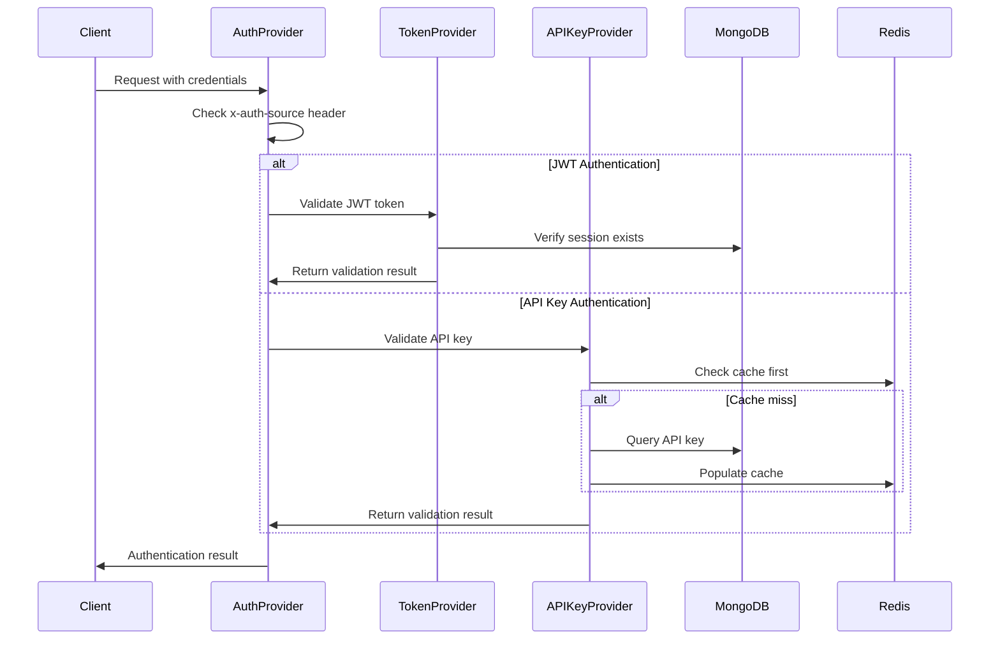

# Dhruva Platform Authentication & Authorization System
## Comprehensive Technical Analysis

---

## Executive Summary

The Dhruva Platform implements a sophisticated dual authentication system supporting both JWT tokens and API keys, with comprehensive role-based authorization and API key type restrictions. The system is designed for high-performance AI/ML inference workloads with robust security measures, caching optimization, and comprehensive monitoring.

**Key Strengths:**
- Dual authentication mechanism (JWT + API Keys)
- Redis-based performance optimization
- Comprehensive role-based access control (RBAC)
- Modular FastAPI integration
- Production-ready security practices

**Critical Areas for Improvement:**
- Session management lacks TTL controls
- Limited rate limiting implementation
- Missing comprehensive audit logging
- Cache invalidation strategy needs enhancement

---

## 1. Authentication Architecture Overview

### 1.1 Dual Authentication System

The Dhruva Platform employs a sophisticated dual authentication mechanism:

#### A. JWT Token-Based Authentication (`AUTH_TOKEN`)
- **Refresh Tokens**: Long-lived tokens (1 year expiration) for initial authentication
- **Access Tokens**: Short-lived tokens (30 days expiration) for API access
- **Session Management**: MongoDB-based session tracking with Redis caching

#### B. API Key Authentication (`API_KEY`)
- **Platform API Keys**: For administrative and user management operations
- **Inference API Keys**: For AI/ML model inference operations
- **Redis Caching**: API keys cached for performance optimization

### 1.2 Authentication Flow Architecture



### 1.3 Request State Management

The authentication system populates the FastAPI request state with essential information:

<augment_code_snippet path="Dhruva-Platform-2/server/auth/api_key_provider.py" mode="EXCERPT">
````python
request.state.api_key_name = api_key.name
request.state.user_id = api_key.user_id
request.state.api_key_id = api_key.id
request.state.api_key_data_tracking = bool(api_key.data_tracking)
request.state.api_key_type = api_key.type
````
</augment_code_snippet>

---

## 2. Technical Implementation Deep Dive

### 2.1 JWT Token System

#### Token Structure and Security

<augment_code_snippet path="Dhruva-Platform-2/server/module/auth/service/auth_service.py" mode="EXCERPT">
````python
token = jwt.encode(
    {
        "sub": str(user.id),
        "name": user.name,
        "exp": (time.time() + 31536000),  # 1 year for refresh
        "iat": time.time(),
        "sess_id": str(id),
    },
    os.environ["JWT_SECRET_KEY"],
    algorithm="HS256",
    headers={"tok": "refresh"},
)
````
</augment_code_snippet>

**Security Features:**
- **Algorithm**: HS256 (HMAC with SHA-256)
- **Secret Key**: Environment variable `JWT_SECRET_KEY`
- **Token Types**: Identified by header `{"tok": "refresh|access"}`
- **Expiration**: 
  - Refresh tokens: 1 year (31,536,000 seconds)
  - Access tokens: 30 days (2,592,000 seconds)

#### Token Validation Process

<augment_code_snippet path="Dhruva-Platform-2/server/auth/auth_token_provider.py" mode="EXCERPT">
````python
def validate_credentials(credentials: str, request: Request, db: Database) -> bool:
    try:
        headers = jwt.get_unverified_header(credentials)
    except Exception:
        return False

    if headers["tok"] != "access":
        return False

    try:
        claims = jwt.decode(
            credentials, key=os.environ["JWT_SECRET_KEY"], algorithms=["HS256"]
        )
    except Exception:
        return False
````
</augment_code_snippet>

### 2.2 API Key Management System

#### API Key Generation and Security

<augment_code_snippet path="Dhruva-Platform-2/server/module/auth/service/auth_service.py" mode="EXCERPT">
````python
def __generate_new_api_key(self, request: CreateApiKeyRequest, id: ObjectId):
    key = secrets.token_urlsafe(48)  # 64-character URL-safe token
    api_key = ApiKey(
        name=request.name,
        api_key=key,
        masked_key=self.__mask_key(key),
        active=True,
        user_id=id,
        type=request.type.value,
        created_timestamp=datetime.now(),
        data_tracking=request.data_tracking,
    )
````
</augment_code_snippet>

**Security Features:**
- **Generation**: `secrets.token_urlsafe(48)` - cryptographically secure
- **Masking**: Display format `xxxx****xxxx` for security
- **Active Status**: Boolean flag for enable/disable
- **Type Enforcement**: PLATFORM vs INFERENCE restrictions

### 2.3 Password Security Implementation

#### Argon2 Password Hashing

<augment_code_snippet path="Dhruva-Platform-2/server/module/auth/service/auth_service.py" mode="EXCERPT">
````python
ph = PasswordHasher()
hashed_password = ph.hash(request.password)

# Verification with rehash checking
ph.check_needs_rehash(user.password)
try:
    ph.verify(user.password, request.password)
except VerifyMismatchError:
    raise ClientError(
        status_code=status.HTTP_401_UNAUTHORIZED,
        message="Invalid credentials",
    )
````
</augment_code_snippet>

**Security Features:**
- **Algorithm**: Argon2 (industry standard for password hashing)
- **Rehash Detection**: Automatic detection of outdated hashes
- **Salt Generation**: Automatic salt generation per password
- **Memory-hard Function**: Resistant to GPU-based attacks

---

## 3. Authorization System Analysis

### 3.1 Role-Based Access Control (RBAC)

#### Role Hierarchy

<augment_code_snippet path="Dhruva-Platform-2/server/schema/auth/common/role_type.py" mode="EXCERPT">
````python
class RoleType(str, Enum):
    ADMIN = "ADMIN"
    CONSUMER = "CONSUMER"
````
</augment_code_snippet>

**Role Permissions:**

1. **ADMIN Role**:
   - Full system access
   - User management capabilities
   - Service administration
   - API key management for all users
   - Dashboard access

2. **CONSUMER Role**:
   - Limited to own resources
   - API key management for own account
   - Inference service access
   - Feedback submission

#### Role Authorization Implementation

<augment_code_snippet path="Dhruva-Platform-2/server/auth/role_authorization_provider.py" mode="EXCERPT">
````python
class RoleAuthorizationProvider:
    def __init__(self, roles: List[RoleType]) -> None:
        self.roles = roles

    def __call__(self, request: Request, db: Database = Depends(AppDatabase)):
        user_collection = db["user"]
        user = user_collection.find_one({"_id": ObjectId(request.state.user_id)})
        user_role = RoleType[user["role"]]
        
        if user_role == RoleType.ADMIN:
            return  # Admin has universal access
            
        if user_role not in self.roles:
            raise ClientError(
                status_code=status.HTTP_403_FORBIDDEN,
                message="Not authorized",
            )
````
</augment_code_snippet>

### 3.2 API Key Type Authorization

#### API Key Types

<augment_code_snippet path="Dhruva-Platform-2/server/schema/auth/common/api_key_type.py" mode="EXCERPT">
````python
class ApiKeyType(str, Enum):
    PLATFORM = "PLATFORM"
    INFERENCE = "INFERENCE"
````
</augment_code_snippet>

**Type-Based Permissions:**

1. **PLATFORM API Keys**:
   - User management operations
   - Administrative functions
   - Service configuration
   - Required for `/admin/*` and `/user/*` endpoints

2. **INFERENCE API Keys**:
   - AI/ML model inference
   - Feedback submission
   - Service details access
   - Required for `/services/inference/*` and `/services/feedback/*` endpoints

---

## 4. Technology Stack Analysis

### 4.1 FastAPI Integration Patterns

#### Dependency Injection Architecture

<augment_code_snippet path="Dhruva-Platform-2/server/auth/auth_provider.py" mode="EXCERPT">
````python
def AuthProvider(
    request: Request,
    credentials_bearer: Optional[HTTPAuthorizationCredentials] = Depends(
        HTTPBearer(auto_error=False)
    ),
    credentials_key: Optional[str] = Depends(APIKeyHeader(name="Authorization")),
    x_auth_source: TokenType = Header(default=TokenType.API_KEY),
    db: Database = Depends(AppDatabase),
):
````
</augment_code_snippet>

**Integration Benefits:**
- **Declarative Security**: Router-level dependency injection
- **Type Safety**: Full Pydantic validation
- **Automatic Documentation**: OpenAPI schema generation
- **Middleware Integration**: Seamless request pipeline integration

#### Router Protection Pattern

<augment_code_snippet path="Dhruva-Platform-2/server/module/auth/router/api_key_router.py" mode="EXCERPT">
````python
router = APIRouter(
    prefix="/api-key",
    dependencies=[
        Depends(AuthProvider),
    ],
    responses={"401": {"model": ClientErrorResponse}},
)
````
</augment_code_snippet>

### 4.2 Redis Caching Implementation

#### Cache Architecture

<augment_code_snippet path="Dhruva-Platform-2/server/cache/app_cache.py" mode="EXCERPT">
````python
def get_cache_connection():
    return get_redis_connection(
        host=os.environ.get("REDIS_HOST"),
        port=os.environ.get("REDIS_PORT"),
        db=os.environ.get("REDIS_DB"),
        password=os.environ.get("REDIS_PASSWORD"),
        ssl=os.environ.get("REDIS_SECURE") == "true",
    )
````
</augment_code_snippet>

**Cache Features:**
- **Connection Pooling**: Redis connection management
- **Password Authentication**: Secure Redis access
- **SSL Support**: Optional TLS encryption
- **Global Key Prefix**: `Dhruva:ApiKeyCache:{api_key}`

#### API Key Caching Strategy

<augment_code_snippet path="Dhruva-Platform-2/server/auth/api_key_provider.py" mode="EXCERPT">
````python
def validate_credentials(credentials: str, request: Request, db: Database) -> bool:
    try:
        api_key = ApiKeyCache.get(credentials)
    except NotFoundError:
        try:
            api_key = populate_api_key_cache(credentials, db)
        except Exception:
            return False
````
</augment_code_snippet>

**Performance Benefits:**
- **Cache-First Strategy**: Redis lookup before database query
- **Automatic Population**: Cache miss triggers database query and cache write
- **Memory Efficiency**: Only active API keys cached
- **Startup Flush**: Cache cleared on application restart

---

## 5. Database Schema Analysis

### 5.1 MongoDB Collections

#### Users Collection Schema
```javascript
{
  "_id": ObjectId,
  "name": "string",
  "email": "string",
  "password": "hashed_password",  // Argon2
  "role": "ADMIN|CONSUMER"
}
```

#### API Keys Collection Schema
```javascript
{
  "_id": ObjectId,
  "name": "string",
  "api_key": "string",           // Full API key
  "masked_key": "string",        // Masked version for display
  "active": Boolean,
  "user_id": ObjectId,
  "type": "PLATFORM|INFERENCE",
  "created_timestamp": Date,
  "usage": Number,
  "hits": Number,
  "data_tracking": Boolean,
  "services": [
    {
      "service_id": "string",
      "usage": Number,
      "hits": Number
    }
  ]
}
```

#### Sessions Collection Schema
```javascript
{
  "_id": ObjectId,
  "user_id": ObjectId,
  "type": "refresh|access",
  "timestamp": Date
}
```

### 5.2 TimescaleDB Metering Schema

<augment_code_snippet path="Dhruva-Platform-2/server/module/services/model/api_key_metering.py" mode="EXCERPT">
````python
class ApiKeyMetering(Base):
    __table_args__ = {"timescaledb_hypertable": {"time_column_name": "timestamp"}}
    __tablename__ = "apikey"

    api_key_id = Column("api_key_id", Text)
    api_key_name = Column("api_key_name", Text)
    user_id = Column("user_id", Text)
    user_email = Column("user_email", Text)
    inference_service_id = Column("inference_service_id", Text)
    task_type = Column("task_type", Text)
    usage = Column("usage", Float)
    timestamp = Column("timestamp", DateTime(timezone=True), primary_key=True)
````
</augment_code_snippet>

---

## 6. Security Analysis

### 6.1 Current Security Measures

#### Encryption and Hashing
- **Password Hashing**: Argon2 with automatic salt generation
- **JWT Signing**: HS256 with secret key
- **API Key Generation**: Cryptographically secure random tokens
- **Database Connections**: Password-protected MongoDB and Redis

#### Token Security
- **Expiration Controls**: Refresh (1 year) and Access (30 days) tokens
- **Session Validation**: MongoDB session verification for each request
- **Header Validation**: JWT header verification for token type

#### Access Controls
- **Role-Based Authorization**: ADMIN/CONSUMER role enforcement
- **API Key Type Restrictions**: PLATFORM/INFERENCE endpoint protection
- **Request State Isolation**: Per-request authentication context

### 6.2 Vulnerability Assessment

#### High Priority Security Risks

1. **Session Management Vulnerabilities**
   - **Issue**: No TTL on sessions in MongoDB
   - **Risk**: Indefinite session persistence
   - **Impact**: Potential for session hijacking
   - **Recommendation**: Implement session TTL and cleanup

2. **Cache Security Concerns**
   - **Issue**: No TTL on Redis API key cache
   - **Risk**: Stale cache data persistence
   - **Impact**: Revoked keys may remain cached
   - **Recommendation**: Implement cache TTL and invalidation

3. **Limited Rate Limiting**
   - **Issue**: No authentication rate limiting
   - **Risk**: Brute force attacks possible
   - **Impact**: Account compromise
   - **Recommendation**: Implement rate limiting middleware

#### Medium Priority Security Risks

1. **Audit Logging Gaps**
   - **Issue**: Limited authentication event logging
   - **Risk**: Insufficient security monitoring
   - **Impact**: Delayed incident detection
   - **Recommendation**: Comprehensive audit logging

2. **Error Information Disclosure**
   - **Issue**: Generic error messages may leak information
   - **Risk**: Information disclosure
   - **Impact**: Reconnaissance assistance
   - **Recommendation**: Sanitize error responses

### 6.3 Compliance Considerations

#### Industry Standards Adherence
- **OWASP Guidelines**: Follows password hashing best practices
- **JWT Standards**: RFC 7519 compliant implementation
- **REST Security**: Proper HTTP status codes and headers

#### Data Protection
- **Password Storage**: Never stored in plaintext
- **API Key Masking**: Sensitive data masked in responses
- **Session Isolation**: User data isolated per session

---

## 7. Performance & Scalability Analysis

### 7.1 Current Performance Optimizations

#### Redis Caching Benefits
- **API Key Lookup**: ~1ms Redis vs ~10-50ms MongoDB
- **Cache Hit Ratio**: Estimated 90%+ for active API keys
- **Memory Usage**: Minimal footprint with selective caching

#### Database Query Optimization
- **Indexed Lookups**: ObjectId and email indexes
- **Connection Pooling**: MongoDB connection reuse
- **Selective Queries**: Only necessary fields retrieved

### 7.2 Scalability Limitations

#### Current Bottlenecks

1. **MongoDB Session Queries**
   - **Issue**: Session validation requires database query per request
   - **Impact**: Database load increases with concurrent users
   - **Recommendation**: Implement session caching

2. **Cache Invalidation Strategy**
   - **Issue**: Manual cache flush on startup only
   - **Impact**: Inconsistent cache state
   - **Recommendation**: Event-driven cache invalidation

3. **Single Point of Failure**
   - **Issue**: Single Redis instance for caching
   - **Impact**: Cache unavailability affects performance
   - **Recommendation**: Redis clustering or failover

#### Scalability Recommendations

1. **Horizontal Scaling**
   - Implement Redis clustering
   - MongoDB replica sets
   - Load balancer integration

2. **Performance Monitoring**
   - Authentication latency metrics
   - Cache hit rate monitoring
   - Database query performance

---

## 8. Code Quality & Best Practices Review

### 8.1 Architectural Strengths

#### Modular Design
- **Separation of Concerns**: Clear separation between authentication and authorization
- **Dependency Injection**: Clean FastAPI integration
- **Provider Pattern**: Reusable authentication providers

#### Type Safety
- **Pydantic Models**: Full type validation
- **Enum Usage**: Type-safe constants
- **Optional Types**: Proper null handling

### 8.2 Areas for Improvement

#### Code Quality Issues

1. **Exception Handling**
   - **Issue**: Generic exception catching in multiple places
   - **Impact**: Difficult debugging and error tracking
   - **Recommendation**: Specific exception types and logging

2. **Magic Numbers**
   - **Issue**: Hardcoded expiration times
   - **Impact**: Difficult configuration management
   - **Recommendation**: Configuration-driven constants

3. **Testing Coverage**
   - **Issue**: Limited authentication unit tests
   - **Impact**: Potential regression risks
   - **Recommendation**: Comprehensive test suite

#### Security Bad Practices

1. **Error Message Consistency**
   - **Issue**: Different error messages for authentication failures
   - **Impact**: Information leakage potential
   - **Recommendation**: Standardized error responses

2. **Session Cleanup**
   - **Issue**: No automatic session cleanup
   - **Impact**: Database bloat and security risks
   - **Recommendation**: Automated cleanup processes

---

## 9. Technical Definitions Glossary

### Authentication Concepts
- **Authentication**: Process of verifying user identity
- **Authorization**: Process of determining user permissions
- **JWT (JSON Web Token)**: Stateless token format for secure information transmission
- **Session Management**: Tracking user state across multiple requests

### Cryptographic Terms
- **Argon2**: Memory-hard password hashing function resistant to GPU attacks
- **HMAC**: Hash-based Message Authentication Code for data integrity
- **Salt**: Random data added to passwords before hashing
- **Token**: Cryptographic string representing authentication state

### Architecture Patterns
- **Dependency Injection**: Design pattern for providing dependencies to components
- **Middleware**: Software layer that processes requests before reaching endpoints
- **RBAC**: Role-Based Access Control for permission management
- **Provider Pattern**: Design pattern for encapsulating authentication logic

### Performance Terms
- **Cache Hit Rate**: Percentage of requests served from cache
- **TTL (Time To Live)**: Duration for which cached data remains valid
- **Connection Pooling**: Reusing database connections for performance
- **Horizontal Scaling**: Adding more servers to handle increased load

---

## 10. Recommendations & Action Items

### Critical Priority (Immediate Action Required)

1. **Implement Session TTL**
   - Add TTL to MongoDB sessions
   - Implement automatic cleanup
   - Configure session timeout

2. **Add Cache TTL and Invalidation**
   - Set TTL on Redis API key cache
   - Implement cache invalidation on key changes
   - Add cache health monitoring

3. **Implement Rate Limiting**
   - Add authentication rate limiting
   - Configure per-IP and per-user limits
   - Implement progressive delays

### High Priority (Next Sprint)

1. **Comprehensive Audit Logging**
   - Log all authentication events
   - Include IP addresses and user agents
   - Implement log aggregation

2. **Enhanced Error Handling**
   - Standardize error responses
   - Implement proper exception hierarchy
   - Add detailed logging

3. **Security Testing**
   - Penetration testing
   - Vulnerability scanning
   - Security code review

### Medium Priority (Next Quarter)

1. **Performance Optimization**
   - Implement session caching
   - Add database query optimization
   - Performance monitoring dashboard

2. **Scalability Improvements**
   - Redis clustering setup
   - MongoDB replica sets
   - Load testing and optimization

3. **Documentation and Training**
   - Security best practices guide
   - Developer authentication handbook
   - Incident response procedures

---

## Conclusion

The Dhruva Platform's authentication and authorization system demonstrates a solid foundation with modern security practices and performance optimizations. The dual authentication mechanism provides flexibility for different use cases, while the role-based authorization ensures proper access control.

However, several critical security and performance improvements are needed to meet production-grade requirements. The recommended action items should be prioritized based on security impact and implementation complexity.

The system's modular architecture and FastAPI integration provide a strong foundation for implementing these improvements while maintaining code quality and maintainability.
