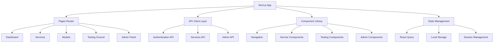

# Frontend Application

## 🎨 Overview

The Dhruva Platform frontend is a modern Next.js application built with TypeScript and Chakra UI, providing an intuitive interface for AI service management, testing, and monitoring. It features responsive design, real-time capabilities, and comprehensive user experience.

## 🏗️ Architecture

### Application Structure



### Technology Stack

- **Framework**: Next.js 13 with TypeScript
- **UI Library**: Chakra UI + Framer Motion
- **State Management**: TanStack React Query
- **API Client**: Axios with interceptors
- **Styling**: Chakra UI theme system
- **Icons**: React Icons
- **Audio Processing**: Web Audio API
- **Real-time**: Socket.IO client

## 📁 Directory Structure

```
client/
├── api/                  # API client functions
│   ├── apiConfig.ts     # Axios configuration
│   ├── authAPI.ts       # Authentication APIs
│   ├── serviceAPI.ts    # Service management APIs
│   ├── modelAPI.ts      # Model management APIs
│   └── adminAPI.ts      # Admin APIs
├── components/          # React components
│   ├── Navigation/      # Navigation components
│   ├── Services/        # Service-related components
│   ├── Models/          # Model management components
│   ├── TryOut/          # Testing interface components
│   ├── Admin/           # Admin panel components
│   ├── Feedback/        # Feedback components
│   ├── Documentation/   # Documentation components
│   └── Utils/           # Utility components
├── pages/               # Next.js pages
│   ├── _app.tsx        # App wrapper
│   ├── _document.tsx   # Document structure
│   ├── index.tsx       # Landing page
│   ├── home.tsx        # Dashboard
│   ├── services/       # Service pages
│   ├── models/         # Model pages
│   ├── admin/          # Admin pages
│   └── testing-ground/ # Testing interface
├── types/               # TypeScript definitions
├── hooks/               # Custom React hooks
├── utils/               # Utility functions
├── themes/              # Chakra UI themes
└── styles/              # Global styles
```

## 🔌 API Client Layer

### Configuration

```typescript
// api/apiConfig.ts
const dhruvaRootURL = "http://localhost:8000";

const apiInstance = axios.create({ 
  baseURL: dhruvaRootURL,
  timeout: 30000
});

// Request interceptor for authentication
apiInstance.interceptors.request.use((config) => {
  const accessToken = localStorage.getItem("access_token");
  if (accessToken) {
    config.headers["Authorization"] = `Bearer ${accessToken}`;
    config.headers["x-auth-source"] = "AUTH_TOKEN";
  }
  return config;
});

// Response interceptor for token refresh
apiInstance.interceptors.response.use(
  (response) => response,
  async (error) => {
    if (error.response?.status === 401) {
      await refreshToken();
      return apiInstance.request(error.config);
    }
    return Promise.reject(error);
  }
);
```

### API Endpoints

```typescript
const dhruvaAPI = {
  // Service Management
  listServices: `${dhruvaRootURL}/services/details/list_services`,
  viewService: `${dhruvaRootURL}/services/details/view_service`,
  listModels: `${dhruvaRootURL}/services/details/list_models`,
  viewModel: `${dhruvaRootURL}/services/details/view_model`,
  
  // AI Inference
  genericInference: `${dhruvaRootURL}/services/inference`,
  translationInference: `${dhruvaRootURL}/services/inference/translation`,
  ttsInference: `${dhruvaRootURL}/services/inference/tts`,
  asrInference: `${dhruvaRootURL}/services/inference/asr`,
  nerInference: `${dhruvaRootURL}/services/inference/ner`,
  xlitInference: `${dhruvaRootURL}/services/inference/transliteration`,
  
  // Streaming
  asrStreamingInference: `wss://localhost:8000/socket.io`,
};
```

## 🎯 Core Components

### Navigation System

```typescript
// components/Navigation/Navbar.tsx
const Navbar = () => {
  const { user, logout } = useAuth();
  const { colorMode, toggleColorMode } = useColorMode();
  
  return (
    <Box bg={useColorModeValue('white', 'gray.800')} px={4}>
      <Flex h={16} alignItems="center" justifyContent="space-between">
        <Logo />
        <NavigationMenu />
        <UserMenu user={user} onLogout={logout} />
      </Flex>
    </Box>
  );
};
```

### Service Testing Interface

```typescript
// components/TryOut/ServiceTester.tsx
const ServiceTester = ({ serviceId }: { serviceId: string }) => {
  const [input, setInput] = useState('');
  const [result, setResult] = useState(null);
  const [loading, setLoading] = useState(false);
  
  const testService = async () => {
    setLoading(true);
    try {
      const response = await serviceAPI.testInference(serviceId, {
        input: [{ source: input }],
        config: { serviceId }
      });
      setResult(response.data);
    } catch (error) {
      toast.error('Service test failed');
    } finally {
      setLoading(false);
    }
  };
  
  return (
    <VStack spacing={4}>
      <Textarea 
        value={input}
        onChange={(e) => setInput(e.target.value)}
        placeholder="Enter text to test..."
      />
      <Button onClick={testService} isLoading={loading}>
        Test Service
      </Button>
      {result && <ResultDisplay result={result} />}
    </VStack>
  );
};
```

### Real-time Audio Processing

```typescript
// components/TryOut/AudioRecorder.tsx
const AudioRecorder = () => {
  const [recording, setRecording] = useState(false);
  const [socket, setSocket] = useState<Socket | null>(null);
  const [transcript, setTranscript] = useState('');
  
  useEffect(() => {
    const newSocket = io('ws://localhost:8000/socket.io');
    setSocket(newSocket);
    
    newSocket.on('partial_result', (data) => {
      setTranscript(data.transcript);
    });
    
    newSocket.on('final_result', (data) => {
      setTranscript(data.transcript);
    });
    
    return () => newSocket.close();
  }, []);
  
  const startRecording = async () => {
    const stream = await navigator.mediaDevices.getUserMedia({ audio: true });
    const mediaRecorder = new MediaRecorder(stream);
    
    mediaRecorder.ondataavailable = (event) => {
      if (socket && event.data.size > 0) {
        socket.emit('audio_chunk', event.data);
      }
    };
    
    socket?.emit('start_stream', {
      config: {
        serviceId: 'ai4bharat/conformer--gpu-t4',
        language: { sourceLanguage: 'hi' }
      }
    });
    
    mediaRecorder.start(100); // 100ms chunks
    setRecording(true);
  };
  
  return (
    <VStack>
      <Button 
        onClick={recording ? stopRecording : startRecording}
        colorScheme={recording ? 'red' : 'blue'}
      >
        {recording ? 'Stop Recording' : 'Start Recording'}
      </Button>
      <Text>{transcript}</Text>
    </VStack>
  );
};
```

## 📱 Pages & Routing

### Main Pages

#### Dashboard (`pages/home.tsx`)
```typescript
const Dashboard = () => {
  const { data: services } = useQuery('services', serviceAPI.listServices);
  const { data: usage } = useQuery('usage', userAPI.getUsage);
  
  return (
    <Container maxW="container.xl">
      <VStack spacing={8}>
        <WelcomeHeader />
        <UsageOverview usage={usage} />
        <ServiceGrid services={services} />
        <RecentActivity />
      </VStack>
    </Container>
  );
};
```

#### Services Page (`pages/services/index.tsx`)
```typescript
const ServicesPage = () => {
  const { data: services, isLoading } = useQuery('services', serviceAPI.listServices);
  const [selectedService, setSelectedService] = useState(null);
  
  return (
    <Grid templateColumns="1fr 2fr" gap={6}>
      <ServiceList 
        services={services}
        onSelect={setSelectedService}
        isLoading={isLoading}
      />
      <ServiceDetails service={selectedService} />
    </Grid>
  );
};
```

#### Testing Ground (`pages/testing-ground.tsx`)
```typescript
const TestingGround = () => {
  const [selectedService, setSelectedService] = useState('translation');
  
  const renderServiceTester = () => {
    switch (selectedService) {
      case 'translation':
        return <TranslationTester />;
      case 'asr':
        return <ASRTester />;
      case 'tts':
        return <TTSTester />;
      default:
        return <GenericTester serviceType={selectedService} />;
    }
  };
  
  return (
    <Container maxW="container.xl">
      <ServiceSelector 
        value={selectedService}
        onChange={setSelectedService}
      />
      {renderServiceTester()}
    </Container>
  );
};
```

## 🎨 UI Components & Theming

### Custom Theme

```typescript
// themes/index.js
export const customTheme = extendTheme({
  colors: {
    brand: {
      50: '#e3f2fd',
      100: '#bbdefb',
      500: '#2196f3',
      900: '#0d47a1',
    },
    dhruva: {
      primary: '#1a365d',
      secondary: '#2d3748',
      accent: '#3182ce',
    }
  },
  fonts: {
    heading: 'Inter, sans-serif',
    body: 'Inter, sans-serif',
  },
  components: {
    Button: {
      defaultProps: {
        colorScheme: 'brand',
      },
    },
    Card: {
      baseStyle: {
        container: {
          boxShadow: 'lg',
          borderRadius: 'lg',
        }
      }
    }
  }
});
```

### Responsive Design

```typescript
// hooks/useMediaQuery.jsx
const useMediaQuery = (query: string) => {
  const [matches, setMatches] = useState(false);
  
  useEffect(() => {
    const media = window.matchMedia(query);
    if (media.matches !== matches) {
      setMatches(media.matches);
    }
    
    const listener = () => setMatches(media.matches);
    media.addEventListener('change', listener);
    
    return () => media.removeEventListener('change', listener);
  }, [matches, query]);
  
  return matches;
};

// Usage in components
const MyComponent = () => {
  const isMobile = useMediaQuery('(max-width: 768px)');
  
  return (
    <Stack direction={isMobile ? 'column' : 'row'}>
      {/* Responsive content */}
    </Stack>
  );
};
```

## 🔄 State Management

### React Query Setup

```typescript
// pages/_app.tsx
const queryClient = new QueryClient({
  defaultOptions: {
    queries: {
      staleTime: 5 * 60 * 1000, // 5 minutes
      cacheTime: 10 * 60 * 1000, // 10 minutes
      retry: 3,
      refetchOnWindowFocus: false,
    },
  },
});

function MyApp({ Component, pageProps }: AppProps) {
  return (
    <QueryClientProvider client={queryClient}>
      <ChakraProvider theme={customTheme}>
        <Layout>
          <Component {...pageProps} />
        </Layout>
      </ChakraProvider>
      <ReactQueryDevtools />
    </QueryClientProvider>
  );
}
```

### Custom Hooks

```typescript
// hooks/useAuth.ts
export const useAuth = () => {
  const queryClient = useQueryClient();
  
  const login = useMutation(authAPI.login, {
    onSuccess: (data) => {
      localStorage.setItem('refresh_token', data.token);
      localStorage.setItem('user_role', data.role);
      queryClient.invalidateQueries('user');
    },
  });
  
  const logout = () => {
    localStorage.removeItem('access_token');
    localStorage.removeItem('refresh_token');
    queryClient.clear();
    router.push('/');
  };
  
  return { login, logout };
};

// hooks/useServices.ts
export const useServices = () => {
  return useQuery('services', serviceAPI.listServices, {
    staleTime: 10 * 60 * 1000, // 10 minutes
  });
};
```

## 🔧 Configuration

### Environment Variables

```bash
# Next.js Configuration
NEXT_PUBLIC_API_URL=http://localhost:8000
NEXT_PUBLIC_WS_URL=ws://localhost:8000
NEXT_PUBLIC_APP_NAME=Dhruva Platform
NEXT_PUBLIC_VERSION=2.0.0

# Feature Flags
NEXT_PUBLIC_ENABLE_OAUTH=true
NEXT_PUBLIC_ENABLE_STREAMING=true
NEXT_PUBLIC_ENABLE_ADMIN=true
```

### Next.js Configuration

```javascript
// next.config.js
const nextConfig = {
  reactStrictMode: true,
  eslint: {
    ignoreDuringBuilds: true,
  },
  images: {
    unoptimized: true,
  },
  basePath: '/dhruva',
  assetPrefix: '/dhruva',
  env: {
    CUSTOM_KEY: process.env.CUSTOM_KEY,
  },
};
```

## 🧪 Testing

### Component Testing

```typescript
// __tests__/components/ServiceTester.test.tsx
import { render, screen, fireEvent } from '@testing-library/react';
import { QueryClient, QueryClientProvider } from '@tanstack/react-query';
import ServiceTester from '../components/TryOut/ServiceTester';

const createTestQueryClient = () => new QueryClient({
  defaultOptions: {
    queries: { retry: false },
    mutations: { retry: false },
  },
});

describe('ServiceTester', () => {
  it('renders input and test button', () => {
    const queryClient = createTestQueryClient();
    
    render(
      <QueryClientProvider client={queryClient}>
        <ServiceTester serviceId="test-service" />
      </QueryClientProvider>
    );
    
    expect(screen.getByPlaceholderText('Enter text to test...')).toBeInTheDocument();
    expect(screen.getByText('Test Service')).toBeInTheDocument();
  });
});
```

### Load Testing

```javascript
// scripts/load-test.js
const loadTest = async () => {
  const results = [];
  
  for (let i = 0; i < 100; i++) {
    const startTime = Date.now();
    
    try {
      await axios.post('/services/inference/translation', testPayload);
      results.push({ success: true, duration: Date.now() - startTime });
    } catch (error) {
      results.push({ success: false, error: error.message });
    }
  }
  
  console.log('Load test results:', results);
};
```

## 🚀 Deployment

### Docker Configuration

```dockerfile
# Dockerfile
FROM node:18-alpine

WORKDIR /app

COPY package*.json ./
RUN npm ci --only=production

COPY . .
RUN npm run build

EXPOSE 3000

CMD ["npm", "start"]
```

### Production Build

```bash
# Build for production
npm run build

# Start production server
npm start

# Static export (if needed)
npm run export
```

## 📊 Performance Optimization

### Code Splitting

```typescript
// Dynamic imports for large components
const AdminPanel = dynamic(() => import('../components/Admin/AdminPanel'), {
  loading: () => <Spinner />,
  ssr: false,
});

// Route-based code splitting
const DashboardPage = dynamic(() => import('../pages/dashboard'), {
  loading: () => <PageLoader />,
});
```

### Image Optimization

```typescript
// Using Next.js Image component
import Image from 'next/image';

const OptimizedImage = () => (
  <Image
    src="/dhruva-logo.png"
    alt="Dhruva Platform"
    width={200}
    height={100}
    priority
    placeholder="blur"
    blurDataURL="data:image/jpeg;base64,..."
  />
);
```

## 🔍 Troubleshooting

### Common Issues

1. **API Connection Failed**: Check backend server status and CORS configuration
2. **Authentication Errors**: Verify token storage and refresh logic
3. **WebSocket Connection**: Check WebSocket URL and firewall settings
4. **Build Errors**: Verify TypeScript types and dependencies

### Debug Tools

```typescript
// Debug API calls
if (process.env.NODE_ENV === 'development') {
  apiInstance.interceptors.request.use((config) => {
    console.log('API Request:', config);
    return config;
  });
  
  apiInstance.interceptors.response.use(
    (response) => {
      console.log('API Response:', response);
      return response;
    },
    (error) => {
      console.error('API Error:', error);
      return Promise.reject(error);
    }
  );
}
```
