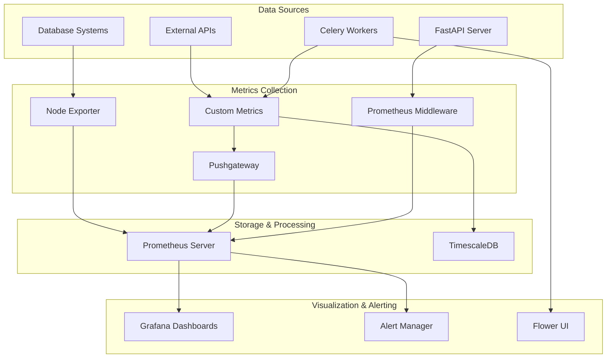

# Monitoring & Observability

## 📊 Overview

The Dhruva Platform implements a comprehensive monitoring and observability stack built on Prometheus, Grafana, and custom metrics collection. This system provides real-time insights into system performance, usage patterns, and operational health.

## 🏗️ Monitoring Architecture

### Observability Stack



## 📈 Metrics Collection

### Application Metrics

#### FastAPI Server Metrics
```python
# Custom metrics in server/custom_metrics.py
from prometheus_client import Counter, Histogram, Gauge, CollectorRegistry

registry = CollectorRegistry()

# Request metrics
REQUEST_COUNT = Counter(
    'dhruva_requests_total',
    'Total number of requests',
    ['method', 'endpoint', 'status_code', 'api_key_name', 'user_id'],
    registry=registry
)

REQUEST_DURATION = Histogram(
    'dhruva_request_duration_seconds',
    'Request duration in seconds',
    ['method', 'endpoint', 'api_key_name', 'user_id'],
    registry=registry
)

# AI Service metrics
AI_SERVICE_REQUESTS = Counter(
    'dhruva_ai_service_requests_total',
    'Total AI service requests',
    ['service_id', 'task_type', 'status'],
    registry=registry
)

AI_SERVICE_DURATION = Histogram(
    'dhruva_ai_service_duration_seconds',
    'AI service processing duration',
    ['service_id', 'task_type'],
    registry=registry
)

# Usage metrics
USAGE_CHARACTERS = Counter(
    'dhruva_usage_characters_total',
    'Total characters processed',
    ['service_id', 'user_id', 'api_key_name'],
    registry=registry
)

USAGE_AUDIO_SECONDS = Counter(
    'dhruva_usage_audio_seconds_total',
    'Total audio seconds processed',
    ['service_id', 'user_id', 'api_key_name'],
    registry=registry
)
```

#### Middleware Integration
```python
# middleware/prometheus_global_metrics_middleware.py
class PrometheusGlobalMetricsMiddleware:
    def __init__(self, app, app_name: str, registry, custom_labels=None):
        self.app = app
        self.app_name = app_name
        self.registry = registry
        self.custom_labels = custom_labels or []
        
    async def __call__(self, scope, receive, send):
        if scope["type"] != "http":
            await self.app(scope, receive, send)
            return
            
        start_time = time.time()
        
        # Extract custom labels from request
        request = Request(scope, receive)
        labels = self.extract_labels(request)
        
        async def send_wrapper(message):
            if message["type"] == "http.response.start":
                status_code = message["status"]
                duration = time.time() - start_time
                
                # Record metrics
                REQUEST_COUNT.labels(
                    method=scope["method"],
                    endpoint=scope["path"],
                    status_code=status_code,
                    **labels
                ).inc()
                
                REQUEST_DURATION.labels(
                    method=scope["method"],
                    endpoint=scope["path"],
                    **labels
                ).observe(duration)
                
            await send(message)
            
        await self.app(scope, receive, send_wrapper)
```

### Celery Task Metrics

```python
# celery_backend/tasks/monitoring.py
from celery.signals import task_prerun, task_postrun, task_failure

@task_prerun.connect
def task_prerun_handler(sender=None, task_id=None, task=None, args=None, kwargs=None, **kwds):
    CELERY_TASK_START.labels(task_name=task.name).inc()

@task_postrun.connect
def task_postrun_handler(sender=None, task_id=None, task=None, args=None, kwargs=None, retval=None, state=None, **kwds):
    CELERY_TASK_COMPLETE.labels(
        task_name=task.name,
        state=state
    ).inc()

@task_failure.connect
def task_failure_handler(sender=None, task_id=None, exception=None, traceback=None, einfo=None, **kwds):
    CELERY_TASK_FAILURE.labels(
        task_name=sender.name,
        exception_type=type(exception).__name__
    ).inc()
```

### Database Metrics

```python
# Database connection monitoring
DB_CONNECTIONS = Gauge(
    'dhruva_db_connections_active',
    'Active database connections',
    ['database_type'],
    registry=registry
)

DB_QUERY_DURATION = Histogram(
    'dhruva_db_query_duration_seconds',
    'Database query duration',
    ['database_type', 'operation'],
    registry=registry
)

# Usage in database operations
class MonitoredRepository:
    def find(self, query):
        start_time = time.time()
        try:
            result = self.collection.find(query)
            DB_QUERY_DURATION.labels(
                database_type='mongodb',
                operation='find'
            ).observe(time.time() - start_time)
            return result
        except Exception as e:
            DB_ERRORS.labels(
                database_type='mongodb',
                error_type=type(e).__name__
            ).inc()
            raise
```

## 📊 Prometheus Configuration

### Prometheus Setup

```yaml
# prometheus/prometheus.yml
global:
  scrape_interval: 15s
  evaluation_interval: 15s
  external_labels:
    monitor: "dhruva-platform"

rule_files:
  - "alert_rules.yml"

scrape_configs:
  # Dhruva Platform metrics
  - job_name: 'dhruva-platform'
    scrape_interval: 5s
    static_configs:
      - targets: ['dhruva-platform-server:8000']
    metrics_path: '/metrics'
    
  # Pushgateway for batch jobs
  - job_name: 'pushgateway'
    scrape_interval: 5s
    static_configs:
      - targets: ['dhruva-platform-pushgateway:9091']
      
  # Node exporter for system metrics
  - job_name: 'node-exporter'
    scrape_interval: 15s
    static_configs:
      - targets: ['node-exporter:9100']
      
  # Database exporters
  - job_name: 'mongodb-exporter'
    scrape_interval: 30s
    static_configs:
      - targets: ['mongodb-exporter:9216']
      
  - job_name: 'postgres-exporter'
    scrape_interval: 30s
    static_configs:
      - targets: ['postgres-exporter:9187']

alerting:
  alertmanagers:
    - static_configs:
        - targets:
          - alertmanager:9093
```

### Alert Rules

```yaml
# prometheus/alert_rules.yml
groups:
  - name: dhruva_platform_alerts
    rules:
      # High error rate
      - alert: HighErrorRate
        expr: rate(dhruva_requests_total{status_code=~"5.."}[5m]) / rate(dhruva_requests_total[5m]) > 0.05
        for: 2m
        labels:
          severity: warning
        annotations:
          summary: "High error rate detected"
          description: "Error rate is {{ $value | humanizePercentage }} for the last 5 minutes"
          
      # High response time
      - alert: HighResponseTime
        expr: histogram_quantile(0.95, rate(dhruva_request_duration_seconds_bucket[5m])) > 2
        for: 5m
        labels:
          severity: warning
        annotations:
          summary: "High response time detected"
          description: "95th percentile response time is {{ $value }}s"
          
      # Queue backlog
      - alert: CeleryQueueBacklog
        expr: rabbitmq_queue_messages{queue="data-log"} > 1000
        for: 2m
        labels:
          severity: critical
        annotations:
          summary: "Celery queue backlog detected"
          description: "Queue {{ $labels.queue }} has {{ $value }} pending messages"
          
      # Database connection issues
      - alert: DatabaseConnectionHigh
        expr: dhruva_db_connections_active > 80
        for: 5m
        labels:
          severity: warning
        annotations:
          summary: "High database connection count"
          description: "{{ $labels.database_type }} has {{ $value }} active connections"
          
      # Service down
      - alert: ServiceDown
        expr: up == 0
        for: 1m
        labels:
          severity: critical
        annotations:
          summary: "Service is down"
          description: "{{ $labels.job }} service is down"
```

## 📈 Grafana Dashboards

### Main Dashboard Configuration

```json
{
  "dashboard": {
    "title": "Dhruva Platform Overview",
    "panels": [
      {
        "title": "Request Rate",
        "type": "graph",
        "targets": [
          {
            "expr": "rate(dhruva_requests_total[5m])",
            "legendFormat": "{{method}} {{endpoint}}"
          }
        ]
      },
      {
        "title": "Response Time Percentiles",
        "type": "graph",
        "targets": [
          {
            "expr": "histogram_quantile(0.50, rate(dhruva_request_duration_seconds_bucket[5m]))",
            "legendFormat": "50th percentile"
          },
          {
            "expr": "histogram_quantile(0.95, rate(dhruva_request_duration_seconds_bucket[5m]))",
            "legendFormat": "95th percentile"
          },
          {
            "expr": "histogram_quantile(0.99, rate(dhruva_request_duration_seconds_bucket[5m]))",
            "legendFormat": "99th percentile"
          }
        ]
      },
      {
        "title": "AI Service Usage",
        "type": "graph",
        "targets": [
          {
            "expr": "rate(dhruva_usage_characters_total[5m])",
            "legendFormat": "{{service_id}} - Characters/sec"
          },
          {
            "expr": "rate(dhruva_usage_audio_seconds_total[5m])",
            "legendFormat": "{{service_id}} - Audio sec/sec"
          }
        ]
      }
    ]
  }
}
```

### Service-Specific Dashboard

```json
{
  "dashboard": {
    "title": "AI Services Performance",
    "panels": [
      {
        "title": "Service Request Rate by Type",
        "type": "graph",
        "targets": [
          {
            "expr": "rate(dhruva_ai_service_requests_total[5m])",
            "legendFormat": "{{service_id}} - {{task_type}}"
          }
        ]
      },
      {
        "title": "Service Processing Time",
        "type": "graph",
        "targets": [
          {
            "expr": "histogram_quantile(0.95, rate(dhruva_ai_service_duration_seconds_bucket[5m]))",
            "legendFormat": "{{service_id}} - 95th percentile"
          }
        ]
      },
      {
        "title": "Error Rate by Service",
        "type": "graph",
        "targets": [
          {
            "expr": "rate(dhruva_ai_service_requests_total{status=\"error\"}[5m]) / rate(dhruva_ai_service_requests_total[5m])",
            "legendFormat": "{{service_id}} error rate"
          }
        ]
      }
    ]
  }
}
```

## 🔔 Alerting & Notifications

### Alert Manager Configuration

```yaml
# alertmanager/alertmanager.yml
global:
  smtp_smarthost: 'localhost:587'
  smtp_from: 'alerts@dhruva.ai4bharat.org'

route:
  group_by: ['alertname']
  group_wait: 10s
  group_interval: 10s
  repeat_interval: 1h
  receiver: 'web.hook'
  routes:
    - match:
        severity: critical
      receiver: 'critical-alerts'
    - match:
        severity: warning
      receiver: 'warning-alerts'

receivers:
  - name: 'web.hook'
    webhook_configs:
      - url: 'http://localhost:5001/'
        
  - name: 'critical-alerts'
    email_configs:
      - to: 'ops-team@dhruva.ai4bharat.org'
        subject: 'CRITICAL: {{ .GroupLabels.alertname }}'
        body: |
          {{ range .Alerts }}
          Alert: {{ .Annotations.summary }}
          Description: {{ .Annotations.description }}
          {{ end }}
    slack_configs:
      - api_url: 'YOUR_SLACK_WEBHOOK_URL'
        channel: '#alerts'
        title: 'Critical Alert'
        text: '{{ .CommonAnnotations.summary }}'
        
  - name: 'warning-alerts'
    email_configs:
      - to: 'dev-team@dhruva.ai4bharat.org'
        subject: 'WARNING: {{ .GroupLabels.alertname }}'
```

## 📊 Custom Dashboards

### Usage Analytics Dashboard

```python
# Custom dashboard for usage analytics
USAGE_DASHBOARD_QUERIES = {
    "daily_usage_by_service": """
        SELECT 
            time_bucket('1 day', timestamp) as day,
            inference_service_id,
            SUM(usage) as total_usage,
            COUNT(*) as request_count
        FROM apikey 
        WHERE timestamp >= NOW() - INTERVAL '30 days'
        GROUP BY day, inference_service_id
        ORDER BY day DESC
    """,
    
    "top_users_by_usage": """
        SELECT 
            user_email,
            SUM(usage) as total_usage,
            COUNT(*) as total_requests
        FROM apikey 
        WHERE timestamp >= NOW() - INTERVAL '7 days'
        GROUP BY user_email
        ORDER BY total_usage DESC
        LIMIT 10
    """,
    
    "service_performance_metrics": """
        SELECT 
            inference_service_id,
            AVG(usage) as avg_usage_per_request,
            PERCENTILE_CONT(0.95) WITHIN GROUP (ORDER BY usage) as p95_usage,
            COUNT(*) as total_requests
        FROM apikey 
        WHERE timestamp >= NOW() - INTERVAL '24 hours'
        GROUP BY inference_service_id
    """
}
```

## 🔍 Log Management

### Structured Logging

```python
# log/logger.py
import logging
import json
from datetime import datetime

class StructuredLogger:
    def __init__(self, name):
        self.logger = logging.getLogger(name)
        
    def log_request(self, request_id, user_id, service_id, duration, status):
        log_data = {
            "timestamp": datetime.utcnow().isoformat(),
            "request_id": request_id,
            "user_id": user_id,
            "service_id": service_id,
            "duration_ms": duration,
            "status": status,
            "event_type": "api_request"
        }
        self.logger.info(json.dumps(log_data))
        
    def log_error(self, error, context=None):
        log_data = {
            "timestamp": datetime.utcnow().isoformat(),
            "error_type": type(error).__name__,
            "error_message": str(error),
            "context": context or {},
            "event_type": "error"
        }
        self.logger.error(json.dumps(log_data))
```

### Log Aggregation

```bash
# Log collection with Docker
docker logs dhruva-platform-server --since 1h | \
  grep -E "(ERROR|WARN)" | \
  jq -r '.timestamp + " " + .level + " " + .message'

# Export logs for analysis
docker logs dhruva-platform-server --since 24h > /var/log/dhruva/app_$(date +%Y%m%d).log
```

## 🔧 Health Checks

### Application Health Endpoints

```python
# Health check endpoints
@app.get("/health")
async def health_check():
    health_status = {
        "status": "healthy",
        "timestamp": datetime.utcnow().isoformat(),
        "version": os.environ.get("APP_VERSION", "unknown"),
        "checks": {}
    }
    
    # Database connectivity
    try:
        db_client["app"].admin.command('ping')
        health_status["checks"]["mongodb"] = "healthy"
    except Exception as e:
        health_status["checks"]["mongodb"] = f"unhealthy: {str(e)}"
        health_status["status"] = "unhealthy"
    
    # Redis connectivity
    try:
        cache = get_cache_connection()
        cache.ping()
        health_status["checks"]["redis"] = "healthy"
    except Exception as e:
        health_status["checks"]["redis"] = f"unhealthy: {str(e)}"
        health_status["status"] = "unhealthy"
    
    # TimescaleDB connectivity
    try:
        with engine.connect() as conn:
            conn.execute("SELECT 1")
        health_status["checks"]["timescaledb"] = "healthy"
    except Exception as e:
        health_status["checks"]["timescaledb"] = f"unhealthy: {str(e)}"
        health_status["status"] = "unhealthy"
    
    return health_status

@app.get("/metrics")
async def metrics():
    return Response(
        generate_latest(registry),
        media_type="text/plain"
    )
```

### Monitoring Scripts

```bash
#!/bin/bash
# scripts/health_monitor.sh

# Check all services
echo "=== Service Health Check ==="
curl -f http://localhost:8000/health || echo "API Server: UNHEALTHY"
curl -f http://localhost:9090/-/healthy || echo "Prometheus: UNHEALTHY"
curl -f http://localhost:3000/api/health || echo "Grafana: UNHEALTHY"

# Check queue status
echo "=== Queue Status ==="
docker exec dhruva-platform-rabbitmq rabbitmqctl list_queues -p dhruva_host

# Check database connections
echo "=== Database Status ==="
docker exec dhruva-platform-app-db mongosh --eval "db.runCommand('ping')" --quiet
docker exec dhruva-platform-timescaledb psql -U dhruva -d dhruva_metering -c "SELECT 1;" -t
docker exec dhruva-platform-redis redis-cli ping

# Check disk space
echo "=== Disk Usage ==="
df -h | grep -E "(docker|var)"
```

## 📊 Performance Monitoring

### Key Performance Indicators

```promql
# Request throughput
rate(dhruva_requests_total[5m])

# Error rate
rate(dhruva_requests_total{status_code=~"5.."}[5m]) / rate(dhruva_requests_total[5m])

# Response time percentiles
histogram_quantile(0.95, rate(dhruva_request_duration_seconds_bucket[5m]))

# Queue depth
rabbitmq_queue_messages

# Database performance
rate(dhruva_db_query_duration_seconds_sum[5m]) / rate(dhruva_db_query_duration_seconds_count[5m])

# Memory usage
process_resident_memory_bytes / 1024 / 1024

# CPU usage
rate(process_cpu_seconds_total[5m]) * 100
```

## 🚀 Deployment Monitoring

### Container Health Monitoring

```bash
# Monitor container health
docker ps --format "table {{.Names}}\t{{.Status}}\t{{.Ports}}"

# Check container resource usage
docker stats --no-stream

# Monitor container logs
docker logs dhruva-platform-server --tail 100 -f | grep -E "(ERROR|WARN|CRITICAL)"
```

### Automated Monitoring Setup

```yaml
# docker-compose-monitoring.yml
version: '3.8'
services:
  prometheus:
    image: prom/prometheus:latest
    container_name: dhruva-platform-prometheus
    volumes:
      - ./prometheus/prometheus.yml:/etc/prometheus/prometheus.yml
      - ./prometheus/alert_rules.yml:/etc/prometheus/alert_rules.yml
    command:
      - '--config.file=/etc/prometheus/prometheus.yml'
      - '--storage.tsdb.path=/prometheus'
      - '--web.console.libraries=/usr/share/prometheus/console_libraries'
      - '--web.console.templates=/usr/share/prometheus/consoles'
      - '--web.enable-lifecycle'
    ports:
      - "9090:9090"
    networks:
      - dhruva-network

  grafana:
    image: grafana/grafana:latest
    container_name: dhruva-platform-grafana
    environment:
      - GF_SECURITY_ADMIN_USER=${GRAFANA_ADMIN_USER}
      - GF_SECURITY_ADMIN_PASSWORD=${GRAFANA_ADMIN_PASSWORD}
    volumes:
      - grafana_data:/var/lib/grafana
      - ./grafana/provisioning:/etc/grafana/provisioning
    ports:
      - "3000:3000"
    networks:
      - dhruva-network
```
