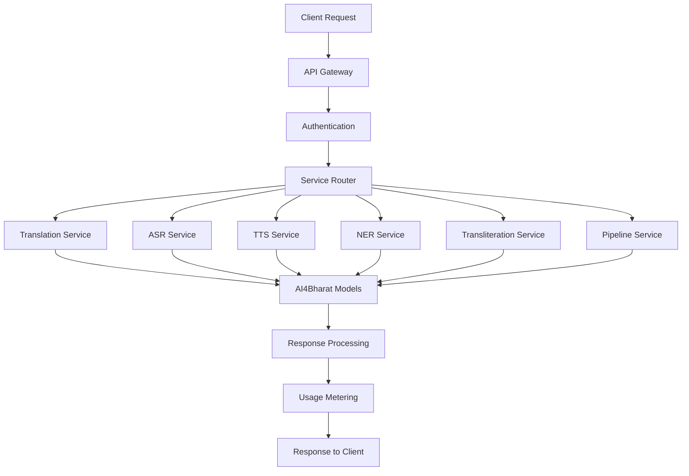
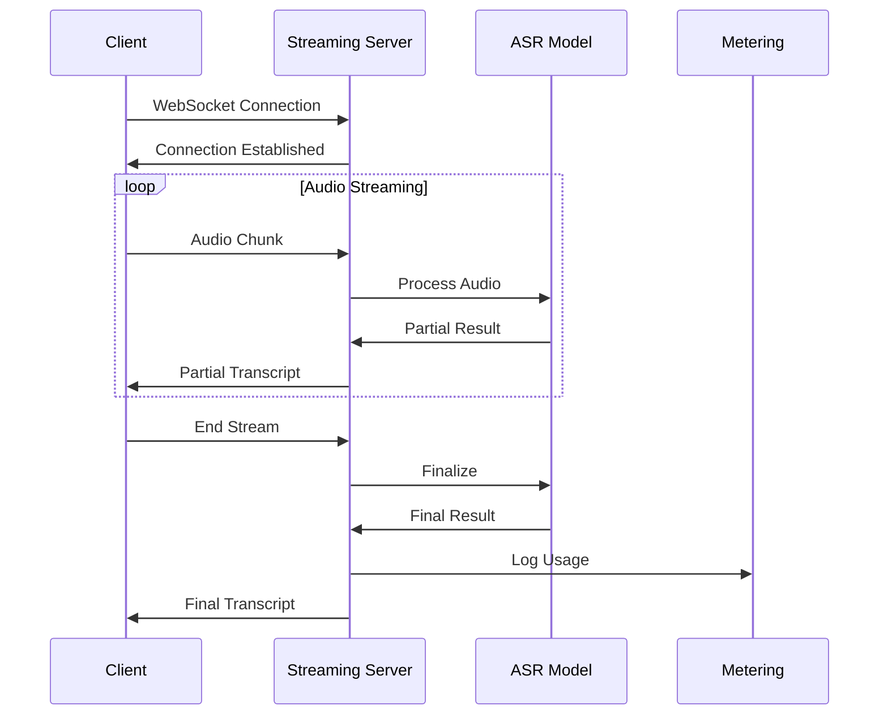
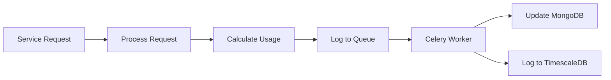

# AI Services Module

## 🤖 Overview

The AI Services module is the core of the Dhruva Platform, providing comprehensive AI/ML inference capabilities for Indian language processing. It supports multiple AI tasks including translation, speech recognition, text-to-speech, named entity recognition, and transliteration.

## 🏗️ Architecture

### Service Architecture



### Core Components

1. **Service Registry**: Manages available AI services and models
2. **Inference Router**: Routes requests to appropriate services
3. **Model Gateway**: Interfaces with AI4Bharat models
4. **Streaming Server**: Handles real-time audio processing
5. **Feedback System**: Collects and processes user feedback
6. **Usage Tracking**: Monitors and meters service usage

## 🔧 Supported AI Services

### 1. Translation Service

**Endpoint**: `/services/inference/translation`

**Capabilities**:
- Multi-directional translation between Indian languages
- Support for 22+ Indian languages
- Batch processing support
- Quality scoring and confidence metrics

**Request Format**:
```json
{
  "config": {
    "serviceId": "ai4bharat/indictrans--gpu-t4",
    "language": {
      "sourceLanguage": "hi",
      "sourceScriptCode": "Deva",
      "targetLanguage": "en",
      "targetScriptCode": "Latn"
    }
  },
  "input": [
    {"source": "नमस्ते, आप कैसे हैं?"}
  ],
  "controlConfig": {
    "dataTracking": true
  }
}
```

### 2. Automatic Speech Recognition (ASR)

**Endpoints**: 
- `/services/inference/asr` (Batch)
- `/socket.io` (Streaming)

**Capabilities**:
- Real-time speech recognition
- Batch audio file processing
- Multiple Indian language support
- Streaming with WebSocket support

**Request Format**:
```json
{
  "config": {
    "serviceId": "ai4bharat/conformer--gpu-t4",
    "language": {
      "sourceLanguage": "hi"
    },
    "audioFormat": "wav",
    "samplingRate": 16000
  },
  "audio": [
    {
      "audioContent": "base64_encoded_audio"
    }
  ]
}
```

### 3. Text-to-Speech (TTS)

**Endpoint**: `/services/inference/tts`

**Capabilities**:
- High-quality speech synthesis
- Multiple voice options (male/female)
- Configurable audio formats
- Batch text processing

**Request Format**:
```json
{
  "config": {
    "serviceId": "ai4bharat/indictts--gpu-t4",
    "gender": "male",
    "samplingRate": 22050,
    "audioFormat": "wav",
    "language": {
      "sourceLanguage": "hi"
    }
  },
  "input": [
    {"source": "नमस्ते, यह एक परीक्षण है।"}
  ]
}
```

### 4. Named Entity Recognition (NER)

**Endpoint**: `/services/inference/ner`

**Capabilities**:
- Entity extraction from text
- Support for person, location, organization entities
- Multi-language entity recognition
- Confidence scoring

### 5. Transliteration

**Endpoint**: `/services/inference/transliteration`

**Capabilities**:
- Script conversion between languages
- Phonetic transliteration
- Batch processing support
- Multiple script support

### 6. Pipeline Service

**Endpoint**: `/services/inference/pipeline`

**Capabilities**:
- Chained AI service execution
- Custom workflow creation
- Multi-step processing
- Result aggregation

## 🔌 Service Management APIs

### Service Discovery

```http
GET /services/details/list_services
GET /services/details/view_service?serviceId={id}
GET /services/details/list_models
GET /services/details/view_model?modelId={id}
```

### Admin Operations

```http
POST /services/admin/add_service
PUT  /services/admin/update_service
DELETE /services/admin/delete_service
POST /services/admin/add_model
```

### Feedback Management

```http
POST /services/feedback/submit
GET  /services/feedback/list
POST /services/feedback/batch_submit
```

## 🌊 Streaming Services

### Real-time ASR Streaming



### Streaming Configuration

```javascript
// Client-side streaming setup
const socket = io('ws://localhost:8000/socket.io');

socket.emit('start_stream', {
  config: {
    serviceId: 'ai4bharat/conformer--gpu-t4',
    language: { sourceLanguage: 'hi' },
    audioFormat: 'wav',
    samplingRate: 16000
  }
});

// Send audio chunks
socket.emit('audio_chunk', audioData);

// Receive results
socket.on('partial_result', (data) => {
  console.log('Partial:', data.transcript);
});

socket.on('final_result', (data) => {
  console.log('Final:', data.transcript);
});
```

## 📊 Service Configuration

### Model Registry

Services are configured through the model registry stored in MongoDB:

```javascript
{
  "modelId": "ai4bharat/indictrans--gpu-t4",
  "name": "IndicTrans GPU T4",
  "description": "Neural machine translation model",
  "task": {
    "type": "translation"
  },
  "languages": [
    {
      "sourceLanguage": "hi",
      "targetLanguage": "en"
    }
  ],
  "inferenceEndPoint": {
    "callbackUrl": "https://api.dhruva.ai4bharat.org/inference/translation",
    "schema": {
      "request": {...},
      "response": {...}
    }
  },
  "domain": ["general"],
  "license": "MIT"
}
```

### Service Registry

```javascript
{
  "serviceId": "ai4bharat/indictrans--gpu-t4",
  "name": "Translation Service",
  "description": "Multi-language translation service",
  "task": {
    "type": "translation"
  },
  "modelId": "ai4bharat/indictrans--gpu-t4",
  "status": {
    "type": "ACTIVE"
  },
  "pricing": {
    "unit": "character",
    "rate": 0.001
  }
}
```

## 🔍 Usage Tracking & Metering

### Automatic Usage Calculation

Each service request automatically calculates usage based on:

- **Translation**: Character count
- **ASR**: Audio duration (seconds)
- **TTS**: Character count
- **NER**: Character count
- **Transliteration**: Character count

### Metering Flow



## 🚀 Performance Optimization

### Caching Strategy

```python
# Redis caching for service metadata
@cache_result(ttl=3600)
def get_service_details(service_id):
    return service_repository.find_by_id(service_id)

# Model response caching
@cache_result(ttl=1800)
def get_model_inference(model_id, input_hash):
    return model_gateway.inference(model_id, input_data)
```

### Load Balancing

- **Round-robin** distribution across model instances
- **Health checks** for model availability
- **Automatic failover** to backup instances
- **Circuit breaker** pattern for fault tolerance

## 🔧 Configuration

### Environment Variables

```bash
# Model Gateway Configuration
MODEL_GATEWAY_URL=https://api.dhruva.ai4bharat.org
MODEL_TIMEOUT_SECONDS=30
MODEL_RETRY_ATTEMPTS=3

# Streaming Configuration
MAX_SOCKET_CONNECTIONS_PER_WORKER=100
STREAMING_BUFFER_SIZE=4096
AUDIO_CHUNK_SIZE=1024

# Service Configuration
DEFAULT_LANGUAGE=hi
SUPPORTED_AUDIO_FORMATS=wav,mp3,flac
MAX_AUDIO_DURATION_SECONDS=300
MAX_TEXT_LENGTH_CHARACTERS=5000
```

### Service Limits

```yaml
# Rate limiting per API key
rate_limits:
  translation: 1000/hour
  asr: 500/hour
  tts: 800/hour
  ner: 1200/hour

# Resource limits
resource_limits:
  max_audio_size: 10MB
  max_text_length: 5000
  max_batch_size: 100
  timeout_seconds: 30
```

## 🧪 Testing & Validation

### Service Health Checks

```bash
# Test translation service
curl -X POST "http://localhost:8000/services/inference/translation" \
  -H "Authorization: your-api-key" \
  -H "Content-Type: application/json" \
  -d '{
    "config": {
      "serviceId": "ai4bharat/indictrans--gpu-t4",
      "language": {
        "sourceLanguage": "hi",
        "targetLanguage": "en"
      }
    },
    "input": [{"source": "नमस्ते"}]
  }'

# Test ASR service
curl -X POST "http://localhost:8000/services/inference/asr" \
  -H "Authorization: your-api-key" \
  -H "Content-Type: application/json" \
  -d '{
    "config": {
      "serviceId": "ai4bharat/conformer--gpu-t4",
      "language": {"sourceLanguage": "hi"}
    },
    "audio": [{"audioContent": "base64_audio_data"}]
  }'
```

### Load Testing

```bash
# Run load tests
cd client/scripts
npm install
npm start  # Runs 2 requests per minute for each service
```

## 📈 Monitoring & Metrics

### Service Metrics

- **Request Rate**: Requests per second by service
- **Response Time**: P50, P95, P99 latencies
- **Error Rate**: Failed requests percentage
- **Usage Volume**: Characters/seconds processed
- **Model Performance**: Accuracy and quality metrics

### Prometheus Metrics

```promql
# Request rate by service
rate(dhruva_requests_total{service="translation"}[5m])

# Response time percentiles
histogram_quantile(0.95, dhruva_request_duration_seconds_bucket)

# Error rate
rate(dhruva_requests_total{status="error"}[5m]) / 
rate(dhruva_requests_total[5m])
```

## 🔄 Deployment & Scaling

### Horizontal Scaling

- **Service Replicas**: Scale individual services independently
- **Load Balancing**: Distribute requests across instances
- **Auto-scaling**: Based on CPU/memory usage and queue depth

### Model Management

- **Model Versioning**: Support multiple model versions
- **A/B Testing**: Compare model performance
- **Gradual Rollout**: Safe deployment of new models
- **Rollback Capability**: Quick revert to previous versions

## 🛠️ Troubleshooting

### Common Issues

1. **Model Timeout**: Increase timeout or check model health
2. **Audio Format Error**: Verify supported formats and encoding
3. **Language Not Supported**: Check service language capabilities
4. **Rate Limit Exceeded**: Monitor API key usage quotas

### Debug Commands

```bash
# Check service status
docker logs dhruva-platform-server | grep "service"

# Monitor model gateway
curl http://localhost:8000/services/details/list_services

# Check streaming connections
docker logs dhruva-platform-server | grep "socket"
```
